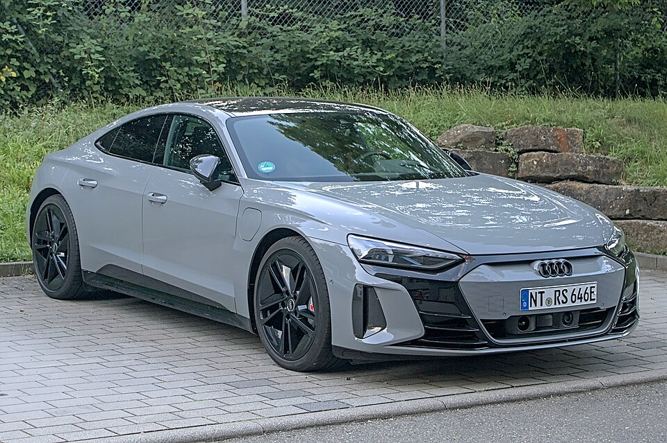

# Audi e-tron GT

*Bild: [Audi RS e-tron GT IMG 0703.jpg](https://commons.wikimedia.org/wiki/File:Audi_RS_e-tron_GT_IMG_0703.jpg) · Urheber: Alexander-93 · Lizenz: CC BY-SA 4.0 · via Wikimedia Commons.*

> Viertüriges Elektro-Gran-Turismo von Audi, technisch eng verwandt mit dem Porsche Taycan und wie dieser auf der J1-Plattform mit 800-Volt-Technik aufgebaut.

## Steckbrief

| Feld | Wert | Beleg |
|---|---|---|
| Hersteller | [[audi\|Audi]] | [[tn-batterycheck-alle-daten]] |
| Segment | Oberklasse-Sportlimousine | Fachwissen¹ |
| Karosserie | Viertüriges Coupé (Gran Turismo) | Fachwissen¹ |
| Bauzeit | seit 2021 | Fachwissen¹ |
| Plattform | J1 (gemeinsam mit Porsche) | Fachwissen¹ |
| Varianten im Bestand | 3 | [[tn-batterycheck-alle-daten]] |
| [[bruttokapazitaet\|Bruttokapazität]] | 93,4–105 kWh | [[tn-batterycheck-alle-daten]] |
| [[nettokapazitaet\|Nettokapazität]] | 83,7–97 kWh | [[tn-batterycheck-alle-daten]] |
| [[batteriepuffer\|Puffer]] | 7,6–10,4 % | berechnet |

## Beschreibung

Der Audi e-tron GT ist die Audi-Variante der von Porsche entwickelten [[plattform-j1|J1-Plattform]] und damit ein [[plattform-geschwister|Plattform-Geschwister]] des [[porsche-taycan|Porsche Taycan]]. Charakteristisch ist die [[800-volt-architektur|800-Volt-Architektur]], die hohe Leistungen beim [[dc-schnellladen|DC-Schnellladen]] ermöglicht.

Alle Varianten haben je einen [[elektromotor|Elektromotor]] an Vorder- und Hinterachse und damit [[allradantrieb|Allradantrieb]]. Die [[traktionsbatterie|Traktionsbatterie]] stammt aus dem Taycan-Baukasten und nutzt [[lithium-ionen-akku|Lithium-Ionen-Zellen]] im Pouch-[[zellformat|Zellformat]].

Mit der [[modellpflege|Modellpflege]] 2024 wurden die Modellnamen neu geordnet und eine größere Batterie eingeführt; seither liegen alle Versionen bei der größeren Kapazität.

## Varianten und Batterien

Zwei Batteriegenerationen: Die Vor-Facelift-Modelle (e-tron GT, RS e-tron GT) nutzen die Batterie mit 93,4 kWh brutto / 83,7 kWh netto, identisch mit der Performancebatterie Plus des Taycan. Die nach der Modellpflege eingeführte Version RS e-tron GT performance hat die neuere Batterie mit 105/97 kWh. "RS" kennzeichnet die stärkste Leistungsstufe.

| Variante | Brutto | Netto | Puffer | Zeile |
|---|---|---|---|---|
| e-tron GT | 93,4 kWh | 83,7 kWh | 9,7 kWh (10,4 %) | 6 |
| RS e-tron GT | 93,4 kWh | 83,7 kWh | 9,7 kWh (10,4 %) | 36 |
| RS e-tron GT performance | 105 kWh | 97,0 kWh | 8 kWh (7,6 %) | 37 |

Quelle: [[tn-batterycheck-alle-daten]], Blatt „Fahrzeuge“, Zeilen 6–37. Puffer = Brutto − Netto (berechnet).

## Fachbegriffe

- [[plattform-j1|J1-Plattform]] — Porsches Elektro-Sportwagenplattform für Taycan und Audi e-tron GT.
- [[800-volt-architektur|800-Volt-Architektur]] — Hochvoltsystem mit etwa doppelter Spannung gegenüber üblichen 400 Volt – ermöglicht schnelleres Laden und leichtere Kabel.
- [[dc-schnellladen|DC-Schnellladen]] — Laden mit Gleichstrom direkt in die Batterie, ohne Umweg über den Bordlader – mit 50 bis über 300 kW.
- [[allradantrieb|Allradantrieb (AWD)]] — Beide Achsen werden angetrieben, bei Elektroautos meist durch je einen eigenen Motor pro Achse.
- [[modellpflege|Modellpflege (Facelift)]] — Überarbeitung eines Modells während der Bauzeit – bei Elektroautos oft mit neuer Batterie.
- [[plattform-geschwister|Plattform-Geschwister (Badge-Engineering)]] — Fahrzeuge verschiedener Marken, die technisch weitgehend baugleich sind und dieselbe Batterie nutzen.
- [[zellformat|Zellformat]] — Bauform der einzelnen Batteriezellen: zylindrische Rundzelle, prismatische Zelle oder Pouch-Zelle.

## Verwandte Fahrzeuge

- [[porsche-taycan|Porsche Taycan]] — technisch verwandt / gleiche Plattform oder Batterie
- Weitere Modelle von Audi: [[audi-e-tron|Audi e-tron]], [[audi-q4-e-tron|Audi Q4 e-tron]], [[audi-q6-e-tron|Audi Q6 e-tron]], [[audi-q8-e-tron|Audi Q8 e-tron]]

## Offene Punkte

- Nach der Modellpflege 2024 heißen die Versionen S e-tron GT, RS e-tron GT und RS e-tron GT performance und haben alle die 105-kWh-Batterie. Der Eintrag RS e-tron GT mit 93,4 kWh (Zeile 36) bezieht sich daher vermutlich auf das Vor-Facelift-Modell; ein RS e-tron GT ab 2024 mit 105 kWh fehlt in den Daten.

Siehe auch [[datenqualitaet]].

## Quellen

- [[tn-batterycheck-alle-daten]] — Brutto-/Nettokapazität aller Varianten (Zeilen 6–37)
- Weiterlesen: [Wikipedia – Audi e-tron GT](https://en.wikipedia.org/wiki/Audi_e-tron_GT)

¹ *Beschreibung und Steckbrief-Felder ohne Quellseite beruhen auf allgemeinem Fachwissen des LLM (Stand 2026-09-23) und sind nicht durch eine Rohquelle im Bestand belegt. Zahlenwerte zur Batterie stammen ausschließlich aus der Rohquelle.*
