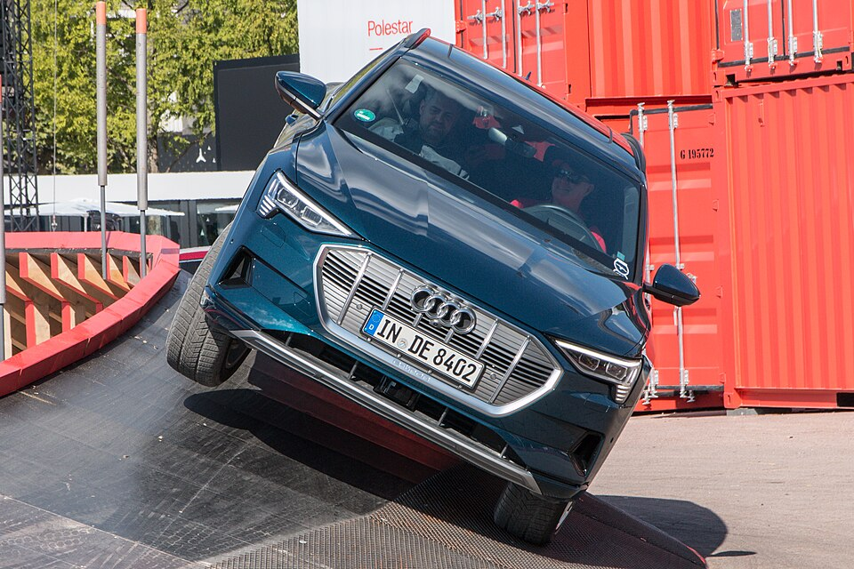

# Audi e-tron

*Bild: [Audi e-tron 55 quattro IAA 2019 JM 0496.jpg](https://commons.wikimedia.org/wiki/File:Audi_e-tron_55_quattro_IAA_2019_JM_0496.jpg) · Urheber: Johannes Maximilian · Lizenz: CC BY-SA 4.0 · via Wikimedia Commons.*

> Erstes rein elektrisches Serienmodell von Audi: ein SUV der oberen Mittelklasse, angeboten als SUV und als SUV-Coupé (Sportback). Mit der Modellpflege 2022/23 wurde es in Q8 e-tron umbenannt.

## Steckbrief

| Feld | Wert | Beleg |
|---|---|---|
| Hersteller | [[audi\|Audi]] | [[tn-batterycheck-alle-daten]] |
| Segment | Oberklasse-SUV | Fachwissen¹ |
| Karosserie | SUV, SUV-Coupé (Sportback) | Fachwissen¹ |
| Bauzeit | 2018–2022 | Fachwissen¹ |
| Plattform | Elektrifizierte Längsbaukasten-Plattform MLB evo | Fachwissen¹ |
| Varianten im Bestand | 10 | [[tn-batterycheck-alle-daten]] |
| [[bruttokapazitaet\|Bruttokapazität]] | 71–105 kWh | [[tn-batterycheck-alle-daten]] |
| [[nettokapazitaet\|Nettokapazität]] | 64,7–97 kWh | [[tn-batterycheck-alle-daten]] |
| [[batteriepuffer\|Puffer]] | 6,3–12,0 % | berechnet |

## Beschreibung

Der Audi e-tron ist ein [[bev|batterieelektrisches Fahrzeug]] und markierte den Einstieg von Audi in die Großserie elektrischer Pkw. Er basiert nicht auf einer reinen Elektro-Plattform, sondern auf einer angepassten Variante des Längsbaukastens MLB evo, den Audi auch für Verbrenner nutzt; die [[traktionsbatterie|Traktionsbatterie]] sitzt im Unterboden zwischen den Achsen. Das Modell ist damit technisch näher an einem [[konversionsfahrzeug|Konversionsfahrzeug]] als die späteren MEB- und PPE-Modelle.

Alle Varianten haben zwei [[elektromotor|Elektromotoren]] und damit [[allradantrieb|Allradantrieb]] (quattro); die S-Modelle nutzen drei Motoren. Die Batterie basiert auf [[lithium-ionen-akku|Lithium-Ionen-Zellen]] mit [[nmc-zellchemie|NMC-Chemie]]. Auffällig ist, dass bei gleicher [[bruttokapazitaet|Bruttokapazität]] von 95 kWh mehrere [[nettokapazitaet|Nettowerte]] genannt werden: Audi hat den nutzbaren Bereich im Laufe der Bauzeit vergrößert und so den [[batteriepuffer|Batteriepuffer]] verkleinert.

Mit der [[modellpflege|Modellpflege]] erhielt die Baureihe den Namen [[audi-q8-e-tron|Audi Q8 e-tron]] und größere Batterien. Die Einstiegsversion 50 quattro nutzt eine kleinere Batterie mit rund 71 kWh brutto.

## Varianten und Batterien

Die Zahl in der Bezeichnung (50, 55) ist eine Leistungsklasse im Audi-Schema der [[typbezeichnungen|Typbezeichnungen]], kein Kapazitätswert; "S" steht für die sportliche Topversion, "Sportback" für die Coupé-Karosserie. Der 50 quattro hat die kleine Batterie (71/64,7 kWh). Der 55 quattro erscheint mit 95 kWh brutto dreimal mit unterschiedlichen Nettowerten (83,6 / 86,5 / 89,0 kWh) – das spiegelt die schrittweise Freigabe von mehr nutzbarer Kapazität über die Bauzeit wider. Der S quattro (SUV) ist mit 105/97 kWh gelistet, der Sportback S quattro dagegen mit 95/86,5 kWh.

| Variante | Brutto | Netto | Puffer | Zeile |
|---|---|---|---|---|
| e-tron 50 quattro | 71 kWh | 64,7 kWh | 6,3 kWh (8,9 %) | 2 |
| e-tron 55 quattro | 95 kWh | 83,6 kWh | 11,4 kWh (12,0 %) | 3 |
| e-tron 55 quattro | 95 kWh | 86,5 kWh | 8,5 kWh (8,9 %) | 4 |
| e-tron 55 quattro | 95 kWh | 89,0 kWh | 6 kWh (6,3 %) | 5 |
| e-tron S quattro | 105 kWh | 97,0 kWh | 8 kWh (7,6 %) | 7 |
| e-tron Sportback 50 quattro | 71 kWh | 64,7 kWh | 6,3 kWh (8,9 %) | 8 |
| e-tron Sportback 55 quattro | 95 kWh | 83,6 kWh | 11,4 kWh (12,0 %) | 9 |
| e-tron Sportback 55 quattro | 95 kWh | 86,5 kWh | 8,5 kWh (8,9 %) | 10 |
| e-tron Sportback 55 quattro | 95 kWh | 89,0 kWh | 6 kWh (6,3 %) | 11 |
| e-tron Sportback S quattro | 95 kWh | 86,5 kWh | 8,5 kWh (8,9 %) | 12 |

Quelle: [[tn-batterycheck-alle-daten]], Blatt „Fahrzeuge“, Zeilen 2–12. Puffer = Brutto − Netto (berechnet).

## Fachbegriffe

- [[bruttokapazitaet|Bruttokapazität]] — Die gesamte, physikalisch in der Batterie verbaute Energiemenge – inklusive der Reserven, die der Fahrer nie nutzen kann.
- [[nettokapazitaet|Nettokapazität]] — Der Teil der Batteriekapazität, den der Fahrer tatsächlich nutzen kann – Grundlage für Reichweite und Batterietests.
- [[batteriepuffer|Batteriepuffer]] — Differenz zwischen Brutto- und Nettokapazität – eine Reserve, die die Batterie schont und Alterung ausgleicht.
- [[allradantrieb|Allradantrieb (AWD)]] — Beide Achsen werden angetrieben, bei Elektroautos meist durch je einen eigenen Motor pro Achse.
- [[konversionsfahrzeug|Konversionsfahrzeug]] — Elektroauto, das von einem Modell mit Verbrennungsmotor abgeleitet ist, statt auf einer reinen Elektroplattform zu basieren.
- [[modellpflege|Modellpflege (Facelift)]] — Überarbeitung eines Modells während der Bauzeit – bei Elektroautos oft mit neuer Batterie.
- [[typbezeichnungen|Typbezeichnungen]] — Wie Hersteller Leistungsstufe, Batterie und Antrieb in Modellnamen codieren – ein Lesehilfe-Artikel.
- [[nmc-zellchemie|NMC-Zellchemie]] — Lithium-Ionen-Zellen mit Kathode aus Nickel, Mangan und Kobalt – hohe Energiedichte, Standard in den meisten Fahrzeugen des Bestands.

## Verwandte Fahrzeuge

- [[audi-q8-e-tron|Audi Q8 e-tron]] — technisch verwandt / gleiche Plattform oder Batterie
- Weitere Modelle von Audi: [[audi-e-tron-gt|Audi e-tron GT]], [[audi-q4-e-tron|Audi Q4 e-tron]], [[audi-q6-e-tron|Audi Q6 e-tron]]

## Offene Punkte

- Zeile 7 (e-tron S quattro, 105/97 kWh) passt nicht zur Baureihe: 105/97 kWh entspricht der Performancebatterie Plus von Porsche Taycan/Audi e-tron GT nach Modellpflege; der Sportback S (Zeile 12) steht mit 95/86,5 kWh. Wahrscheinlich Datenfehler.
- Der Nettowert 89,0 kWh (Zeilen 5 und 11) entspricht dem Wert des Q8 50 e-tron; ob er für den e-tron 55 zutrifft, ist unsicher.
- Drei Nettowerte bei identischer Bezeichnung e-tron 55 quattro (83,6 / 86,5 / 89,0 kWh) – ohne Modelljahr nicht eindeutig zuzuordnen.

Siehe auch [[datenqualitaet]].

## Quellen

- [[tn-batterycheck-alle-daten]] — Brutto-/Nettokapazität aller Varianten (Zeilen 2–12)

¹ *Beschreibung und Steckbrief-Felder ohne Quellseite beruhen auf allgemeinem Fachwissen des LLM (Stand 2026-09-23) und sind nicht durch eine Rohquelle im Bestand belegt. Zahlenwerte zur Batterie stammen ausschließlich aus der Rohquelle.*
