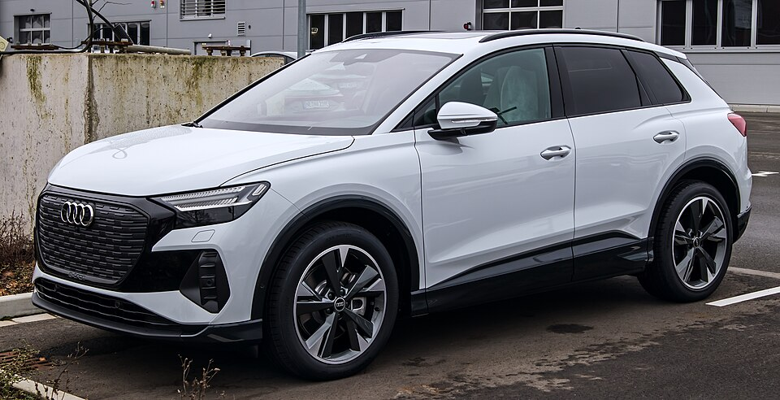

# Audi Q4 e-tron

*Bild: [Audi Q4 e-tron 50 quattro – f 22012023.jpg](https://commons.wikimedia.org/wiki/File:Audi_Q4_e-tron_50_quattro_%E2%80%93_f_22012023.jpg) · Urheber: © M 93 · Lizenz: CC BY-SA 3.0 de · via Wikimedia Commons.*

> Kompakt-SUV von Audi auf Basis des Modularen E-Antriebs-Baukastens (MEB) des Volkswagen-Konzerns, erhältlich als SUV und SUV-Coupé (Sportback).

## Steckbrief

| Feld | Wert | Beleg |
|---|---|---|
| Hersteller | [[audi\|Audi]] | [[tn-batterycheck-alle-daten]] |
| Segment | Kompakt-SUV | Fachwissen¹ |
| Karosserie | SUV, SUV-Coupé (Sportback) | Fachwissen¹ |
| Bauzeit | seit 2021 | Fachwissen¹ |
| Plattform | MEB | Fachwissen¹ |
| Varianten im Bestand | 14 | [[tn-batterycheck-alle-daten]] |
| [[bruttokapazitaet\|Bruttokapazität]] | 55–82 kWh | [[tn-batterycheck-alle-daten]] |
| [[nettokapazitaet\|Nettokapazität]] | 51,5–76,6 kWh | [[tn-batterycheck-alle-daten]] |
| [[batteriepuffer\|Puffer]] | 6,3–6,6 % | berechnet |

## Beschreibung

Der Audi Q4 e-tron ist das Audi-Modell auf dem [[plattform-meb|Modularen E-Antriebs-Baukasten (MEB)]] und teilt Antrieb, Batterien und Grundarchitektur mit [[vw-id-4|VW ID.4]], [[vw-id-5|VW ID.5]] und [[skoda-enyaq|Škoda Enyaq]]. Er positioniert sich oberhalb dieser [[plattform-geschwister|Plattform-Geschwister]] durch Ausstattung und Innenraum, nicht durch eigene Batterietechnik.

Grundsätzlich hat der Q4 [[hinterradantrieb|Hinterradantrieb]]; die quattro-Varianten erhalten einen zusätzlichen [[elektromotor|Elektromotor]] an der Vorderachse und damit [[allradantrieb|Allradantrieb]]. Die [[traktionsbatterie|Traktionsbatterie]] stammt aus dem MEB-Baukasten und ist in mehreren Größen verfügbar.

Im Rahmen der [[modellpflege|Modellpflege]] hat Audi die Leistungsstufen und Bezeichnungen mehrfach angepasst; so taucht die Bezeichnung 40 e-tron sowohl mit der mittleren als auch mit der großen Batterie auf.

## Varianten und Batterien

Die Zahl (35, 40, 45, 50, 55) ist eine Leistungsklasse nach dem Audi-Schema der [[typbezeichnungen|Typbezeichnungen]], "quattro" steht für Allradantrieb, "Sportback" für die Coupé-Karosserie. In den Daten gibt es drei MEB-Batterien: 55/51,5 kWh (35 e-tron), 63/59 kWh (40 e-tron, neuere Einstiegsbatterie) und 82/76,6 kWh (alle übrigen). Dass der 40 e-tron zweimal mit unterschiedlicher Batterie erscheint, erklärt sich durch die Umbenennung von Leistungsstufen im Zuge der Modellpflege.

| Variante | Brutto | Netto | Puffer | Zeile |
|---|---|---|---|---|
| Q4 35 e-tron | 55 kWh | 51,5 kWh | 3,5 kWh (6,4 %) | 13 |
| Q4 40 e-tron | 63 kWh | 59 kWh | 4 kWh (6,3 %) | 14 |
| Q4 40 e-tron | 82 kWh | 76,6 kWh | 5,4 kWh (6,6 %) | 15 |
| Q4 45 e-tron | 82 kWh | 76,6 kWh | 5,4 kWh (6,6 %) | 16 |
| Q4 45 e-tron quattro | 82 kWh | 76,6 kWh | 5,4 kWh (6,6 %) | 17 |
| Q4 50 e-tron quattro | 82 kWh | 76,6 kWh | 5,4 kWh (6,6 %) | 18 |
| Q4 55 e-tron quattro | 82 kWh | 76,6 kWh | 5,4 kWh (6,6 %) | 19 |
| Q4 Sportback 35 e-tron | 55 kWh | 51,5 kWh | 3,5 kWh (6,4 %) | 20 |
| Q4 Sportback 40 e-tron | 63 kWh | 59 kWh | 4 kWh (6,3 %) | 21 |
| Q4 Sportback 40 e-tron | 82 kWh | 76,6 kWh | 5,4 kWh (6,6 %) | 22 |
| Q4 Sportback 45 e-tron | 82 kWh | 76,6 kWh | 5,4 kWh (6,6 %) | 23 |
| Q4 Sportback 45 e-tron quattro | 82 kWh | 76,6 kWh | 5,4 kWh (6,6 %) | 24 |
| Q4 Sportback 50 e-tron quattro | 82 kWh | 76,6 kWh | 5,4 kWh (6,6 %) | 25 |
| Q4 Sportback 55 e-tron quattro | 82 kWh | 76,6 kWh | 5,4 kWh (6,6 %) | 26 |

Quelle: [[tn-batterycheck-alle-daten]], Blatt „Fahrzeuge“, Zeilen 13–26 – bereinigte Fassung (Stand 2026-09-24, Änderungen in [[datenqualitaet]]). Puffer = Brutto − Netto (berechnet).

## Fachbegriffe

- [[plattform-meb|MEB (Modularer E-Antriebs-Baukasten)]] — Volkswagens erste reine Elektroauto-Plattform, Basis für ID.-Modelle, Enyaq, Elroq, Born, Tavascan und Q4 e-tron.
- [[plattform-geschwister|Plattform-Geschwister (Badge-Engineering)]] — Fahrzeuge verschiedener Marken, die technisch weitgehend baugleich sind und dieselbe Batterie nutzen.
- [[hinterradantrieb|Hinterradantrieb (RWD)]] — Der Elektromotor treibt die Hinterräder an – Standard auf vielen reinen Elektroplattformen.
- [[allradantrieb|Allradantrieb (AWD)]] — Beide Achsen werden angetrieben, bei Elektroautos meist durch je einen eigenen Motor pro Achse.
- [[typbezeichnungen|Typbezeichnungen]] — Wie Hersteller Leistungsstufe, Batterie und Antrieb in Modellnamen codieren – ein Lesehilfe-Artikel.
- [[modellpflege|Modellpflege (Facelift)]] — Überarbeitung eines Modells während der Bauzeit – bei Elektroautos oft mit neuer Batterie.
- [[nettokapazitaet|Nettokapazität]] — Der Teil der Batteriekapazität, den der Fahrer tatsächlich nutzen kann – Grundlage für Reichweite und Batterietests.

## Verwandte Fahrzeuge

- [[vw-id-4|VW ID.4]] — technisch verwandt / gleiche Plattform oder Batterie
- [[vw-id-5|VW ID.5]] — technisch verwandt / gleiche Plattform oder Batterie
- [[skoda-enyaq|Škoda Enyaq]] — technisch verwandt / gleiche Plattform oder Batterie
- [[vw-id-3|VW ID.3]] — technisch verwandt / gleiche Plattform oder Batterie
- [[cupra-born|Cupra Born]] — technisch verwandt / gleiche Plattform oder Batterie
- [[cupra-tavascan|Cupra Tavascan]] — technisch verwandt / gleiche Plattform oder Batterie
- [[skoda-elroq|Škoda Elroq]] — technisch verwandt / gleiche Plattform oder Batterie
- [[vw-id-7|VW ID.7]] — technisch verwandt / gleiche Plattform oder Batterie
- Weitere Modelle von Audi: [[audi-e-tron|Audi e-tron]], [[audi-e-tron-gt|Audi e-tron GT]], [[audi-q6-e-tron|Audi Q6 e-tron]], [[audi-q8-e-tron|Audi Q8 e-tron]]

## Offene Punkte

- Q4 40 e-tron und Q4 Sportback 40 e-tron erscheinen jeweils zweimal mit unterschiedlichen Batterien (63 und 82 kWh brutto); die zeitliche Zuordnung der Bezeichnungen ist ohne Modelljahr nicht eindeutig.

Siehe auch [[datenqualitaet]].

## Quellen

- [[tn-batterycheck-alle-daten]] — Brutto-/Nettokapazität aller Varianten (Zeilen 13–26)
- Weiterlesen: [Wikipedia – Audi Q4 e-tron](https://en.wikipedia.org/wiki/Audi_Q4_e-tron)

¹ *Beschreibung und Steckbrief-Felder ohne Quellseite beruhen auf allgemeinem Fachwissen des LLM (Stand 2026-09-24) und sind nicht durch eine Rohquelle im Bestand belegt. Zahlenwerte zur Batterie stammen aus der Rohquelle, bereinigt nach dem Protokoll in [[datenqualitaet]].*
