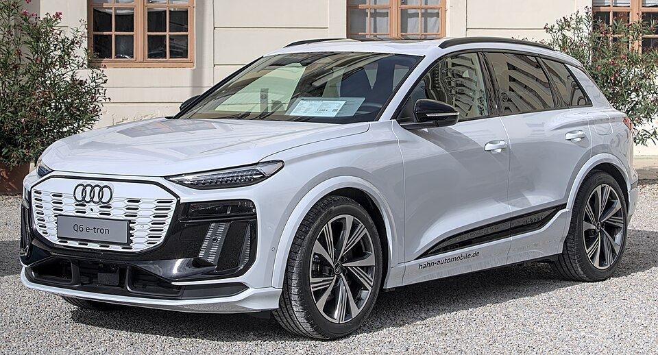

# Audi Q6 e-tron

*Bild: [Audi SQ6 e-tron Automesse Ludwigsburg 2024 IMG 1395.jpg](https://commons.wikimedia.org/wiki/File:Audi_SQ6_e-tron_Automesse_Ludwigsburg_2024_IMG_1395.jpg) · Urheber: Alexander-93 · Lizenz: CC BY-SA 4.0 · via Wikimedia Commons.*

> Elektrisches SUV der oberen Mittelklasse von Audi und erstes Serienmodell auf der mit Porsche entwickelten Premium Platform Electric (PPE) mit 800-Volt-Technik.

## Steckbrief

| Feld | Wert | Beleg |
|---|---|---|
| Hersteller | [[audi\|Audi]] | [[tn-batterycheck-alle-daten]] |
| Segment | Mittelklasse-SUV | Fachwissen¹ |
| Karosserie | SUV, SUV-Coupé (Sportback) | Fachwissen¹ |
| Bauzeit | seit 2024 | Fachwissen¹ |
| Plattform | PPE (Premium Platform Electric) | Fachwissen¹ |
| Varianten im Bestand | 7 | [[tn-batterycheck-alle-daten]] |
| [[bruttokapazitaet\|Bruttokapazität]] | 83–100 kWh | [[tn-batterycheck-alle-daten]] |
| [[nettokapazitaet\|Nettokapazität]] | 75,8–94,9 kWh | [[tn-batterycheck-alle-daten]] |
| [[batteriepuffer\|Puffer]] | 5,1–8,7 % | berechnet |

## Beschreibung

Der Audi Q6 e-tron ist das erste Modell auf der [[plattform-ppe|Premium Platform Electric (PPE)]], die Audi gemeinsam mit Porsche entwickelt hat. Sein technisches [[plattform-geschwister|Plattform-Geschwister]] ist der elektrische [[porsche-macan-electric|Porsche Macan]]. Die PPE basiert auf einer [[800-volt-architektur|800-Volt-Architektur]] und ist auf hohe Ladeleistung beim [[dc-schnellladen|DC-Schnellladen]] ausgelegt.

Die Basisversionen haben [[hinterradantrieb|Hinterradantrieb]], die quattro- und SQ6-Modelle zwei [[elektromotor|Elektromotoren]] und [[allradantrieb|Allradantrieb]]. Die [[traktionsbatterie|Traktionsbatterie]] nutzt prismatische [[lithium-ionen-akku|Lithium-Ionen-Zellen]] mit [[nmc-zellchemie|NMC-Chemie]]; es gibt eine große und eine kleinere Batterie.

## Varianten und Batterien

"performance" bezeichnet hier die hinterradgetriebene Version mit großer Batterie, "quattro" den Allradantrieb, SQ6 die sportliche Topversion und "Sportback" die Coupé-Karosserie. Zwei Batterien: 100/94,9 kWh für fast alle Varianten und 83/75,8 kWh für den Einstieg (Q6 e-tron ohne Zusatz).

| Variante | Brutto | Netto | Puffer | Zeile |
|---|---|---|---|---|
| Q6 e-tron | 83 kWh | 75,8 kWh | 7,2 kWh (8,7 %) | 27 |
| Q6 e-tron performance | 100 kWh | 94,9 kWh | 5,1 kWh (5,1 %) | 28 |
| Q6 e-tron quattro | 100 kWh | 94,9 kWh | 5,1 kWh (5,1 %) | 29 |
| Q6 Sportback e-tron performance | 100 kWh | 94,9 kWh | 5,1 kWh (5,1 %) | 30 |
| Q6 Sportback e-tron quattro | 100 kWh | 94,9 kWh | 5,1 kWh (5,1 %) | 31 |
| SQ6 e-tron quattro | 100 kWh | 94,9 kWh | 5,1 kWh (5,1 %) | 38 |
| SQ6 Sportback e-tron quattro | 100 kWh | 94,9 kWh | 5,1 kWh (5,1 %) | 39 |

Quelle: [[tn-batterycheck-alle-daten]], Blatt „Fahrzeuge“, Zeilen 27–39. Puffer = Brutto − Netto (berechnet).

## Fachbegriffe

- [[plattform-ppe|PPE (Premium Platform Electric)]] — Gemeinsame Elektroplattform von Audi und Porsche für Oberklasse-Fahrzeuge mit 800-Volt-Technik.
- [[800-volt-architektur|800-Volt-Architektur]] — Hochvoltsystem mit etwa doppelter Spannung gegenüber üblichen 400 Volt – ermöglicht schnelleres Laden und leichtere Kabel.
- [[dc-schnellladen|DC-Schnellladen]] — Laden mit Gleichstrom direkt in die Batterie, ohne Umweg über den Bordlader – mit 50 bis über 300 kW.
- [[hinterradantrieb|Hinterradantrieb (RWD)]] — Der Elektromotor treibt die Hinterräder an – Standard auf vielen reinen Elektroplattformen.
- [[allradantrieb|Allradantrieb (AWD)]] — Beide Achsen werden angetrieben, bei Elektroautos meist durch je einen eigenen Motor pro Achse.
- [[plattform-geschwister|Plattform-Geschwister (Badge-Engineering)]] — Fahrzeuge verschiedener Marken, die technisch weitgehend baugleich sind und dieselbe Batterie nutzen.
- [[nmc-zellchemie|NMC-Zellchemie]] — Lithium-Ionen-Zellen mit Kathode aus Nickel, Mangan und Kobalt – hohe Energiedichte, Standard in den meisten Fahrzeugen des Bestands.

## Verwandte Fahrzeuge

- [[porsche-macan-electric|Porsche Macan (Elektro)]] — technisch verwandt / gleiche Plattform oder Batterie
- Weitere Modelle von Audi: [[audi-e-tron|Audi e-tron]], [[audi-e-tron-gt|Audi e-tron GT]], [[audi-q4-e-tron|Audi Q4 e-tron]], [[audi-q8-e-tron|Audi Q8 e-tron]]

## Quellen

- [[tn-batterycheck-alle-daten]] — Brutto-/Nettokapazität aller Varianten (Zeilen 27–39)
- Weiterlesen: [Wikipedia – Audi Q6 e-tron](https://en.wikipedia.org/wiki/Audi_Q6_e-tron)

¹ *Beschreibung und Steckbrief-Felder ohne Quellseite beruhen auf allgemeinem Fachwissen des LLM (Stand 2026-09-23) und sind nicht durch eine Rohquelle im Bestand belegt. Zahlenwerte zur Batterie stammen ausschließlich aus der Rohquelle.*
