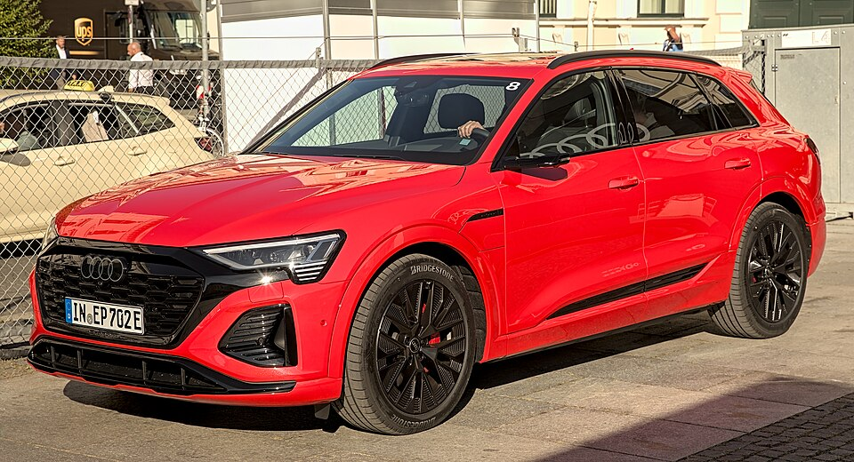

# Audi Q8 e-tron

*Bild: [Audi Q8 e-tron IAA 2023 1X7A0616.jpg](https://commons.wikimedia.org/wiki/File:Audi_Q8_e-tron_IAA_2023_1X7A0616.jpg) · Urheber: Alexander-93 · Lizenz: CC BY-SA 4.0 · via Wikimedia Commons.*

> Überarbeitete und umbenannte Fassung des Audi e-tron, ein elektrisches Oberklasse-SUV mit Allradantrieb, angeboten als SUV und Sportback.

## Steckbrief

| Feld | Wert | Beleg |
|---|---|---|
| Hersteller | [[audi\|Audi]] | [[tn-batterycheck-alle-daten]] |
| Segment | Oberklasse-SUV | Fachwissen¹ |
| Karosserie | SUV, SUV-Coupé (Sportback) | Fachwissen¹ |
| Bauzeit | 2022–2025 | Fachwissen¹ |
| Plattform | Elektrifizierte Längsbaukasten-Plattform MLB evo | Fachwissen¹ |
| Varianten im Bestand | 6 | [[tn-batterycheck-alle-daten]] |
| [[bruttokapazitaet\|Bruttokapazität]] | 95–114 kWh | [[tn-batterycheck-alle-daten]] |
| [[nettokapazitaet\|Nettokapazität]] | 89–106 kWh | [[tn-batterycheck-alle-daten]] |
| [[batteriepuffer\|Puffer]] | 6,3–7,0 % | berechnet |

## Beschreibung

Der Audi Q8 e-tron ist das Ergebnis der [[modellpflege|Modellpflege]] des [[audi-e-tron|Audi e-tron]]. Neben dem neuen Namen erhielt die Baureihe überarbeitete Batterien mit höherer [[nettokapazitaet|Nettokapazität]]; Plattform, Karosserie und Grundkonzept blieben erhalten.

Alle Varianten haben [[allradantrieb|Allradantrieb]] mit zwei, die SQ8-Modelle mit drei [[elektromotor|Elektromotoren]]. Die [[traktionsbatterie|Traktionsbatterie]] basiert auf [[nmc-zellchemie|NMC-Zellen]] und ist in zwei Größen erhältlich, die sich nicht nur in der Kapazität, sondern auch in der Zellausführung unterscheiden sollen.

Mit dem Produktionsende im Werk Brüssel lief die Baureihe ohne direkten Nachfolger aus; die Rolle im Portfolio übernehmen PPE-Modelle.

## Varianten und Batterien

"50" und "55" sind Leistungsklassen nach Audi-Schema der [[typbezeichnungen|Typbezeichnungen]]; sie sind hier fest an die Batterie gekoppelt: 50 = 95/89 kWh, 55 und SQ8 = 114/106 kWh. "Sportback" ist die Coupé-Karosserie.

| Variante | Brutto | Netto | Puffer | Zeile |
|---|---|---|---|---|
| Q8 50 e-tron | 95 kWh | 89 kWh | 6 kWh (6,3 %) | 32 |
| Q8 55 e-tron | 114 kWh | 106 kWh | 8 kWh (7,0 %) | 33 |
| Q8 Sportback 50 e-tron | 95 kWh | 89 kWh | 6 kWh (6,3 %) | 34 |
| Q8 Sportback 55 e-tron | 114 kWh | 106 kWh | 8 kWh (7,0 %) | 35 |
| SQ8 e-tron quattro | 114 kWh | 106 kWh | 8 kWh (7,0 %) | 40 |
| SQ8 Sportback e-tron quattro | 114 kWh | 106 kWh | 8 kWh (7,0 %) | 41 |

Quelle: [[tn-batterycheck-alle-daten]], Blatt „Fahrzeuge“, Zeilen 32–41 – bereinigte Fassung (Stand 2026-09-24, Änderungen in [[datenqualitaet]]). Puffer = Brutto − Netto (berechnet).

## Fachbegriffe

- [[modellpflege|Modellpflege (Facelift)]] — Überarbeitung eines Modells während der Bauzeit – bei Elektroautos oft mit neuer Batterie.
- [[nettokapazitaet|Nettokapazität]] — Der Teil der Batteriekapazität, den der Fahrer tatsächlich nutzen kann – Grundlage für Reichweite und Batterietests.
- [[allradantrieb|Allradantrieb (AWD)]] — Beide Achsen werden angetrieben, bei Elektroautos meist durch je einen eigenen Motor pro Achse.
- [[typbezeichnungen|Typbezeichnungen]] — Wie Hersteller Leistungsstufe, Batterie und Antrieb in Modellnamen codieren – ein Lesehilfe-Artikel.
- [[nmc-zellchemie|NMC-Zellchemie]] — Lithium-Ionen-Zellen mit Kathode aus Nickel, Mangan und Kobalt – hohe Energiedichte, Standard in den meisten Fahrzeugen des Bestands.
- [[zellformat|Zellformat]] — Bauform der einzelnen Batteriezellen: zylindrische Rundzelle, prismatische Zelle oder Pouch-Zelle.

## Verwandte Fahrzeuge

- [[audi-e-tron|Audi e-tron]] — technisch verwandt / gleiche Plattform oder Batterie
- Weitere Modelle von Audi: [[audi-e-tron-gt|Audi e-tron GT]], [[audi-q4-e-tron|Audi Q4 e-tron]], [[audi-q6-e-tron|Audi Q6 e-tron]]

## Offene Punkte

- Unterschiedliches Zellformat (Pouch beim 95-kWh-Akku, prismatisch beim 114-kWh-Akku) wird häufig genannt, ist hier aber nicht verifiziert.
- Bauzeit: Produktion vermutlich von Ende 2022 bis Anfang 2025 (Schließung des Werks Brüssel) – Angabe prüfen.

Siehe auch [[datenqualitaet]].

## Quellen

- [[tn-batterycheck-alle-daten]] — Brutto-/Nettokapazität aller Varianten (Zeilen 32–41)

¹ *Beschreibung und Steckbrief-Felder ohne Quellseite beruhen auf allgemeinem Fachwissen des LLM (Stand 2026-09-24) und sind nicht durch eine Rohquelle im Bestand belegt. Zahlenwerte zur Batterie stammen aus der Rohquelle, bereinigt nach dem Protokoll in [[datenqualitaet]].*
