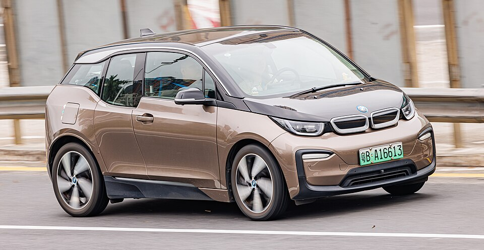

# BMW i3

*Bild: [BMW i3 (I01) China (2).jpg](https://commons.wikimedia.org/wiki/File:BMW_i3_(I01)_China_(2).jpg) · Urheber: Dinkun Chen · Lizenz: CC BY-SA 4.0 · via Wikimedia Commons.*

> Elektrischer Kleinwagen von BMW mit Kohlefaser-Fahrgastzelle und optionalem Range Extender; eines der ersten Premium-Elektroautos in Großserie.

## Steckbrief

| Feld | Wert | Beleg |
|---|---|---|
| Hersteller | [[bmw\|BMW]] | [[tn-batterycheck-alle-daten]] |
| Segment | Kleinwagen | Fachwissen¹ |
| Karosserie | Fünftürige Kompaktlimousine mit gegenläufig öffnenden Fondtüren | Fachwissen¹ |
| Bauzeit | 2013–2022 | Fachwissen¹ |
| Plattform | Eigenständige LifeDrive-Architektur (Aluminium-Fahrmodul mit CFK-Fahrgastzelle) | Fachwissen¹ |
| Varianten im Bestand | 9 | [[tn-batterycheck-alle-daten]] |
| [[bruttokapazitaet\|Bruttokapazität]] | 22–42,2 kWh | [[tn-batterycheck-alle-daten]] |
| [[nettokapazitaet\|Nettokapazität]] | 18,8–37,9 kWh | [[tn-batterycheck-alle-daten]] |
| [[batteriepuffer\|Puffer]] | 10,2–18,1 % | berechnet |

## Beschreibung

Der BMW i3 wurde von Beginn an als [[bev|Elektroauto]] entwickelt. Seine LifeDrive-Architektur trennt ein Aluminium-Fahrgestell mit [[traktionsbatterie|Traktionsbatterie]] und Antrieb von einer Fahrgastzelle aus kohlefaserverstärktem Kunststoff. Der [[elektromotor|Elektromotor]] sitzt an der Hinterachse, das Fahrzeug hat [[hinterradantrieb|Hinterradantrieb]].

Optional war ein [[range-extender|Range Extender]] erhältlich: ein kleiner Zweizylinder-Benzinmotor, der als Generator die Batterie während der Fahrt nachlädt, aber nicht direkt die Räder antreibt. Die Batterie besteht aus prismatischen [[lithium-ionen-akku|Lithium-Ionen-Zellen]]; das [[zellformat|Zellformat]] blieb über die Bauzeit gleich, die Zellkapazität stieg.

Über die Bauzeit wurde der i3 zweimal mit stärkeren Zellen ausgestattet. Dadurch existieren drei Batteriegenerationen bei unveränderten Außenmaßen des Akkus – ein typisches Beispiel dafür, wie [[modellpflege|Modellpflege]] die [[bruttokapazitaet|Bruttokapazität]] erhöht.

## Varianten und Batterien

Drei Batteriegenerationen, die jeweils für i3, i3s und die Range-Extender-Versionen gelten: 22/18,8 kWh (erste Generation, oft als 60 Ah bezeichnet), 33,2/27,2 kWh (94 Ah) und 42,2/37,9 kWh (120 Ah). Der i3s ist eine sportlichere Version mit mehr Leistung, die erst mit der 94-Ah-Batterie angeboten wurde, deshalb fehlt er in der ersten Generation. "(Range Extender)" kennzeichnet die Version mit Benzin-Generator.

| Variante | Brutto | Netto | Puffer | Zeile |
|---|---|---|---|---|
| i3 | 22 kWh | 18,8 kWh | 3,2 kWh (14,5 %) | 42 |
| i3 | 33,2 kWh | 27,2 kWh | 6 kWh (18,1 %) | 43 |
| i3 | 42,2 kWh | 37,9 kWh | 4,3 kWh (10,2 %) | 44 |
| i3 (Range Extender) | 22 kWh | 18,8 kWh | 3,2 kWh (14,5 %) | 45 |
| i3 (Range Extender) | 33,2 kWh | 27,2 kWh | 6 kWh (18,1 %) | 46 |
| i3 (Range Extender) | 42,2 kWh | 37,9 kWh | 4,3 kWh (10,2 %) | 47 |
| i3s | 33,2 kWh | 27,2 kWh | 6 kWh (18,1 %) | 48 |
| i3s | 42,2 kWh | 37,9 kWh | 4,3 kWh (10,2 %) | 49 |
| i3s (Range Extender) | 33,2 kWh | 27,2 kWh | 6 kWh (18,1 %) | 50 |

Quelle: [[tn-batterycheck-alle-daten]], Blatt „Fahrzeuge“, Zeilen 42–50 – bereinigte Fassung (Stand 2026-09-24, Änderungen in [[datenqualitaet]]). Puffer = Brutto − Netto (berechnet).

## Fachbegriffe

- [[range-extender|Range Extender (REx)]] — Kleiner Verbrennungsmotor als Generator, der bei leerer Batterie Strom erzeugt und so die Reichweite verlängert.
- [[hinterradantrieb|Hinterradantrieb (RWD)]] — Der Elektromotor treibt die Hinterräder an – Standard auf vielen reinen Elektroplattformen.
- [[bruttokapazitaet|Bruttokapazität]] — Die gesamte, physikalisch in der Batterie verbaute Energiemenge – inklusive der Reserven, die der Fahrer nie nutzen kann.
- [[nettokapazitaet|Nettokapazität]] — Der Teil der Batteriekapazität, den der Fahrer tatsächlich nutzen kann – Grundlage für Reichweite und Batterietests.
- [[batteriepuffer|Batteriepuffer]] — Differenz zwischen Brutto- und Nettokapazität – eine Reserve, die die Batterie schont und Alterung ausgleicht.
- [[zellformat|Zellformat]] — Bauform der einzelnen Batteriezellen: zylindrische Rundzelle, prismatische Zelle oder Pouch-Zelle.
- [[modellpflege|Modellpflege (Facelift)]] — Überarbeitung eines Modells während der Bauzeit – bei Elektroautos oft mit neuer Batterie.
- [[batteriealterung|Batteriealterung (Degradation)]] — Allmählicher Kapazitäts- und Leistungsverlust einer Lithium-Ionen-Batterie über Zeit und Nutzung.

## Verwandte Fahrzeuge

- Weitere Modelle von BMW: [[bmw-i4|BMW i4]], [[bmw-i5|BMW i5]], [[bmw-i7|BMW i7]], [[bmw-ix|BMW iX]], [[bmw-ix1|BMW iX1]], [[bmw-ix2|BMW iX2]], [[bmw-ix3|BMW iX3]]

## Offene Punkte

- Für den i3s (Range Extender) fehlt in den Daten die 120-Ah-Version (42,2 kWh); ob sie angeboten wurde, ist hier nicht geprüft.
- Die Ah-Bezeichnungen (60/94/120 Ah) sind geläufig, stehen aber nicht in den Rohdaten.

Siehe auch [[datenqualitaet]].

## Quellen

- [[tn-batterycheck-alle-daten]] — Brutto-/Nettokapazität aller Varianten (Zeilen 42–50)

¹ *Beschreibung und Steckbrief-Felder ohne Quellseite beruhen auf allgemeinem Fachwissen des LLM (Stand 2026-09-24) und sind nicht durch eine Rohquelle im Bestand belegt. Zahlenwerte zur Batterie stammen aus der Rohquelle, bereinigt nach dem Protokoll in [[datenqualitaet]].*
