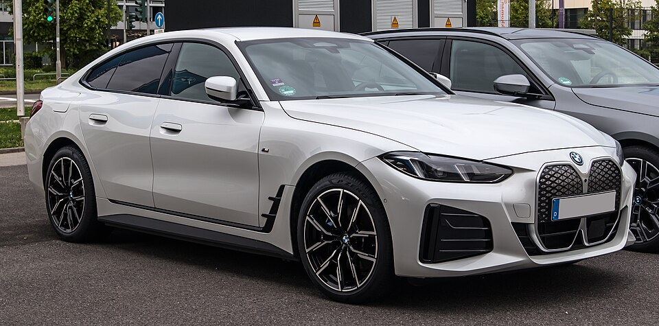

# BMW i4

*Bild: [BMW i4 eDrive40 Gran Coupé M Sportpaket (G26, Facelift) – f 18042025.jpg](https://commons.wikimedia.org/wiki/File:BMW_i4_eDrive40_Gran_Coup%C3%A9_M_Sportpaket_(G26,_Facelift)_%E2%80%93_f_18042025.jpg) · Urheber: © M 93 · Lizenz: CC BY-SA 3.0 de · via Wikimedia Commons.*

> Elektrische Mittelklasse-Limousine von BMW in Gran-Coupé-Form, eng verwandt mit dem 4er Gran Coupé und ausgestattet mit dem BMW-eDrive-Antrieb der fünften Generation.

## Steckbrief

| Feld | Wert | Beleg |
|---|---|---|
| Hersteller | [[bmw\|BMW]] | [[tn-batterycheck-alle-daten]] |
| Segment | Mittelklasse-Limousine | Fachwissen¹ |
| Karosserie | Fünftürige Fließheck-Limousine (Gran Coupé) | Fachwissen¹ |
| Bauzeit | seit 2021 | Fachwissen¹ |
| Plattform | CLAR (Mischplattform für Verbrenner und Elektro) | Fachwissen¹ |
| Varianten im Bestand | 5 | [[tn-batterycheck-alle-daten]] |
| [[bruttokapazitaet\|Bruttokapazität]] | 70,3–83,9 kWh | [[tn-batterycheck-alle-daten]] |
| [[nettokapazitaet\|Nettokapazität]] | 66–81,1 kWh | [[tn-batterycheck-alle-daten]] |
| [[batteriepuffer\|Puffer]] | 3,3–6,1 % | berechnet |

## Beschreibung

Der BMW i4 nutzt die Karosserie des 4er Gran Coupé und basiert auf der CLAR-Plattform, die BMW sowohl für Verbrenner als auch für Elektroautos verwendet. Er ist damit kein [[konversionsfahrzeug|Konversionsfahrzeug]] im engeren Sinn, teilt aber viele Bauteile mit den Verbrennerversionen.

Der Antrieb gehört zur fünften eDrive-Generation, bei der BMW auf fremderregte Synchron-[[elektromotor|Elektromotoren]] ohne Seltene Erden setzt. Die eDrive-Varianten haben [[hinterradantrieb|Hinterradantrieb]], xDrive-Varianten und M-Modelle [[allradantrieb|Allradantrieb]]. Die [[traktionsbatterie|Traktionsbatterie]] mit prismatischen [[nmc-zellchemie|NMC-Zellen]] gibt es in zwei Größen.

## Varianten und Batterien

"eDrive" steht bei BMW für Hinterradantrieb, "xDrive" für Allradantrieb; die Zahl (35, 40) ist eine Leistungsklasse, M50/M60 bezeichnen die Topversion der M GmbH (M50 vor, M60 nach der Modellpflege). Zwei Batterien: 70,3/66 kWh (eDrive35) und 83,9/80,7 kWh (alle anderen).

| Variante | Brutto | Netto | Puffer | Zeile |
|---|---|---|---|---|
| i4 eDrive35 | 70,3 kWh | 66,0 kWh | 4,3 kWh (6,1 %) | 51 |
| i4 eDrive40 | 83,9 kWh | 80,7 kWh | 3,2 kWh (3,8 %) | 52 |
| i4 M50 xDrive | 83,9 kWh | 80,7 kWh | 3,2 kWh (3,8 %) | 53 |
| i4 M60 xDrive | 83,9 kWh | 81,1 kWh | 2,8 kWh (3,3 %) | 54 |
| i4 xDrive40 | 83,9 kWh | 80,7 kWh | 3,2 kWh (3,8 %) | 55 |

Quelle: [[tn-batterycheck-alle-daten]], Blatt „Fahrzeuge“, Zeilen 51–55. Puffer = Brutto − Netto (berechnet).

## Fachbegriffe

- [[typbezeichnungen|Typbezeichnungen]] — Wie Hersteller Leistungsstufe, Batterie und Antrieb in Modellnamen codieren – ein Lesehilfe-Artikel.
- [[hinterradantrieb|Hinterradantrieb (RWD)]] — Der Elektromotor treibt die Hinterräder an – Standard auf vielen reinen Elektroplattformen.
- [[allradantrieb|Allradantrieb (AWD)]] — Beide Achsen werden angetrieben, bei Elektroautos meist durch je einen eigenen Motor pro Achse.
- [[nmc-zellchemie|NMC-Zellchemie]] — Lithium-Ionen-Zellen mit Kathode aus Nickel, Mangan und Kobalt – hohe Energiedichte, Standard in den meisten Fahrzeugen des Bestands.
- [[nettokapazitaet|Nettokapazität]] — Der Teil der Batteriekapazität, den der Fahrer tatsächlich nutzen kann – Grundlage für Reichweite und Batterietests.
- [[modellpflege|Modellpflege (Facelift)]] — Überarbeitung eines Modells während der Bauzeit – bei Elektroautos oft mit neuer Batterie.

## Verwandte Fahrzeuge

- [[bmw-i5|BMW i5]] — technisch verwandt / gleiche Plattform oder Batterie
- [[bmw-i7|BMW i7]] — technisch verwandt / gleiche Plattform oder Batterie
- [[bmw-ix3|BMW iX3]] — technisch verwandt / gleiche Plattform oder Batterie
- Weitere Modelle von BMW: [[bmw-i3|BMW i3]], [[bmw-ix|BMW iX]], [[bmw-ix1|BMW iX1]], [[bmw-ix2|BMW iX2]]

## Offene Punkte

- i4 M60 xDrive ist mit 81,1 kWh netto gelistet, die übrigen 83,9-kWh-Versionen mit 80,7 kWh – vermutlich Rundungs- oder Quellenunterschied bei gleicher Batterie.

Siehe auch [[datenqualitaet]].

## Quellen

- [[tn-batterycheck-alle-daten]] — Brutto-/Nettokapazität aller Varianten (Zeilen 51–55)
- Weiterlesen: [Wikipedia – BMW i4](https://en.wikipedia.org/wiki/BMW_i4)

¹ *Beschreibung und Steckbrief-Felder ohne Quellseite beruhen auf allgemeinem Fachwissen des LLM (Stand 2026-09-23) und sind nicht durch eine Rohquelle im Bestand belegt. Zahlenwerte zur Batterie stammen ausschließlich aus der Rohquelle.*
