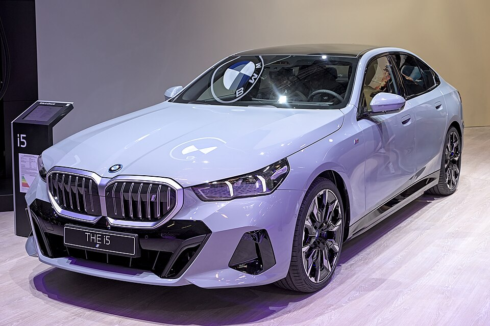

# BMW i5

*Bild: [BMW i5 IAA 2023 1X7A0105.jpg](https://commons.wikimedia.org/wiki/File:BMW_i5_IAA_2023_1X7A0105.jpg) · Urheber: Alexander-93 · Lizenz: CC BY-SA 4.0 · via Wikimedia Commons. Abgebildet ist die Messe-Präsentation 2023.*

> Elektrische Version des BMW 5er (G60/G61) als Limousine und Kombi (Touring), angetrieben durch eDrive der fünften Generation.

## Steckbrief

| Feld | Wert | Beleg |
|---|---|---|
| Hersteller | [[bmw\|BMW]] | [[tn-batterycheck-alle-daten]] |
| Segment | Obere Mittelklasse | Fachwissen¹ |
| Karosserie | Limousine, Kombi (Touring) | Fachwissen¹ |
| Bauzeit | seit 2023 | Fachwissen¹ |
| Plattform | CLAR (Mischplattform für Verbrenner und Elektro) | Fachwissen¹ |
| Varianten im Bestand | 6 | [[tn-batterycheck-alle-daten]] |
| [[bruttokapazitaet\|Bruttokapazität]] | 83,9 kWh | [[tn-batterycheck-alle-daten]] |
| [[nettokapazitaet\|Nettokapazität]] | 81,2 kWh | [[tn-batterycheck-alle-daten]] |
| [[batteriepuffer\|Puffer]] | 3,2 % | berechnet |

## Beschreibung

Der BMW i5 ist die batterieelektrische Ausführung der achten 5er-Generation. Verbrenner, Plug-in-Hybride und [[bev|Elektroauto]] laufen auf derselben CLAR-Plattform vom Band; die [[traktionsbatterie|Traktionsbatterie]] ist flach im Unterboden untergebracht.

Wie beim [[bmw-i4|i4]] und [[bmw-i7|i7]] kommen [[elektromotor|Elektromotoren]] der fünften eDrive-Generation zum Einsatz. Die Batterie ist für alle Versionen identisch; unterschiedlich sind Antrieb ([[hinterradantrieb|Hinterradantrieb]] oder [[allradantrieb|Allradantrieb]]) und Karosserie.

## Varianten und Batterien

Alle Varianten nutzen dieselbe Batterie mit 83,9/81,2 kWh. "eDrive40" steht für Hinterradantrieb, "xDrive40" für Allradantrieb, "M60" für die Topversion mit Allrad; "Touring" kennzeichnet den Kombi.

| Variante | Brutto | Netto | Puffer | Zeile |
|---|---|---|---|---|
| i5 eDrive40 | 83,9 kWh | 81,2 kWh | 2,7 kWh (3,2 %) | 56 |
| i5 eDrive40 Touring | 83,9 kWh | 81,2 kWh | 2,7 kWh (3,2 %) | 57 |
| i5 M60 xDrive | 83,9 kWh | 81,2 kWh | 2,7 kWh (3,2 %) | 58 |
| i5 M60 xDrive Touring | 83,9 kWh | 81,2 kWh | 2,7 kWh (3,2 %) | 59 |
| i5 xDrive40 | 83,9 kWh | 81,2 kWh | 2,7 kWh (3,2 %) | 60 |
| i5 xDrive40 Touring | 83,9 kWh | 81,2 kWh | 2,7 kWh (3,2 %) | 61 |

Quelle: [[tn-batterycheck-alle-daten]], Blatt „Fahrzeuge“, Zeilen 56–61 – bereinigte Fassung (Stand 2026-09-24, Änderungen in [[datenqualitaet]]). Puffer = Brutto − Netto (berechnet).

## Fachbegriffe

- [[typbezeichnungen|Typbezeichnungen]] — Wie Hersteller Leistungsstufe, Batterie und Antrieb in Modellnamen codieren – ein Lesehilfe-Artikel.
- [[hinterradantrieb|Hinterradantrieb (RWD)]] — Der Elektromotor treibt die Hinterräder an – Standard auf vielen reinen Elektroplattformen.
- [[allradantrieb|Allradantrieb (AWD)]] — Beide Achsen werden angetrieben, bei Elektroautos meist durch je einen eigenen Motor pro Achse.
- [[nettokapazitaet|Nettokapazität]] — Der Teil der Batteriekapazität, den der Fahrer tatsächlich nutzen kann – Grundlage für Reichweite und Batterietests.
- [[karosserieformen|Karosserieformen]] — Varianten der Aufbauform eines Modells – beeinflussen Aussehen und Luftwiderstand, meist nicht die Batterie.

## Verwandte Fahrzeuge

- [[bmw-i4|BMW i4]] — technisch verwandt / gleiche Plattform oder Batterie
- [[bmw-i7|BMW i7]] — technisch verwandt / gleiche Plattform oder Batterie
- [[bmw-ix3|BMW iX3]] — technisch verwandt / gleiche Plattform oder Batterie
- Weitere Modelle von BMW: [[bmw-i3|BMW i3]], [[bmw-ix|BMW iX]], [[bmw-ix1|BMW iX1]], [[bmw-ix2|BMW iX2]]

## Quellen

- [[tn-batterycheck-alle-daten]] — Brutto-/Nettokapazität aller Varianten (Zeilen 56–61)
- Weiterlesen: [Wikipedia – BMW i5](https://en.wikipedia.org/wiki/BMW_i5)

¹ *Beschreibung und Steckbrief-Felder ohne Quellseite beruhen auf allgemeinem Fachwissen des LLM (Stand 2026-09-24) und sind nicht durch eine Rohquelle im Bestand belegt. Zahlenwerte zur Batterie stammen aus der Rohquelle, bereinigt nach dem Protokoll in [[datenqualitaet]].*
