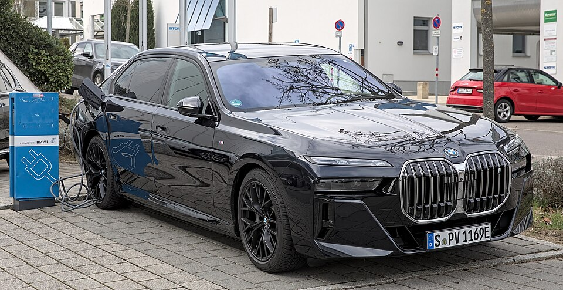

# BMW i7

*Bild: [BMW i7 xDrive60 1X7A6834.jpg](https://commons.wikimedia.org/wiki/File:BMW_i7_xDrive60_1X7A6834.jpg) · Urheber: Alexander-93 · Lizenz: CC BY-SA 4.0 · via Wikimedia Commons.*

> Elektrische Version der BMW 7er-Reihe (G70), eine Luxuslimousine mit der größten Batterie der CLAR-basierten BMW-Elektromodelle.

## Steckbrief

| Feld | Wert | Beleg |
|---|---|---|
| Hersteller | [[bmw\|BMW]] | [[tn-batterycheck-alle-daten]] |
| Segment | Oberklasse-Limousine | Fachwissen¹ |
| Karosserie | Limousine | Fachwissen¹ |
| Bauzeit | seit 2022 | Fachwissen¹ |
| Plattform | CLAR (Mischplattform für Verbrenner und Elektro) | Fachwissen¹ |
| Varianten im Bestand | 3 | [[tn-batterycheck-alle-daten]] |
| [[bruttokapazitaet\|Bruttokapazität]] | 105,7 kWh | [[tn-batterycheck-alle-daten]] |
| [[nettokapazitaet\|Nettokapazität]] | 101,7 kWh | [[tn-batterycheck-alle-daten]] |
| [[batteriepuffer\|Puffer]] | 3,8 % | berechnet |

## Beschreibung

Der BMW i7 ist die batterieelektrische Ausführung des 7er der Baureihe G70. Wie beim [[bmw-i5|i5]] teilt er Karosserie und Plattform mit Verbrenner- und Hybridversionen.

Die [[traktionsbatterie|Traktionsbatterie]] ist deutlich größer als bei i4 und i5 und hat einen vergleichsweise kleinen [[batteriepuffer|Batteriepuffer]]. Die eDrive50-Version hat [[hinterradantrieb|Hinterradantrieb]], xDrive60 und M70 [[allradantrieb|Allradantrieb]] mit zwei [[elektromotor|Elektromotoren]].

## Varianten und Batterien

Eine einzige Batterie mit 105,7/101,7 kWh für alle Varianten. "eDrive50" = Hinterradantrieb, "xDrive60" = Allradantrieb, "M70" = Topversion mit Allradantrieb.

| Variante | Brutto | Netto | Puffer | Zeile |
|---|---|---|---|---|
| i7 eDrive50 | 105,7 kWh | 101,7 kWh | 4 kWh (3,8 %) | 62 |
| i7 M70 | 105,7 kWh | 101,7 kWh | 4 kWh (3,8 %) | 63 |
| i7 xDrive60 | 105,7 kWh | 101,7 kWh | 4 kWh (3,8 %) | 64 |

Quelle: [[tn-batterycheck-alle-daten]], Blatt „Fahrzeuge“, Zeilen 62–64. Puffer = Brutto − Netto (berechnet).

## Fachbegriffe

- [[typbezeichnungen|Typbezeichnungen]] — Wie Hersteller Leistungsstufe, Batterie und Antrieb in Modellnamen codieren – ein Lesehilfe-Artikel.
- [[batteriepuffer|Batteriepuffer]] — Differenz zwischen Brutto- und Nettokapazität – eine Reserve, die die Batterie schont und Alterung ausgleicht.
- [[hinterradantrieb|Hinterradantrieb (RWD)]] — Der Elektromotor treibt die Hinterräder an – Standard auf vielen reinen Elektroplattformen.
- [[allradantrieb|Allradantrieb (AWD)]] — Beide Achsen werden angetrieben, bei Elektroautos meist durch je einen eigenen Motor pro Achse.
- [[nettokapazitaet|Nettokapazität]] — Der Teil der Batteriekapazität, den der Fahrer tatsächlich nutzen kann – Grundlage für Reichweite und Batterietests.

## Verwandte Fahrzeuge

- [[bmw-i5|BMW i5]] — technisch verwandt / gleiche Plattform oder Batterie
- [[bmw-i4|BMW i4]] — technisch verwandt / gleiche Plattform oder Batterie
- Weitere Modelle von BMW: [[bmw-i3|BMW i3]], [[bmw-ix|BMW iX]], [[bmw-ix1|BMW iX1]], [[bmw-ix2|BMW iX2]], [[bmw-ix3|BMW iX3]]

## Quellen

- [[tn-batterycheck-alle-daten]] — Brutto-/Nettokapazität aller Varianten (Zeilen 62–64)

¹ *Beschreibung und Steckbrief-Felder ohne Quellseite beruhen auf allgemeinem Fachwissen des LLM (Stand 2026-09-23) und sind nicht durch eine Rohquelle im Bestand belegt. Zahlenwerte zur Batterie stammen ausschließlich aus der Rohquelle.*
