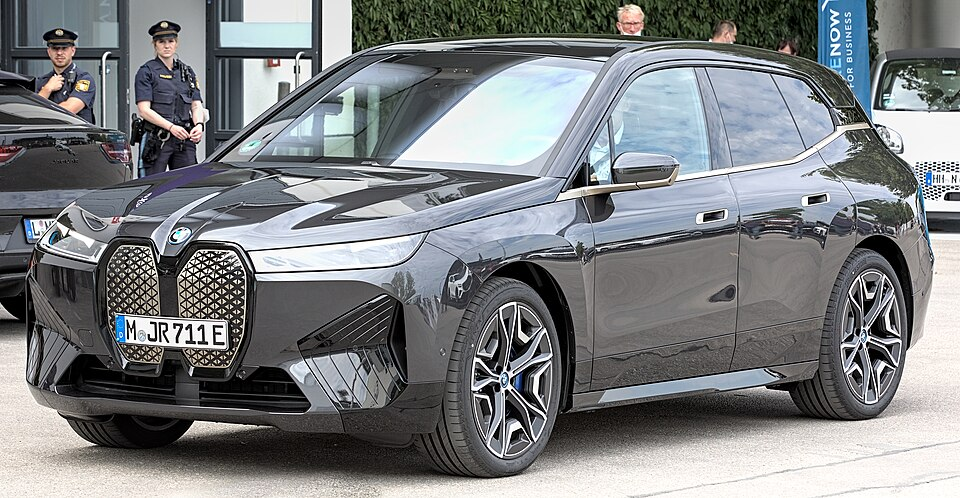

# BMW iX

*Bild: [BMW iX IAA 2021 1X7A0241.jpg](https://commons.wikimedia.org/wiki/File:BMW_iX_IAA_2021_1X7A0241.jpg) · Urheber: Alexander Migl · Lizenz: CC BY-SA 4.0 · via Wikimedia Commons.*

> Elektrisches Oberklasse-SUV von BMW mit eigenständiger Karosseriestruktur und Kohlefaser-Anteilen; Technologieträger der fünften eDrive-Generation.

## Steckbrief

| Feld | Wert | Beleg |
|---|---|---|
| Hersteller | [[bmw\|BMW]] | [[tn-batterycheck-alle-daten]] |
| Segment | Oberklasse-SUV | Fachwissen¹ |
| Karosserie | SUV | Fachwissen¹ |
| Bauzeit | seit 2021 | Fachwissen¹ |
| Plattform | Eigenständige Elektro-Architektur mit CFK-Rahmenstruktur (Carbon Cage) | Fachwissen¹ |
| Varianten im Bestand | 6 | [[tn-batterycheck-alle-daten]] |
| [[bruttokapazitaet\|Bruttokapazität]] | 76,6–111,5 kWh | [[tn-batterycheck-alle-daten]] |
| [[nettokapazitaet\|Nettokapazität]] | 71–109,1 kWh | [[tn-batterycheck-alle-daten]] |
| [[batteriepuffer\|Puffer]] | 2,2–7,3 % | berechnet |

## Beschreibung

Der BMW iX wurde als reines [[bev|Elektroauto]] entwickelt und nicht von einem Verbrennermodell abgeleitet. Die Karosserie kombiniert Aluminium mit Bauteilen aus kohlefaserverstärktem Kunststoff. Alle Versionen haben zwei [[elektromotor|Elektromotoren]] und [[allradantrieb|Allradantrieb]].

Die [[traktionsbatterie|Traktionsbatterie]] basiert auf prismatischen [[nmc-zellchemie|NMC-Zellen]] und wurde in mehreren Größen angeboten. Mit der [[modellpflege|Modellpflege]] 2025 hat BMW die Modellbezeichnungen und Batterien neu geordnet: aus xDrive40/xDrive50/M60 wurden xDrive45/xDrive60/M70.

## Varianten und Batterien

Vor der Modellpflege: xDrive40 (76,6 kWh brutto), xDrive50 und M60 (111,5 kWh brutto). Nach der Modellpflege: xDrive45 (100,6/94,8 kWh), xDrive60 und M70 (111,5 kWh brutto). Die Zahl ist eine Leistungsklasse, nicht die Kapazität. Vor dem Facelift (2021–2025) haben xDrive50 und M60 laut BMW 105,2 kWh netto; nach dem Facelift 2025 nennt BMW 109,1 kWh (xDrive60) bzw. 108,9 kWh (M70) netto. Die Rohquelle hatte für xDrive40, xDrive50 und M60 zu hohe Nettowerte (korrigiert).

| Variante | Brutto | Netto | Puffer | Zeile | Status |
|---|---|---|---|---|---|
| iX M60 | 111,5 kWh | 105,2 kWh | 6,3 kWh (5,7 %) | 65 | korrigiert ([#9](https://github.com/Thitronik01/Frank-Repo/issues/9)) |
| iX M70 | 111,5 kWh | 108,9 kWh | 2,6 kWh (2,3 %) | 66 | bestätigt |
| iX xDrive40 | 76,6 kWh | 71 kWh | 5,6 kWh (7,3 %) | 67 | korrigiert ([#9](https://github.com/Thitronik01/Frank-Repo/issues/9)) |
| iX xDrive45 | 100,6 kWh | 94,8 kWh | 5,8 kWh (5,8 %) | 68 | bestätigt |
| iX xDrive50 | 111,5 kWh | 105,2 kWh | 6,3 kWh (5,7 %) | 69 | korrigiert ([#9](https://github.com/Thitronik01/Frank-Repo/issues/9)) |
| iX xDrive60 | 111,5 kWh | 109,1 kWh | 2,4 kWh (2,2 %) | 70 | bestätigt |

Quelle: [[tn-batterycheck-alle-daten]], Blatt „Fahrzeuge“, Zeilen 65–70 – bereinigte Fassung (Stand 2026-09-24, Änderungen in [[datenqualitaet]]). Puffer = Brutto − Netto (berechnet).

## Korrekturen

- **Zeile 65 korrigiert:** „iX M60“ 111,5 kWh / 107,7 kWh → 111,5 kWh / 105,2 kWh. Laut BMW-Datenblatt und ev-database hat der iX M60 111,5 / 105,2 kWh. Beleg: [Quelle 1](https://ev-database.org/uk/car/1590/BMW-iX-M60), [Quelle 2](https://www.press.bmwgroup.com/asia/article/attachment/T0334029EN/481303). Issue [#9](https://github.com/Thitronik01/Frank-Repo/issues/9).
- **Zeile 67 korrigiert:** „iX xDrive40“ 76,6 kWh / 74,4 kWh → 76,6 kWh / 71 kWh. Laut BMW-Datenblatt (06/2021) hat der iX xDrive40 76,6 / 71,0 kWh. Beleg: [Quelle 1](https://www.press.bmwgroup.com/asia/article/attachment/T0334029EN/481303), [Quelle 2](https://ev-database.org/uk/car/1472/BMW-iX-xDrive-40). Issue [#9](https://github.com/Thitronik01/Frank-Repo/issues/9).
- **Zeile 69 korrigiert:** „iX xDrive50“ 111,5 kWh / 109,4 kWh → 111,5 kWh / 105,2 kWh. Laut BMW-Datenblatt (06/2021) hat der iX xDrive50 111,5 / 105,2 kWh. Beleg: [Quelle 1](https://www.press.bmwgroup.com/asia/article/attachment/T0334029EN/481303). Issue [#9](https://github.com/Thitronik01/Frank-Repo/issues/9).

Gegenüber der Rohquelle geändert am 2026-09-24; vollständiges Protokoll in [[datenqualitaet]].

## Fachbegriffe

- [[allradantrieb|Allradantrieb (AWD)]] — Beide Achsen werden angetrieben, bei Elektroautos meist durch je einen eigenen Motor pro Achse.
- [[modellpflege|Modellpflege (Facelift)]] — Überarbeitung eines Modells während der Bauzeit – bei Elektroautos oft mit neuer Batterie.
- [[typbezeichnungen|Typbezeichnungen]] — Wie Hersteller Leistungsstufe, Batterie und Antrieb in Modellnamen codieren – ein Lesehilfe-Artikel.
- [[nettokapazitaet|Nettokapazität]] — Der Teil der Batteriekapazität, den der Fahrer tatsächlich nutzen kann – Grundlage für Reichweite und Batterietests.
- [[batteriepuffer|Batteriepuffer]] — Differenz zwischen Brutto- und Nettokapazität – eine Reserve, die die Batterie schont und Alterung ausgleicht.
- [[nmc-zellchemie|NMC-Zellchemie]] — Lithium-Ionen-Zellen mit Kathode aus Nickel, Mangan und Kobalt – hohe Energiedichte, Standard in den meisten Fahrzeugen des Bestands.

## Verwandte Fahrzeuge

- [[bmw-i7|BMW i7]] — technisch verwandt / gleiche Plattform oder Batterie
- Weitere Modelle von BMW: [[bmw-i3|BMW i3]], [[bmw-i4|BMW i4]], [[bmw-i5|BMW i5]], [[bmw-ix1|BMW iX1]], [[bmw-ix2|BMW iX2]], [[bmw-ix3|BMW iX3]]

## Quellen

- [[tn-batterycheck-alle-daten]] — Brutto-/Nettokapazität aller Varianten (Zeilen 65–70)
- Weiterlesen: [Wikipedia – BMW iX](https://en.wikipedia.org/wiki/BMW_iX)

¹ *Beschreibung und Steckbrief-Felder ohne Quellseite beruhen auf allgemeinem Fachwissen des LLM (Stand 2026-09-24) und sind nicht durch eine Rohquelle im Bestand belegt. Zahlenwerte zur Batterie stammen aus der Rohquelle, bereinigt nach dem Protokoll in [[datenqualitaet]].*
