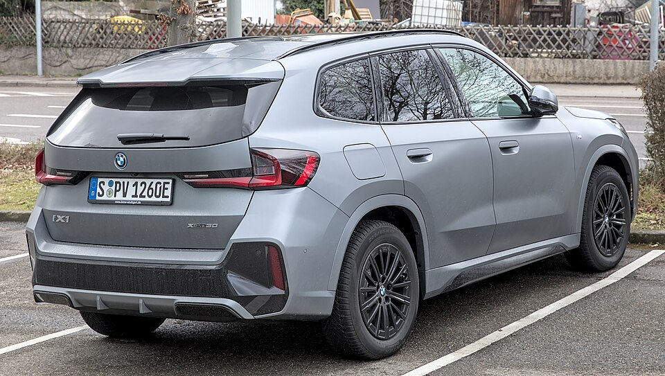

# BMW iX1

*Bild: [BMW iX1 1X7A6827.jpg](https://commons.wikimedia.org/wiki/File:BMW_iX1_1X7A6827.jpg) · Urheber: Alexander-93 · Lizenz: CC BY-SA 4.0 · via Wikimedia Commons.*

> Elektrisches Kompakt-SUV von BMW (U11), die batterieelektrische Variante des X1; teilt die Technik mit iX2 und Mini Countryman E/SE.

## Steckbrief

| Feld | Wert | Beleg |
|---|---|---|
| Hersteller | [[bmw\|BMW]] | [[tn-batterycheck-alle-daten]] |
| Segment | Kompakt-SUV | Fachwissen¹ |
| Karosserie | SUV | Fachwissen¹ |
| Bauzeit | seit 2022 | Fachwissen¹ |
| Plattform | FAAR (Frontantriebs-Architektur für Verbrenner und Elektro) | Fachwissen¹ |
| Varianten im Bestand | 2 | [[tn-batterycheck-alle-daten]] |
| [[bruttokapazitaet\|Bruttokapazität]] | 66,5 kWh | [[tn-batterycheck-alle-daten]] |
| [[nettokapazitaet\|Nettokapazität]] | 64,7 kWh | [[tn-batterycheck-alle-daten]] |
| [[batteriepuffer\|Puffer]] | 2,7 % | berechnet |

## Beschreibung

Der BMW iX1 basiert auf der FAAR-Plattform, einer Mischplattform für Fahrzeuge mit quer eingebautem Antrieb, die BMW für Verbrenner, Plug-in-Hybride und Elektroautos nutzt. Er ist das elektrische Gegenstück zum X1 und ein [[plattform-geschwister|Plattform-Geschwister]] von [[bmw-ix2|iX2]] und [[mini-countryman-electric|Mini Countryman E/SE]].

Der eDrive20 hat [[frontantrieb|Frontantrieb]], der xDrive30 zwei [[elektromotor|Elektromotoren]] und [[allradantrieb|Allradantrieb]]. Beide nutzen dieselbe [[traktionsbatterie|Traktionsbatterie]] mit kleinem [[batteriepuffer|Batteriepuffer]].

## Varianten und Batterien

Beide Varianten haben die Batterie mit 66,5/64,7 kWh; sie unterscheiden sich nur im Antrieb (eDrive20 = Frontantrieb, xDrive30 = Allradantrieb).

| Variante | Brutto | Netto | Puffer | Zeile |
|---|---|---|---|---|
| iX1 eDrive20 | 66,5 kWh | 64,7 kWh | 1,8 kWh (2,7 %) | 71 |
| iX1 xDrive30 | 66,5 kWh | 64,7 kWh | 1,8 kWh (2,7 %) | 72 |

Quelle: [[tn-batterycheck-alle-daten]], Blatt „Fahrzeuge“, Zeilen 71–72 – bereinigte Fassung (Stand 2026-09-24, Änderungen in [[datenqualitaet]]). Puffer = Brutto − Netto (berechnet).

## Fachbegriffe

- [[frontantrieb|Frontantrieb (FWD)]] — Der Elektromotor treibt die Vorderräder an – typisch für Kleinwagen und Konversionsfahrzeuge.
- [[allradantrieb|Allradantrieb (AWD)]] — Beide Achsen werden angetrieben, bei Elektroautos meist durch je einen eigenen Motor pro Achse.
- [[plattform-geschwister|Plattform-Geschwister (Badge-Engineering)]] — Fahrzeuge verschiedener Marken, die technisch weitgehend baugleich sind und dieselbe Batterie nutzen.
- [[batteriepuffer|Batteriepuffer]] — Differenz zwischen Brutto- und Nettokapazität – eine Reserve, die die Batterie schont und Alterung ausgleicht.
- [[typbezeichnungen|Typbezeichnungen]] — Wie Hersteller Leistungsstufe, Batterie und Antrieb in Modellnamen codieren – ein Lesehilfe-Artikel.

## Verwandte Fahrzeuge

- [[bmw-ix2|BMW iX2]] — technisch verwandt / gleiche Plattform oder Batterie
- [[mini-countryman-electric|Mini Countryman E / SE]] — technisch verwandt / gleiche Plattform oder Batterie
- Weitere Modelle von BMW: [[bmw-i3|BMW i3]], [[bmw-i4|BMW i4]], [[bmw-i5|BMW i5]], [[bmw-i7|BMW i7]], [[bmw-ix|BMW iX]], [[bmw-ix3|BMW iX3]]

## Quellen

- [[tn-batterycheck-alle-daten]] — Brutto-/Nettokapazität aller Varianten (Zeilen 71–72)

¹ *Beschreibung und Steckbrief-Felder ohne Quellseite beruhen auf allgemeinem Fachwissen des LLM (Stand 2026-09-24) und sind nicht durch eine Rohquelle im Bestand belegt. Zahlenwerte zur Batterie stammen aus der Rohquelle, bereinigt nach dem Protokoll in [[datenqualitaet]].*
