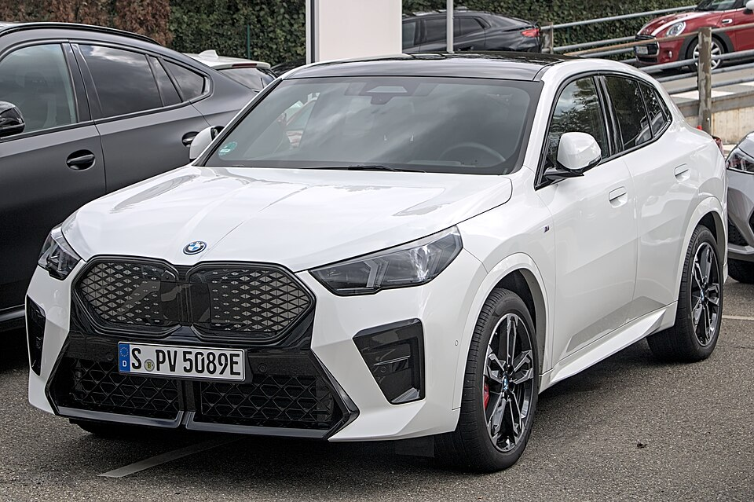

# BMW iX2

*Bild: [BMW iX2 xDrive30 IMG 1811.jpg](https://commons.wikimedia.org/wiki/File:BMW_iX2_xDrive30_IMG_1811.jpg) · Urheber: Alexander-93 · Lizenz: CC BY-SA 4.0 · via Wikimedia Commons.*

> Elektrisches SUV-Coupé von BMW (U10), die batterieelektrische Variante des X2, technisch identisch mit dem iX1.

## Steckbrief

| Feld | Wert | Beleg |
|---|---|---|
| Hersteller | [[bmw\|BMW]] | [[tn-batterycheck-alle-daten]] |
| Segment | Kompakt-SUV | Fachwissen¹ |
| Karosserie | SUV-Coupé | Fachwissen¹ |
| Bauzeit | seit 2024 | Fachwissen¹ |
| Plattform | FAAR (Frontantriebs-Architektur für Verbrenner und Elektro) | Fachwissen¹ |
| Varianten im Bestand | 2 | [[tn-batterycheck-alle-daten]] |
| [[bruttokapazitaet\|Bruttokapazität]] | 66,5 kWh | [[tn-batterycheck-alle-daten]] |
| [[nettokapazitaet\|Nettokapazität]] | 64,7 kWh | [[tn-batterycheck-alle-daten]] |
| [[batteriepuffer\|Puffer]] | 2,7 % | berechnet |

## Beschreibung

Der BMW iX2 ist die flachere Coupé-Variante des [[bmw-ix1|iX1]] und teilt mit ihm Plattform, Batterie und Antriebe. Weitere [[plattform-geschwister|Plattform-Geschwister]] sind die Elektroversionen des [[mini-countryman-electric|Mini Countryman]].

Die [[traktionsbatterie|Traktionsbatterie]] ist für alle Versionen gleich. Der eDrive20 hat [[frontantrieb|Frontantrieb]], der xDrive30 [[allradantrieb|Allradantrieb]].

## Varianten und Batterien

Beide Zeilen nutzen die Batterie mit 66,5/64,7 kWh; die Bezeichnung gibt Antrieb und Leistungsklasse an.

| Variante | Brutto | Netto | Puffer | Zeile |
|---|---|---|---|---|
| iX2 eDrive20 | 66,5 kWh | 64,7 kWh | 1,8 kWh (2,7 %) | 73 |
| iX2 eDrive30 | 66,5 kWh | 64,7 kWh | 1,8 kWh (2,7 %) | 74 |

Quelle: [[tn-batterycheck-alle-daten]], Blatt „Fahrzeuge“, Zeilen 73–74. Puffer = Brutto − Netto (berechnet).

## Fachbegriffe

- [[frontantrieb|Frontantrieb (FWD)]] — Der Elektromotor treibt die Vorderräder an – typisch für Kleinwagen und Konversionsfahrzeuge.
- [[allradantrieb|Allradantrieb (AWD)]] — Beide Achsen werden angetrieben, bei Elektroautos meist durch je einen eigenen Motor pro Achse.
- [[plattform-geschwister|Plattform-Geschwister (Badge-Engineering)]] — Fahrzeuge verschiedener Marken, die technisch weitgehend baugleich sind und dieselbe Batterie nutzen.
- [[karosserieformen|Karosserieformen]] — Varianten der Aufbauform eines Modells – beeinflussen Aussehen und Luftwiderstand, meist nicht die Batterie.
- [[typbezeichnungen|Typbezeichnungen]] — Wie Hersteller Leistungsstufe, Batterie und Antrieb in Modellnamen codieren – ein Lesehilfe-Artikel.

## Verwandte Fahrzeuge

- [[bmw-ix1|BMW iX1]] — technisch verwandt / gleiche Plattform oder Batterie
- [[mini-countryman-electric|Mini Countryman E / SE]] — technisch verwandt / gleiche Plattform oder Batterie
- Weitere Modelle von BMW: [[bmw-i3|BMW i3]], [[bmw-i4|BMW i4]], [[bmw-i5|BMW i5]], [[bmw-i7|BMW i7]], [[bmw-ix|BMW iX]], [[bmw-ix3|BMW iX3]]

## Offene Punkte

- Zeile 74 lautet "iX2 eDrive30"; üblich ist beim iX2 die Bezeichnung xDrive30 (Allradantrieb). Wahrscheinlich Schreibfehler.

Siehe auch [[datenqualitaet]].

## Quellen

- [[tn-batterycheck-alle-daten]] — Brutto-/Nettokapazität aller Varianten (Zeilen 73–74)

¹ *Beschreibung und Steckbrief-Felder ohne Quellseite beruhen auf allgemeinem Fachwissen des LLM (Stand 2026-09-23) und sind nicht durch eine Rohquelle im Bestand belegt. Zahlenwerte zur Batterie stammen ausschließlich aus der Rohquelle.*
