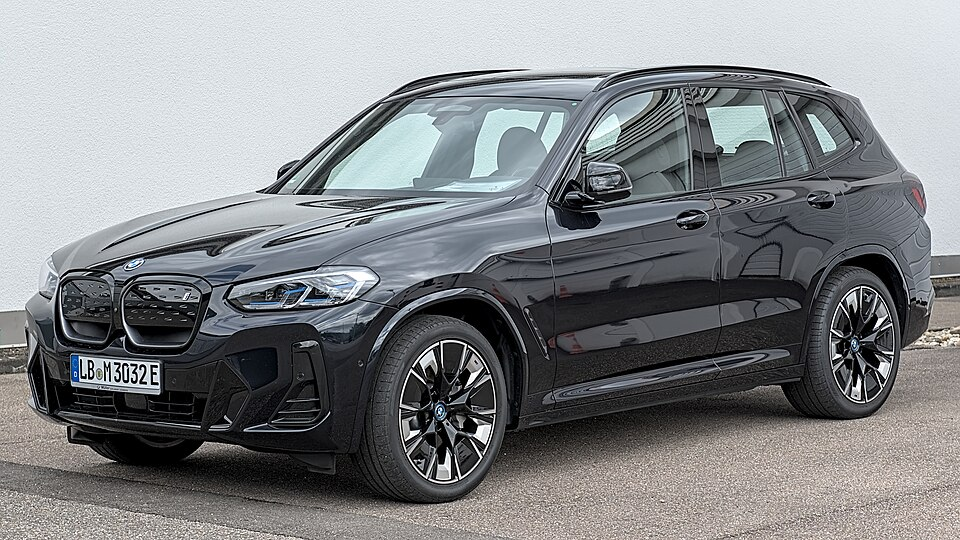

# BMW iX3

*Bild: [BMW iX3 G08 FL DSC 9318.jpg](https://commons.wikimedia.org/wiki/File:BMW_iX3_G08_FL_DSC_9318.jpg) · Urheber: Alexander Migl · Lizenz: CC BY-SA 4.0 · via Wikimedia Commons.*

> Elektrische Variante des BMW X3 der Baureihe G08, gebaut in China; erstes Modell mit eDrive der fünften Generation.

## Steckbrief

| Feld | Wert | Beleg |
|---|---|---|
| Hersteller | [[bmw\|BMW]] | [[tn-batterycheck-alle-daten]] |
| Segment | Mittelklasse-SUV | Fachwissen¹ |
| Karosserie | SUV | Fachwissen¹ |
| Plattform | CLAR (Mischplattform für Verbrenner und Elektro) | Fachwissen¹ |
| Varianten im Bestand | 1 | [[tn-batterycheck-alle-daten]] |
| [[bruttokapazitaet\|Bruttokapazität]] | 80 kWh | [[tn-batterycheck-alle-daten]] |
| [[nettokapazitaet\|Nettokapazität]] | 73,83 kWh | [[tn-batterycheck-alle-daten]] |
| [[batteriepuffer\|Puffer]] | 7,7 % | berechnet |

## Beschreibung

Der BMW iX3 (G08) ist die batterieelektrische Ausführung des X3 und damit ein [[konversionsfahrzeug|Konversionsfahrzeug]] auf der CLAR-Plattform. Er wurde im chinesischen Werk Shenyang gebaut und von dort auch nach Europa exportiert.

Mit dem iX3 führte BMW die fünfte eDrive-Generation ein: [[elektromotor|Elektromotor]], Leistungselektronik und Getriebe sind in einem Gehäuse integriert, der Motor kommt ohne Seltene Erden aus. Das Fahrzeug hat [[hinterradantrieb|Hinterradantrieb]].

Der Name iX3 wurde später für ein Modell der Neuen Klasse wiederverwendet, das technisch nicht mit dem G08 verwandt ist; die Rohdaten beziehen sich auf den G08.

## Varianten und Batterien

Nur eine Zeile: iX3 mit 80/73,83 kWh. Es gab für den G08 nur eine Batterie- und Antriebsvariante.

| Variante | Brutto | Netto | Puffer | Zeile |
|---|---|---|---|---|
| iX3 | 80 kWh | 73,83 kWh | 6,17 kWh (7,7 %) | 75 |

Quelle: [[tn-batterycheck-alle-daten]], Blatt „Fahrzeuge“, Zeilen 75 – bereinigte Fassung (Stand 2026-09-24, Änderungen in [[datenqualitaet]]). Puffer = Brutto − Netto (berechnet).

## Fachbegriffe

- [[konversionsfahrzeug|Konversionsfahrzeug]] — Elektroauto, das von einem Modell mit Verbrennungsmotor abgeleitet ist, statt auf einer reinen Elektroplattform zu basieren.
- [[hinterradantrieb|Hinterradantrieb (RWD)]] — Der Elektromotor treibt die Hinterräder an – Standard auf vielen reinen Elektroplattformen.
- [[elektromotor|Elektromotor (PSM / ASM / FSM)]] — Antriebsmaschine eines Elektroautos; verbreitet sind permanenterregte Synchron-, Asynchron- und fremderregte Synchronmotoren.
- [[bruttokapazitaet|Bruttokapazität]] — Die gesamte, physikalisch in der Batterie verbaute Energiemenge – inklusive der Reserven, die der Fahrer nie nutzen kann.
- [[nettokapazitaet|Nettokapazität]] — Der Teil der Batteriekapazität, den der Fahrer tatsächlich nutzen kann – Grundlage für Reichweite und Batterietests.

## Verwandte Fahrzeuge

- [[bmw-i4|BMW i4]] — technisch verwandt / gleiche Plattform oder Batterie
- [[bmw-i5|BMW i5]] — technisch verwandt / gleiche Plattform oder Batterie
- Weitere Modelle von BMW: [[bmw-i3|BMW i3]], [[bmw-i7|BMW i7]], [[bmw-ix|BMW iX]], [[bmw-ix1|BMW iX1]], [[bmw-ix2|BMW iX2]]

## Offene Punkte

- Nettowert mit zwei Nachkommastellen (73,83 kWh) – ungewöhnlich präzise im Vergleich zu den übrigen Einträgen.
- Bauzeit des G08 nicht sicher belegt (ca. ab 2020); der neue iX3 der Neuen Klasse fehlt in den Daten.

Siehe auch [[datenqualitaet]].

## Quellen

- [[tn-batterycheck-alle-daten]] — Brutto-/Nettokapazität aller Varianten (Zeilen 75)

¹ *Beschreibung und Steckbrief-Felder ohne Quellseite beruhen auf allgemeinem Fachwissen des LLM (Stand 2026-09-24) und sind nicht durch eine Rohquelle im Bestand belegt. Zahlenwerte zur Batterie stammen aus der Rohquelle, bereinigt nach dem Protokoll in [[datenqualitaet]].*
