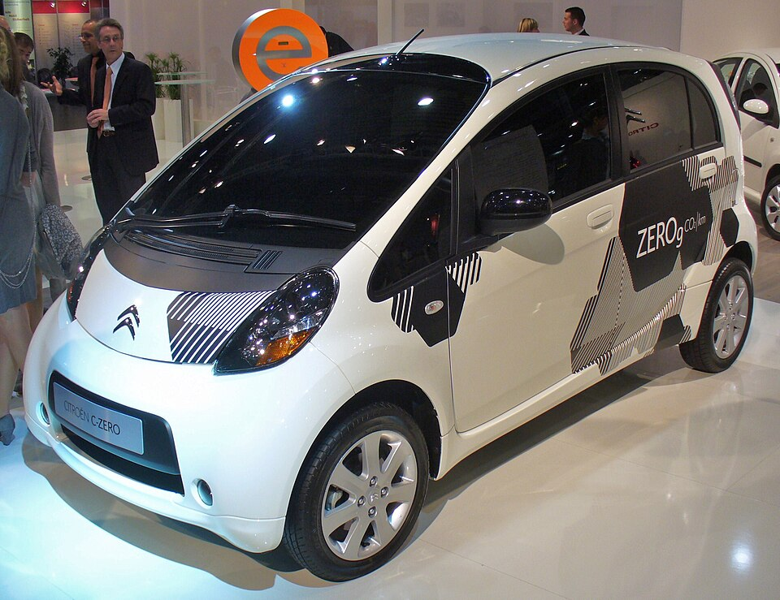

# Citroën C-Zero

*Bild: [Citroen C-Zero.JPG](https://commons.wikimedia.org/wiki/File:Citroen_C-Zero.JPG) · Urheber: Thomas doerfer · Lizenz: CC BY 3.0 · via Wikimedia Commons.*

> Elektrischer Kleinstwagen von Citroën, der als Schwestermodell des Mitsubishi i-MiEV bei Mitsubishi in Japan gebaut wurde.

## Steckbrief

| Feld | Wert | Beleg |
|---|---|---|
| Hersteller | [[citroen\|Citroën]] | [[tn-batterycheck-alle-daten]] |
| Segment | Kleinstwagen | Fachwissen¹ |
| Karosserie | Schrägheck, fünftürig | Fachwissen¹ |
| Bauzeit | 2010–2020 | Fachwissen¹ |
| Plattform | Mitsubishi i-MiEV (abgeleitet vom Kei-Car Mitsubishi i) | Fachwissen¹ |
| Varianten im Bestand | 1 | [[tn-batterycheck-alle-daten]] |
| [[bruttokapazitaet\|Bruttokapazität]] | 16 kWh | [[tn-batterycheck-alle-daten]] |
| [[nettokapazitaet\|Nettokapazität]] | 14,5 kWh | [[tn-batterycheck-alle-daten]] |
| [[batteriepuffer\|Puffer]] | 9,4 % | berechnet |

## Beschreibung

Der Citroën C-Zero gehört zu den ersten in Großserie angebotenen Elektroautos in Europa. Er entstand aus einer Kooperation des damaligen PSA-Konzerns mit Mitsubishi: Technik, Karosserie und Fertigung stammen vom Mitsubishi i-MiEV, Citroën steuerte im Wesentlichen Markenzeichen und Ausstattungsdetails bei. Baugleich ist der [[peugeot-ion|Peugeot iOn]]; man spricht hier von [[plattform-geschwister|Plattform-Geschwistern]] bzw. Badge-Engineering.

Das Fahrzeug basiert auf dem japanischen Kleinstwagen Mitsubishi i, dessen Heckmotor-Layout für den [[elektromotor|Elektromotor]] übernommen wurde; angetrieben werden die Hinterräder ([[hinterradantrieb|Hinterradantrieb]]). Die [[traktionsbatterie|Traktionsbatterie]] aus [[lithium-ionen-akku|Lithium-Ionen-Zellen]] liegt flach im Unterboden.

Mit seiner kleinen Batterie ist der C-Zero auf Stadt- und Pendelverkehr ausgelegt. Für heutige Gebrauchtwagenkäufer ist wegen des Alters vor allem die [[batteriealterung|Batteriealterung]] relevant; ein [[batteriecheck|Batteriecheck]] mit Ermittlung des [[state-of-health|State of Health]] ist bei diesen Fahrzeugen besonders empfehlenswert.

## Varianten und Batterien

Die Rohdaten enthalten nur eine Zeile (C-Zero) mit 16 kWh [[bruttokapazitaet|brutto]] und 14,5 kWh [[nettokapazitaet|netto]]. Eine Unterscheidung nach Baujahren oder Batteriegenerationen ist in den Daten nicht abgebildet; dieselben Werte finden sich beim baugleichen [[peugeot-ion|Peugeot iOn]].

| Variante | Brutto | Netto | Puffer | Zeile |
|---|---|---|---|---|
| C-Zero | 16 kWh | 14,5 kWh | 1,5 kWh (9,4 %) | 76 |

Quelle: [[tn-batterycheck-alle-daten]], Blatt „Fahrzeuge“, Zeilen 76 – bereinigte Fassung (Stand 2026-09-24, Änderungen in [[datenqualitaet]]). Puffer = Brutto − Netto (berechnet).

## Fachbegriffe

- [[plattform-geschwister|Plattform-Geschwister (Badge-Engineering)]] — Fahrzeuge verschiedener Marken, die technisch weitgehend baugleich sind und dieselbe Batterie nutzen.
- [[traktionsbatterie|Traktionsbatterie]] — Der Hochvolt-Energiespeicher, der den Elektromotor eines Elektroautos versorgt.
- [[lithium-ionen-akku|Lithium-Ionen-Akku]] — Wiederaufladbare Batterietechnik, bei der Lithium-Ionen zwischen Anode und Kathode wandern – Standard in allen Fahrzeugen dieses Wikis.
- [[hinterradantrieb|Hinterradantrieb (RWD)]] — Der Elektromotor treibt die Hinterräder an – Standard auf vielen reinen Elektroplattformen.
- [[batteriealterung|Batteriealterung (Degradation)]] — Allmählicher Kapazitäts- und Leistungsverlust einer Lithium-Ionen-Batterie über Zeit und Nutzung.
- [[state-of-health|State of Health (SoH)]] — Gesundheitszustand der Batterie: verbleibende Kapazität im Verhältnis zur Neu-Kapazität, in Prozent.
- [[bruttokapazitaet|Bruttokapazität]] — Die gesamte, physikalisch in der Batterie verbaute Energiemenge – inklusive der Reserven, die der Fahrer nie nutzen kann.
- [[nettokapazitaet|Nettokapazität]] — Der Teil der Batteriekapazität, den der Fahrer tatsächlich nutzen kann – Grundlage für Reichweite und Batterietests.

## Verwandte Fahrzeuge

- [[peugeot-ion|Peugeot iOn]] — technisch verwandt / gleiche Plattform oder Batterie
- Weitere Modelle von Citroën: [[citroen-e-berlingo|Citroën ë-Berlingo]], [[citroen-e-c3|Citroën ë-C3]], [[citroen-e-c3-aircross|Citroën ë-C3 Aircross]], [[citroen-e-c4|Citroën ë-C4]], [[citroen-e-c4-x|Citroën ë-C4 X]], [[citroen-e-jumpy|Citroën ë-Jumpy Combi]], [[citroen-e-spacetourer|Citroën ë-SpaceTourer]]

## Offene Punkte

- In der Literatur werden für i-MiEV/C-Zero/iOn je nach Baujahr sowohl 16 kWh als auch 14,5 kWh als Gesamtkapazität genannt. Möglicherweise ist der Wert 14,5 kWh keine Nettokapazität, sondern die Bruttokapazität einer späteren Batterieversion – bitte prüfen.

Siehe auch [[datenqualitaet]].

## Quellen

- [[tn-batterycheck-alle-daten]] — Brutto-/Nettokapazität aller Varianten (Zeilen 76)
- Weiterlesen: [Wikipedia – Citroën C-Zero](https://en.wikipedia.org/wiki/Citroën_C-Zero)

¹ *Beschreibung und Steckbrief-Felder ohne Quellseite beruhen auf allgemeinem Fachwissen des LLM (Stand 2026-09-24) und sind nicht durch eine Rohquelle im Bestand belegt. Zahlenwerte zur Batterie stammen aus der Rohquelle, bereinigt nach dem Protokoll in [[datenqualitaet]].*
