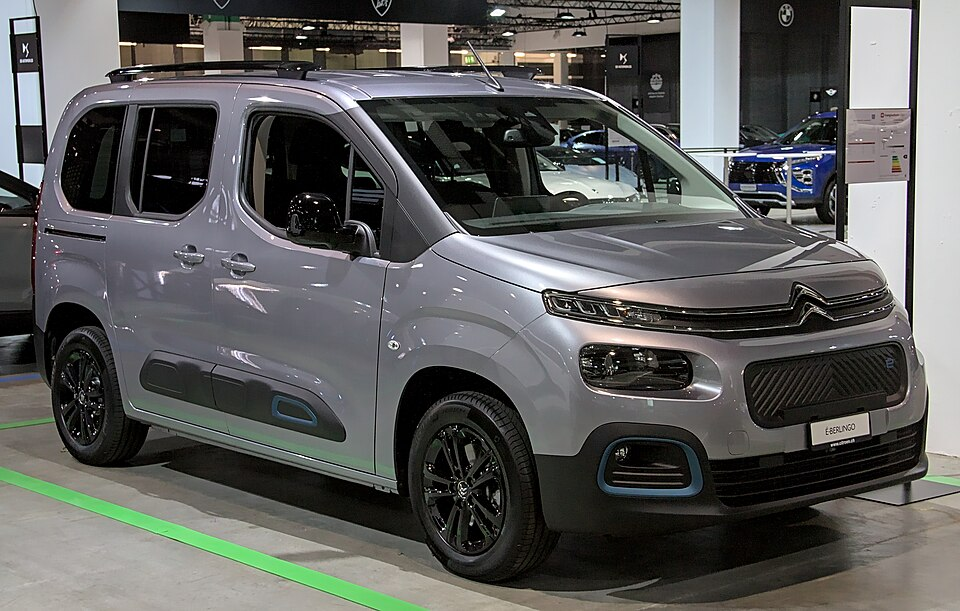

# Citroën ë-Berlingo

*Bild: [Citroen e-Berlingo Auto Zuerich 2021 IMG 0097.jpg](https://commons.wikimedia.org/wiki/File:Citroen_e-Berlingo_Auto_Zuerich_2021_IMG_0097.jpg) · Urheber: Alexander Migl · Lizenz: CC BY-SA 4.0 · via Wikimedia Commons.*

> Elektrischer Hochdachkombi von Citroën auf Stellantis-Technik; die Modellreihe umfasst hier auch den älteren Berlingo mit kleiner Batterie.

## Steckbrief

| Feld | Wert | Beleg |
|---|---|---|
| Hersteller | [[citroen\|Citroën]] | [[tn-batterycheck-alle-daten]] |
| Segment | Hochdachkombi / Kleintransporter | Fachwissen¹ |
| Karosserie | Hochdachkombi (Van), kurze und lange Version | Fachwissen¹ |
| Plattform | EMP2 (K9-Baureihe) für den aktuellen ë-Berlingo; Vorgänger auf Basis des Berlingo der zweiten Generation | Fachwissen¹ |
| Varianten im Bestand | 5 | [[tn-batterycheck-alle-daten]] |
| [[bruttokapazitaet\|Bruttokapazität]] | 22,5–52 kWh | [[tn-batterycheck-alle-daten]] |
| [[nettokapazitaet\|Nettokapazität]] | 20,5–50 kWh | [[tn-batterycheck-alle-daten]] |
| [[batteriepuffer\|Puffer]] | 3,8–8,9 % | berechnet |

## Beschreibung

Der Citroën ë-Berlingo ist die batterieelektrische Version des Hochdachkombis Berlingo. Die aktuelle Generation (Baureihe K9) teilt sich Technik und Karosserie mit dem [[peugeot-e-rifter|Peugeot e-Rifter]] und dem [[peugeot-e-partner|Peugeot e-Partner]] sowie weiteren Stellantis-Marken; sie ist ein typisches Beispiel für [[plattform-geschwister|Plattform-Geschwister]] innerhalb der [[plattform-stellantis|Stellantis-Plattformen]]. Die Plattform ist als Multi-Energie-Plattform ausgelegt, d. h. dieselbe Karosserie wird auch mit Verbrennungsmotor angeboten.

Antriebsseitig nutzt der ë-Berlingo den aus dem Pkw-Bereich bekannten Stellantis-Baukasten mit [[elektromotor|Elektromotor]] an der Vorderachse ([[frontantrieb|Frontantrieb]]) und einer [[traktionsbatterie|Traktionsbatterie]] im Unterboden. Mit der [[modellpflege|Modellpflege]] wurde eine neuere Batterieversion eingeführt, die in den Rohdaten als eigene Zeile erscheint.

Unter demselben Slug sind außerdem Daten des älteren Berlingo mit Elektroantrieb erfasst, der noch auf der Vorgängergeneration beruhte und eine deutlich kleinere Batterie hatte. Dieses frühere Modell war ein [[konversionsfahrzeug|Konversionsfahrzeug]] auf Basis eines Verbrennermodells; sein Gegenstück bei Peugeot ist der [[peugeot-partner-tepee-electric|Partner Tepee Electric]].

## Varianten und Batterien

„M“ und „XL“ bezeichnen die beiden Karosserielängen des aktuellen ë-Berlingo. Beide gibt es in den Rohdaten jeweils mit 50 kWh brutto / 46,3 kWh netto (ursprüngliche Batterie) und mit 52 kWh brutto / 50,0 kWh netto (neuere Batterie nach der [[modellpflege|Modellpflege]]). Die Zeile „E-Berlingo Multispace“ mit 22,5 kWh gehört dagegen zur älteren Generation des elektrischen Berlingo und entspricht dem [[peugeot-partner-tepee-electric|Peugeot Partner Tepee Electric]].

| Variante | Brutto | Netto | Puffer | Zeile |
|---|---|---|---|---|
| E-Berlingo Multispace | 22,5 kWh | 20,5 kWh | 2 kWh (8,9 %) | 79 |
| ë-Berlingo M | 50 kWh | 46,3 kWh | 3,7 kWh (7,4 %) | 77 |
| ë-Berlingo M | 52 kWh | 50 kWh | 2 kWh (3,8 %) | 78 |
| ë-Berlingo XL | 50 kWh | 46,3 kWh | 3,7 kWh (7,4 %) | 80 |
| ë-Berlingo XL | 52 kWh | 50 kWh | 2 kWh (3,8 %) | 81 |

Quelle: [[tn-batterycheck-alle-daten]], Blatt „Fahrzeuge“, Zeilen 77–81 – bereinigte Fassung (Stand 2026-09-24, Änderungen in [[datenqualitaet]]). Puffer = Brutto − Netto (berechnet).

## Fachbegriffe

- [[plattform-stellantis|Stellantis-Plattformen (e-CMP, EMP2, STLA)]] — Die Elektro-Baukästen des Stellantis-Konzerns (Peugeot, Citroën, Opel u. a.).
- [[plattform-geschwister|Plattform-Geschwister (Badge-Engineering)]] — Fahrzeuge verschiedener Marken, die technisch weitgehend baugleich sind und dieselbe Batterie nutzen.
- [[elektro-transporter|Elektro-Transporter und Vans]] — Leichte Nutzfahrzeuge und Großraum-Pkw mit Elektroantrieb – im Bestand vor allem von Stellantis, Mercedes, Renault und VW.
- [[modellpflege|Modellpflege (Facelift)]] — Überarbeitung eines Modells während der Bauzeit – bei Elektroautos oft mit neuer Batterie.
- [[konversionsfahrzeug|Konversionsfahrzeug]] — Elektroauto, das von einem Modell mit Verbrennungsmotor abgeleitet ist, statt auf einer reinen Elektroplattform zu basieren.
- [[batteriepuffer|Batteriepuffer]] — Differenz zwischen Brutto- und Nettokapazität – eine Reserve, die die Batterie schont und Alterung ausgleicht.
- [[frontantrieb|Frontantrieb (FWD)]] — Der Elektromotor treibt die Vorderräder an – typisch für Kleinwagen und Konversionsfahrzeuge.

## Verwandte Fahrzeuge

- [[peugeot-e-rifter|Peugeot e-Rifter]] — technisch verwandt / gleiche Plattform oder Batterie
- [[peugeot-e-partner|Peugeot e-Partner]] — technisch verwandt / gleiche Plattform oder Batterie
- [[peugeot-partner-tepee-electric|Peugeot Partner Tepee Electric]] — technisch verwandt / gleiche Plattform oder Batterie
- Weitere Modelle von Citroën: [[citroen-c-zero|Citroën C-Zero]], [[citroen-e-c3|Citroën ë-C3]], [[citroen-e-c3-aircross|Citroën ë-C3 Aircross]], [[citroen-e-c4|Citroën ë-C4]], [[citroen-e-c4-x|Citroën ë-C4 X]], [[citroen-e-jumpy|Citroën ë-Jumpy Combi]], [[citroen-e-spacetourer|Citroën ë-SpaceTourer]]

## Offene Punkte

- Unter einem Slug sind zwei Fahrzeuggenerationen zusammengefasst: das alte Berlingo-Elektromodell (22,5 kWh) und der aktuelle ë-Berlingo (50/52 kWh). Ggf. trennen.
- Schreibweise uneinheitlich: „e-Berlingo“ vs. „E-Berlingo Multispace“.
- Die 52-kWh-Batterie (50,0 kWh netto) hat einen deutlich kleineren Puffer als die 50-kWh-Version (46,3 kWh netto). Bei den Peugeot-Geschwistern (e-Rifter, e-Partner) fehlt die 52-kWh-Version in den Rohdaten.
- Die genaue Zuordnung der 52-kWh-Batterie zur Modellpflege (Jahr) ist nicht gesichert.

Siehe auch [[datenqualitaet]].

## Quellen

- [[tn-batterycheck-alle-daten]] — Brutto-/Nettokapazität aller Varianten (Zeilen 77–81)
- Weiterlesen: [Wikipedia – Citroën Berlingo](https://en.wikipedia.org/wiki/Citroën_Berlingo)

¹ *Beschreibung und Steckbrief-Felder ohne Quellseite beruhen auf allgemeinem Fachwissen des LLM (Stand 2026-09-24) und sind nicht durch eine Rohquelle im Bestand belegt. Zahlenwerte zur Batterie stammen aus der Rohquelle, bereinigt nach dem Protokoll in [[datenqualitaet]].*
