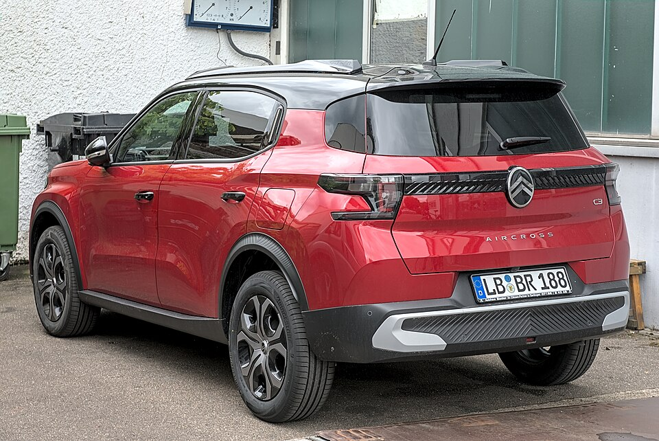

# Citroën ë-C3 Aircross

*Bild: [Citroën C3 Aircross (2024) DSC 9300.jpg](https://commons.wikimedia.org/wiki/File:Citro%C3%ABn_C3_Aircross_(2024)_DSC_9300.jpg) · Urheber: Alexander Migl · Lizenz: CC BY-SA 4.0 · via Wikimedia Commons.*

> Kompaktes Elektro-SUV von Citroën auf der Smart-Car-Plattform von Stellantis, technisch eng mit dem ë-C3 verwandt.

## Steckbrief

| Feld | Wert | Beleg |
|---|---|---|
| Hersteller | [[citroen\|Citroën]] | [[tn-batterycheck-alle-daten]] |
| Segment | Kleinwagen-SUV | Fachwissen¹ |
| Karosserie | SUV | Fachwissen¹ |
| Bauzeit | seit 2024 | Fachwissen¹ |
| Plattform | Stellantis Smart Car Platform | Fachwissen¹ |
| Varianten im Bestand | 2 | [[tn-batterycheck-alle-daten]] |
| [[bruttokapazitaet\|Bruttokapazität]] | 44–54 kWh | [[tn-batterycheck-alle-daten]] |
| [[nettokapazitaet\|Nettokapazität]] | 43,8–52,8 kWh | [[tn-batterycheck-alle-daten]] |
| [[batteriepuffer\|Puffer]] | 0,5–2,2 % | berechnet |

## Beschreibung

Der Citroën ë-C3 Aircross ist die Elektroversion des C3 Aircross der zweiten Generation. Er nutzt dieselbe Smart-Car-Plattform wie der [[citroen-e-c3|ë-C3]], ist aber länger und bietet mehr Innenraum; die Plattform zählt zu den [[plattform-stellantis|Stellantis-Plattformen]] für preisorientierte Modelle.

Die Basisversion verwendet dieselbe [[traktionsbatterie|Traktionsbatterie]] wie der ë-C3, die auf [[lfp-zellchemie|LFP-Zellchemie]] beruht. Später wurde zusätzlich eine Version mit größerer Batterie (Extended Range) angeboten. Angetrieben wird das Fahrzeug über die Vorderräder ([[frontantrieb|Frontantrieb]]).

Wie beim ë-C3 liegen [[bruttokapazitaet|Brutto-]] und [[nettokapazitaet|Nettokapazität]] in den Rohdaten sehr nah beieinander, der [[batteriepuffer|Batteriepuffer]] ist also klein.

## Varianten und Batterien

„e-C3 Aircross“ steht für die Basisbatterie mit 44 kWh brutto / 43,8 kWh netto (identisch mit dem [[citroen-e-c3|ë-C3]]). „Extended Range“ bezeichnet die später ergänzte größere Batterie mit 54 kWh brutto / 52,8 kWh netto (korrigiert). Es handelt sich also nicht um Generationen, sondern um zwei parallel angebotene Batteriegrößen.

| Variante | Brutto | Netto | Puffer | Zeile | Status |
|---|---|---|---|---|---|
| ë-C3 Aircross | 44 kWh | 43,8 kWh | 0,2 kWh (0,5 %) | 83 | bestätigt |
| ë-C3 Aircross Extended Range | 54 kWh | 52,8 kWh | 1,2 kWh (2,2 %) | 84 | korrigiert ([#10](https://github.com/Thitronik01/Frank-Repo/issues/10)) |

Quelle: [[tn-batterycheck-alle-daten]], Blatt „Fahrzeuge“, Zeilen 83–84 – bereinigte Fassung (Stand 2026-09-24, Änderungen in [[datenqualitaet]]). Puffer = Brutto − Netto (berechnet).

## Korrekturen

- **Zeile 84 korrigiert:** „ë-C3 Aircross Extended Range“ 54 kWh / 53,5 kWh → 54 kWh / 52,8 kWh. ADAC (Herstellerdaten): 54,0 / 52,8 kWh. Die 53,5 kWh sind ein Schätzwert von ev-database. Der baugleiche Opel Frontera ER hat laut ADAC 52,0 kWh netto. Beleg: [Quelle 1](https://www.adac.de/rund-ums-fahrzeug/autokatalog/marken-modelle/citroen/c3-aircross/2generation/350756/), [Quelle 2](https://ev-database.org/car/3228/Citroen-e-C3-Aircross-Extended-Range-54-kWh). Issue [#10](https://github.com/Thitronik01/Frank-Repo/issues/10).

Gegenüber der Rohquelle geändert am 2026-09-24; vollständiges Protokoll in [[datenqualitaet]].

## Fachbegriffe

- [[lfp-zellchemie|LFP-Zellchemie]] — Lithium-Eisenphosphat-Zellen – kobaltfrei, günstig, sehr langlebig, aber mit geringerer Energiedichte.
- [[plattform-stellantis|Stellantis-Plattformen (e-CMP, EMP2, STLA)]] — Die Elektro-Baukästen des Stellantis-Konzerns (Peugeot, Citroën, Opel u. a.).
- [[plattform-geschwister|Plattform-Geschwister (Badge-Engineering)]] — Fahrzeuge verschiedener Marken, die technisch weitgehend baugleich sind und dieselbe Batterie nutzen.
- [[batteriepuffer|Batteriepuffer]] — Differenz zwischen Brutto- und Nettokapazität – eine Reserve, die die Batterie schont und Alterung ausgleicht.
- [[bruttokapazitaet|Bruttokapazität]] — Die gesamte, physikalisch in der Batterie verbaute Energiemenge – inklusive der Reserven, die der Fahrer nie nutzen kann.
- [[nettokapazitaet|Nettokapazität]] — Der Teil der Batteriekapazität, den der Fahrer tatsächlich nutzen kann – Grundlage für Reichweite und Batterietests.
- [[frontantrieb|Frontantrieb (FWD)]] — Der Elektromotor treibt die Vorderräder an – typisch für Kleinwagen und Konversionsfahrzeuge.

## Verwandte Fahrzeuge

- [[citroen-e-c3|Citroën ë-C3]] — technisch verwandt / gleiche Plattform oder Batterie
- Weitere Modelle von Citroën: [[citroen-c-zero|Citroën C-Zero]], [[citroen-e-berlingo|Citroën ë-Berlingo]], [[citroen-e-c4|Citroën ë-C4]], [[citroen-e-c4-x|Citroën ë-C4 X]], [[citroen-e-jumpy|Citroën ë-Jumpy Combi]], [[citroen-e-spacetourer|Citroën ë-SpaceTourer]]

## Quellen

- [[tn-batterycheck-alle-daten]] — Brutto-/Nettokapazität aller Varianten (Zeilen 83–84)

¹ *Beschreibung und Steckbrief-Felder ohne Quellseite beruhen auf allgemeinem Fachwissen des LLM (Stand 2026-09-24) und sind nicht durch eine Rohquelle im Bestand belegt. Zahlenwerte zur Batterie stammen aus der Rohquelle, bereinigt nach dem Protokoll in [[datenqualitaet]].*
