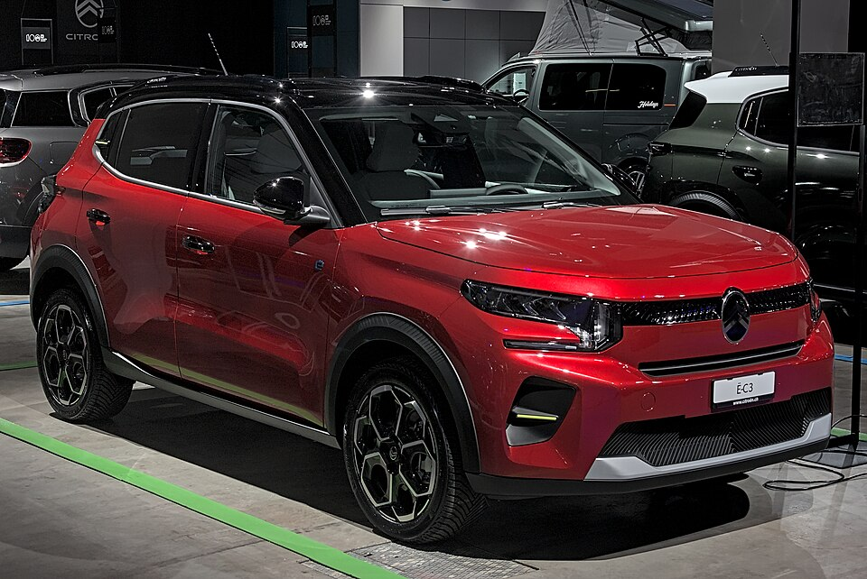

# Citroën ë-C3

*Bild: [Citroën ë-C3 Auto Zuerich 2024 DSC 6102.jpg](https://commons.wikimedia.org/wiki/File:Citro%C3%ABn_%C3%AB-C3_Auto_Zuerich_2024_DSC_6102.jpg) · Urheber: Alexander-93 · Lizenz: CC BY-SA 4.0 · via Wikimedia Commons.*

> Elektrischer Kleinwagen von Citroën mit leicht erhöhter Crossover-Optik, konzipiert als preisgünstiges Elektroauto mit LFP-Batterie.

## Steckbrief

| Feld | Wert | Beleg |
|---|---|---|
| Hersteller | [[citroen\|Citroën]] | [[tn-batterycheck-alle-daten]] |
| Segment | Kleinwagen | Fachwissen¹ |
| Karosserie | Schrägheck, fünftürig (Crossover-Stil) | Fachwissen¹ |
| Bauzeit | seit 2024 | Fachwissen¹ |
| Plattform | Stellantis Smart Car Platform | Fachwissen¹ |
| Varianten im Bestand | 1 | [[tn-batterycheck-alle-daten]] |
| [[bruttokapazitaet\|Bruttokapazität]] | 44 kWh | [[tn-batterycheck-alle-daten]] |
| [[nettokapazitaet\|Nettokapazität]] | 43,8 kWh | [[tn-batterycheck-alle-daten]] |
| [[batteriepuffer\|Puffer]] | 0,5 % | berechnet |

## Beschreibung

Der Citroën ë-C3 ist die batterieelektrische Version der vierten C3-Generation. Er steht auf der kostengünstigen Smart-Car-Plattform, einer der [[plattform-stellantis|Stellantis-Plattformen]], die sowohl Verbrenner als auch Elektroantrieb aufnehmen kann. Die Plattform teilt er unter anderem mit dem größeren [[citroen-e-c3-aircross|ë-C3 Aircross]].

Anders als die meisten älteren Stellantis-Elektroautos nutzt der ë-C3 eine Batterie mit [[lfp-zellchemie|LFP-Zellchemie]] (Lithium-Eisenphosphat). Diese Zellchemie gilt als kostengünstig und zyklenfest, hat aber eine geringere Energiedichte als [[nmc-zellchemie|NMC-Zellen]]. Angetrieben werden die Vorderräder ([[frontantrieb|Frontantrieb]]).

Auffällig ist der sehr geringe Unterschied zwischen [[bruttokapazitaet|Brutto-]] und [[nettokapazitaet|Nettokapazität]]; der [[batteriepuffer|Batteriepuffer]] ist damit deutlich kleiner als bei den NMC-Batterien anderer Stellantis-Modelle.

## Varianten und Batterien

Die Rohdaten enthalten eine einzige Zeile (e-C3) mit 44 kWh brutto und 43,8 kWh netto. Weitere Batteriegrößen sind für dieses Modell nicht erfasst.

| Variante | Brutto | Netto | Puffer | Zeile | Status |
|---|---|---|---|---|---|
| ë-C3 | 44 kWh | 43,8 kWh | 0,2 kWh (0,5 %) | 82 | bestätigt |

Quelle: [[tn-batterycheck-alle-daten]], Blatt „Fahrzeuge“, Zeilen 82 – bereinigte Fassung (Stand 2026-09-24, Änderungen in [[datenqualitaet]]). Puffer = Brutto − Netto (berechnet).

## Fachbegriffe

- [[lfp-zellchemie|LFP-Zellchemie]] — Lithium-Eisenphosphat-Zellen – kobaltfrei, günstig, sehr langlebig, aber mit geringerer Energiedichte.
- [[plattform-stellantis|Stellantis-Plattformen (e-CMP, EMP2, STLA)]] — Die Elektro-Baukästen des Stellantis-Konzerns (Peugeot, Citroën, Opel u. a.).
- [[batteriepuffer|Batteriepuffer]] — Differenz zwischen Brutto- und Nettokapazität – eine Reserve, die die Batterie schont und Alterung ausgleicht.
- [[bruttokapazitaet|Bruttokapazität]] — Die gesamte, physikalisch in der Batterie verbaute Energiemenge – inklusive der Reserven, die der Fahrer nie nutzen kann.
- [[nettokapazitaet|Nettokapazität]] — Der Teil der Batteriekapazität, den der Fahrer tatsächlich nutzen kann – Grundlage für Reichweite und Batterietests.
- [[frontantrieb|Frontantrieb (FWD)]] — Der Elektromotor treibt die Vorderräder an – typisch für Kleinwagen und Konversionsfahrzeuge.
- [[plattform-geschwister|Plattform-Geschwister (Badge-Engineering)]] — Fahrzeuge verschiedener Marken, die technisch weitgehend baugleich sind und dieselbe Batterie nutzen.

## Verwandte Fahrzeuge

- [[citroen-e-c3-aircross|Citroën ë-C3 Aircross]] — technisch verwandt / gleiche Plattform oder Batterie
- Weitere Modelle von Citroën: [[citroen-c-zero|Citroën C-Zero]], [[citroen-e-berlingo|Citroën ë-Berlingo]], [[citroen-e-c4|Citroën ë-C4]], [[citroen-e-c4-x|Citroën ë-C4 X]], [[citroen-e-jumpy|Citroën ë-Jumpy Combi]], [[citroen-e-spacetourer|Citroën ë-SpaceTourer]]

## Quellen

- [[tn-batterycheck-alle-daten]] — Brutto-/Nettokapazität aller Varianten (Zeilen 82)

¹ *Beschreibung und Steckbrief-Felder ohne Quellseite beruhen auf allgemeinem Fachwissen des LLM (Stand 2026-09-24) und sind nicht durch eine Rohquelle im Bestand belegt. Zahlenwerte zur Batterie stammen aus der Rohquelle, bereinigt nach dem Protokoll in [[datenqualitaet]].*
