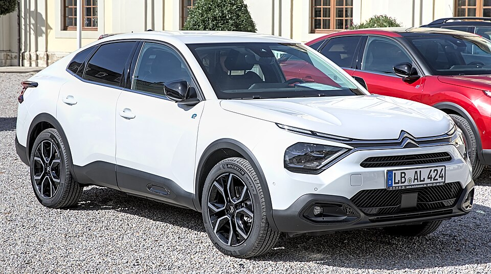

# Citroën ë-C4 X

*Bild: [Citroën e-C4 X Automesse Ludwigsburg 2023 1X7A0016.jpg](https://commons.wikimedia.org/wiki/File:Citro%C3%ABn_e-C4_X_Automesse_Ludwigsburg_2023_1X7A0016.jpg) · Urheber: Alexander-93 · Lizenz: CC BY-SA 4.0 · via Wikimedia Commons.*

> Stufenheck-Ableger des Citroën ë-C4 mit verlängertem Heck, technisch identisch mit dem ë-C4.

## Steckbrief

| Feld | Wert | Beleg |
|---|---|---|
| Hersteller | [[citroen\|Citroën]] | [[tn-batterycheck-alle-daten]] |
| Segment | Kompaktklasse | Fachwissen¹ |
| Karosserie | Fließheck-Limousine (Stufenheck-Crossover) | Fachwissen¹ |
| Bauzeit | seit 2023 | Fachwissen¹ |
| Plattform | e-CMP (Stellantis, ehemals PSA) | Fachwissen¹ |
| Varianten im Bestand | 2 | [[tn-batterycheck-alle-daten]] |
| [[bruttokapazitaet\|Bruttokapazität]] | 50–54 kWh | [[tn-batterycheck-alle-daten]] |
| [[nettokapazitaet\|Nettokapazität]] | 46,3–50,8 kWh | [[tn-batterycheck-alle-daten]] |
| [[batteriepuffer\|Puffer]] | 5,9–7,4 % | berechnet |

## Beschreibung

Der Citroën ë-C4 X ist eine Karosserievariante des [[citroen-e-c4|ë-C4]] mit längerem Heck und separatem Kofferraum. Unter der Haut ist er mit dem ë-C4 identisch und nutzt die e-CMP-Plattform, eine der [[plattform-stellantis|Stellantis-Plattformen]]; zu den Varianten siehe auch [[karosserieformen|Karosserieformen]].

Antrieb und [[traktionsbatterie|Traktionsbatterie]] entsprechen dem ë-C4 sowie weiteren e-CMP-Modellen wie dem [[peugeot-e-208|Peugeot e-208]]. Der [[elektromotor|Elektromotor]] treibt die Vorderräder an ([[frontantrieb|Frontantrieb]]).

Auch beim ë-C4 X spiegeln die zwei Batteriegrößen den Wechsel von der ersten zur überarbeiteten e-CMP-Batterie wider.

## Varianten und Batterien

Wie beim [[citroen-e-c4|ë-C4]] gibt es zwei Zeilen mit identischer Bezeichnung: 50 kWh brutto / 46,3 kWh netto (ursprüngliche Batterie) und 54 kWh brutto / 50,8 kWh netto (überarbeitete Batterie). Die Unterscheidung ergibt sich aus Baujahr bzw. Leistungsstufe, nicht aus der Modellbezeichnung.

| Variante | Brutto | Netto | Puffer | Zeile |
|---|---|---|---|---|
| ë-C4 X | 50 kWh | 46,3 kWh | 3,7 kWh (7,4 %) | 87 |
| ë-C4 X | 54 kWh | 50,8 kWh | 3,2 kWh (5,9 %) | 88 |

Quelle: [[tn-batterycheck-alle-daten]], Blatt „Fahrzeuge“, Zeilen 87–88 – bereinigte Fassung (Stand 2026-09-24, Änderungen in [[datenqualitaet]]). Puffer = Brutto − Netto (berechnet).

## Fachbegriffe

- [[plattform-stellantis|Stellantis-Plattformen (e-CMP, EMP2, STLA)]] — Die Elektro-Baukästen des Stellantis-Konzerns (Peugeot, Citroën, Opel u. a.).
- [[plattform-geschwister|Plattform-Geschwister (Badge-Engineering)]] — Fahrzeuge verschiedener Marken, die technisch weitgehend baugleich sind und dieselbe Batterie nutzen.
- [[karosserieformen|Karosserieformen]] — Varianten der Aufbauform eines Modells – beeinflussen Aussehen und Luftwiderstand, meist nicht die Batterie.
- [[modellpflege|Modellpflege (Facelift)]] — Überarbeitung eines Modells während der Bauzeit – bei Elektroautos oft mit neuer Batterie.
- [[frontantrieb|Frontantrieb (FWD)]] — Der Elektromotor treibt die Vorderräder an – typisch für Kleinwagen und Konversionsfahrzeuge.
- [[nmc-zellchemie|NMC-Zellchemie]] — Lithium-Ionen-Zellen mit Kathode aus Nickel, Mangan und Kobalt – hohe Energiedichte, Standard in den meisten Fahrzeugen des Bestands.

## Verwandte Fahrzeuge

- [[citroen-e-c4|Citroën ë-C4]] — technisch verwandt / gleiche Plattform oder Batterie
- [[peugeot-e-208|Peugeot e-208]] — technisch verwandt / gleiche Plattform oder Batterie
- [[peugeot-e-2008|Peugeot e-2008]] — technisch verwandt / gleiche Plattform oder Batterie
- Weitere Modelle von Citroën: [[citroen-c-zero|Citroën C-Zero]], [[citroen-e-berlingo|Citroën ë-Berlingo]], [[citroen-e-c3|Citroën ë-C3]], [[citroen-e-c3-aircross|Citroën ë-C3 Aircross]], [[citroen-e-jumpy|Citroën ë-Jumpy Combi]], [[citroen-e-spacetourer|Citroën ë-SpaceTourer]]

## Quellen

- [[tn-batterycheck-alle-daten]] — Brutto-/Nettokapazität aller Varianten (Zeilen 87–88)

¹ *Beschreibung und Steckbrief-Felder ohne Quellseite beruhen auf allgemeinem Fachwissen des LLM (Stand 2026-09-24) und sind nicht durch eine Rohquelle im Bestand belegt. Zahlenwerte zur Batterie stammen aus der Rohquelle, bereinigt nach dem Protokoll in [[datenqualitaet]].*
