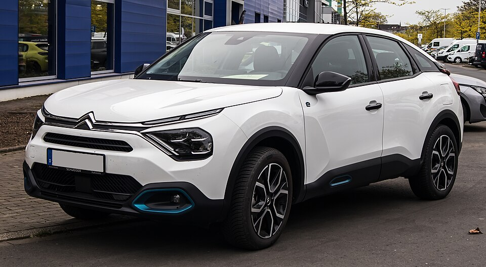

# Citroën ë-C4

*Bild: [Citroën ë-C4 Feel (III) – f 14042024.jpg](https://commons.wikimedia.org/wiki/File:Citro%C3%ABn_%C3%AB-C4_Feel_(III)_%E2%80%93_f_14042024.jpg) · Urheber: © M 93 · Lizenz: CC BY-SA 3.0 de · via Wikimedia Commons.*

> Elektrische Version des kompakten Citroën C4 im Crossover-Stil auf der e-CMP-Plattform von Stellantis.

## Steckbrief

| Feld | Wert | Beleg |
|---|---|---|
| Hersteller | [[citroen\|Citroën]] | [[tn-batterycheck-alle-daten]] |
| Segment | Kompaktklasse | Fachwissen¹ |
| Karosserie | Schrägheck mit Crossover-Elementen | Fachwissen¹ |
| Bauzeit | seit 2020 | Fachwissen¹ |
| Plattform | e-CMP (Stellantis, ehemals PSA) | Fachwissen¹ |
| Varianten im Bestand | 2 | [[tn-batterycheck-alle-daten]] |
| [[bruttokapazitaet\|Bruttokapazität]] | 50–54 kWh | [[tn-batterycheck-alle-daten]] |
| [[nettokapazitaet\|Nettokapazität]] | 46,3–50,8 kWh | [[tn-batterycheck-alle-daten]] |
| [[batteriepuffer\|Puffer]] | 5,9–7,4 % | berechnet |

## Beschreibung

Der Citroën ë-C4 ist die batterieelektrische Variante der dritten C4-Generation. Er basiert auf der e-CMP-Plattform, die der damalige PSA-Konzern für Klein- und Kompaktwagen entwickelt hat und die heute zu den [[plattform-stellantis|Stellantis-Plattformen]] zählt. Dieselbe Antriebstechnik findet sich unter anderem im [[peugeot-e-208|Peugeot e-208]], [[peugeot-e-2008|Peugeot e-2008]] und im [[citroen-e-c4-x|ë-C4 X]].

Die [[traktionsbatterie|Traktionsbatterie]] mit [[nmc-zellchemie|NMC-Zellen]] sitzt im Unterboden, der [[elektromotor|Elektromotor]] treibt die Vorderräder an ([[frontantrieb|Frontantrieb]]). Im Zuge einer technischen Überarbeitung der e-CMP-Komponenten wurde die ursprüngliche Batterie durch eine etwas größere ersetzt.

Da viele Modelle des Konzerns dieselbe Batterie nutzen, sind Erfahrungswerte zu [[batteriealterung|Batteriealterung]] und [[state-of-health|State of Health]] gut zwischen den [[plattform-geschwister|Plattform-Geschwistern]] übertragbar.

## Varianten und Batterien

Beide Zeilen tragen dieselbe Bezeichnung „e-C4“ und unterscheiden sich nur in der Batterie: 50 kWh brutto / 46,3 kWh netto ist die ursprüngliche e-CMP-Batterie, 54 kWh brutto / 50,8 kWh netto die spätere, überarbeitete Batteriegeneration. Das Baujahr bzw. die Motorleistung entscheidet also über die Batteriegröße.

| Variante | Brutto | Netto | Puffer | Zeile |
|---|---|---|---|---|
| e-C4 | 50 kWh | 46,3 kWh | 3,7 kWh (7,4 %) | 85 |
| e-C4 | 54 kWh | 50,8 kWh | 3,2 kWh (5,9 %) | 86 |

Quelle: [[tn-batterycheck-alle-daten]], Blatt „Fahrzeuge“, Zeilen 85–86. Puffer = Brutto − Netto (berechnet).

## Fachbegriffe

- [[plattform-stellantis|Stellantis-Plattformen (e-CMP, EMP2, STLA)]] — Die Elektro-Baukästen des Stellantis-Konzerns (Peugeot, Citroën, Opel u. a.).
- [[plattform-geschwister|Plattform-Geschwister (Badge-Engineering)]] — Fahrzeuge verschiedener Marken, die technisch weitgehend baugleich sind und dieselbe Batterie nutzen.
- [[nmc-zellchemie|NMC-Zellchemie]] — Lithium-Ionen-Zellen mit Kathode aus Nickel, Mangan und Kobalt – hohe Energiedichte, Standard in den meisten Fahrzeugen des Bestands.
- [[modellpflege|Modellpflege (Facelift)]] — Überarbeitung eines Modells während der Bauzeit – bei Elektroautos oft mit neuer Batterie.
- [[batteriepuffer|Batteriepuffer]] — Differenz zwischen Brutto- und Nettokapazität – eine Reserve, die die Batterie schont und Alterung ausgleicht.
- [[frontantrieb|Frontantrieb (FWD)]] — Der Elektromotor treibt die Vorderräder an – typisch für Kleinwagen und Konversionsfahrzeuge.
- [[state-of-health|State of Health (SoH)]] — Gesundheitszustand der Batterie: verbleibende Kapazität im Verhältnis zur Neu-Kapazität, in Prozent.

## Verwandte Fahrzeuge

- [[citroen-e-c4-x|Citroën ë-C4 X]] — technisch verwandt / gleiche Plattform oder Batterie
- [[peugeot-e-208|Peugeot e-208]] — technisch verwandt / gleiche Plattform oder Batterie
- [[peugeot-e-2008|Peugeot e-2008]] — technisch verwandt / gleiche Plattform oder Batterie
- Weitere Modelle von Citroën: [[citroen-c-zero|Citroën C-Zero]], [[citroen-e-berlingo|Citroën ë-Berlingo]], [[citroen-e-c3|Citroën ë-C3]], [[citroen-e-c3-aircross|Citroën ë-C3 Aircross]], [[citroen-e-jumpy|Citroën ë-Jumpy Combi]], [[citroen-e-spacetourer|Citroën ë-SpaceTourer]]

## Quellen

- [[tn-batterycheck-alle-daten]] — Brutto-/Nettokapazität aller Varianten (Zeilen 85–86)

¹ *Beschreibung und Steckbrief-Felder ohne Quellseite beruhen auf allgemeinem Fachwissen des LLM (Stand 2026-09-23) und sind nicht durch eine Rohquelle im Bestand belegt. Zahlenwerte zur Batterie stammen ausschließlich aus der Rohquelle.*
