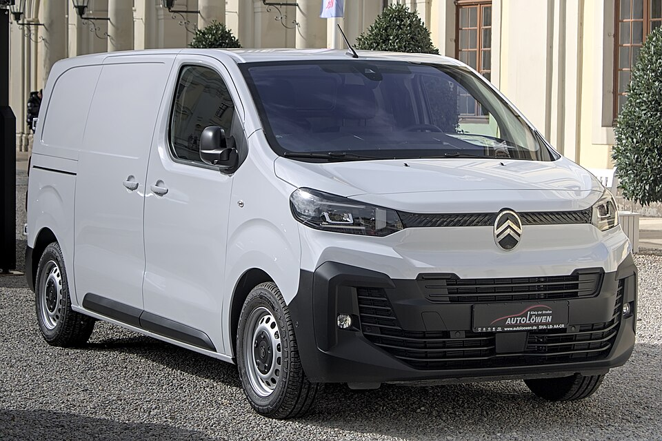

# Citroën ë-Jumpy Combi

*Bild: [2024 Citroën ë-Jumpy Automesse Ludwigsburg 2024 IMG 1391.jpg](https://commons.wikimedia.org/wiki/File:2024_Citro%C3%ABn_%C3%AB-Jumpy_Automesse_Ludwigsburg_2024_IMG_1391.jpg) · Urheber: Alexander-93 · Lizenz: CC BY-SA 4.0 · via Wikimedia Commons.*

> Elektrischer Transporter bzw. Kleinbus von Citroën in der Personenversion „Combi“, baugleich mit Peugeot e-Expert und Citroën ë-SpaceTourer.

## Steckbrief

| Feld | Wert | Beleg |
|---|---|---|
| Hersteller | [[citroen\|Citroën]] | [[tn-batterycheck-alle-daten]] |
| Segment | Transporter / Kleinbus | Fachwissen¹ |
| Karosserie | Kastenwagen-basierter Kleinbus (Combi), drei Längen | Fachwissen¹ |
| Bauzeit | seit 2020 | Fachwissen¹ |
| Plattform | EMP2 (Transporter-Baureihe K0, Stellantis) | Fachwissen¹ |
| Varianten im Bestand | 5 | [[tn-batterycheck-alle-daten]] |
| [[bruttokapazitaet\|Bruttokapazität]] | 50–75 kWh | [[tn-batterycheck-alle-daten]] |
| [[nettokapazitaet\|Nettokapazität]] | 46,3–68 kWh | [[tn-batterycheck-alle-daten]] |
| [[batteriepuffer\|Puffer]] | 7,4–9,3 % | berechnet |

## Beschreibung

Der Citroën ë-Jumpy ist die batterieelektrische Version des mittelgroßen Transporters Jumpy; die Rohdaten beziehen sich auf die Personenversion Combi. Er gehört zu einer Gruppe von [[plattform-geschwister|Plattform-Geschwistern]], zu der unter anderem der [[peugeot-e-expert|Peugeot e-Expert]], der [[citroen-e-spacetourer|ë-SpaceTourer]] und der [[peugeot-e-traveller|Peugeot e-Traveller]] zählen; siehe auch [[elektro-transporter|Elektro-Transporter]].

Technisch basiert das Fahrzeug auf der EMP2-Plattform in der Ausprägung für Transporter (Baureihe K0), die Stellantis für mehrere Marken nutzt. Der [[elektromotor|Elektromotor]] treibt die Vorderräder an ([[frontantrieb|Frontantrieb]]); die [[traktionsbatterie|Traktionsbatterie]] ist im Unterboden untergebracht, sodass der Innenraum gegenüber den Verbrennerversionen weitgehend unverändert bleibt.

Angeboten wurden zwei Batteriegrößen, die parallel erhältlich waren; die kürzeste Karosserieversion war nur mit der kleineren Batterie verfügbar.

## Varianten und Batterien

XS, M und XL bezeichnen die drei Fahrzeuglängen. M und XL gibt es mit 50 kWh brutto / 46,3 kWh netto und mit 75 kWh brutto / 68,0 kWh netto; die kurze Version XS ist nur mit der 50-kWh-Batterie erfasst. Die beiden Batteriegrößen sind parallel angebotene Optionen, keine Generationen.

| Variante | Brutto | Netto | Puffer | Zeile |
|---|---|---|---|---|
| e-Jumpy Combi M | 50 kWh | 46,3 kWh | 3,7 kWh (7,4 %) | 89 |
| e-Jumpy Combi M | 75 kWh | 68,0 kWh | 7 kWh (9,3 %) | 90 |
| e-Jumpy Combi XL | 50 kWh | 46,3 kWh | 3,7 kWh (7,4 %) | 91 |
| e-Jumpy Combi XL | 75 kWh | 68,0 kWh | 7 kWh (9,3 %) | 92 |
| e-Jumpy Combi XS | 50 kWh | 46,3 kWh | 3,7 kWh (7,4 %) | 93 |

Quelle: [[tn-batterycheck-alle-daten]], Blatt „Fahrzeuge“, Zeilen 89–93. Puffer = Brutto − Netto (berechnet).

## Fachbegriffe

- [[elektro-transporter|Elektro-Transporter und Vans]] — Leichte Nutzfahrzeuge und Großraum-Pkw mit Elektroantrieb – im Bestand vor allem von Stellantis, Mercedes, Renault und VW.
- [[plattform-stellantis|Stellantis-Plattformen (e-CMP, EMP2, STLA)]] — Die Elektro-Baukästen des Stellantis-Konzerns (Peugeot, Citroën, Opel u. a.).
- [[plattform-geschwister|Plattform-Geschwister (Badge-Engineering)]] — Fahrzeuge verschiedener Marken, die technisch weitgehend baugleich sind und dieselbe Batterie nutzen.
- [[batteriepuffer|Batteriepuffer]] — Differenz zwischen Brutto- und Nettokapazität – eine Reserve, die die Batterie schont und Alterung ausgleicht.
- [[frontantrieb|Frontantrieb (FWD)]] — Der Elektromotor treibt die Vorderräder an – typisch für Kleinwagen und Konversionsfahrzeuge.
- [[typbezeichnungen|Typbezeichnungen]] — Wie Hersteller Leistungsstufe, Batterie und Antrieb in Modellnamen codieren – ein Lesehilfe-Artikel.

## Verwandte Fahrzeuge

- [[citroen-e-spacetourer|Citroën ë-SpaceTourer]] — technisch verwandt / gleiche Plattform oder Batterie
- [[peugeot-e-expert|Peugeot e-Expert Combi]] — technisch verwandt / gleiche Plattform oder Batterie
- [[peugeot-e-traveller|Peugeot e-Traveller]] — technisch verwandt / gleiche Plattform oder Batterie
- Weitere Modelle von Citroën: [[citroen-c-zero|Citroën C-Zero]], [[citroen-e-berlingo|Citroën ë-Berlingo]], [[citroen-e-c3|Citroën ë-C3]], [[citroen-e-c3-aircross|Citroën ë-C3 Aircross]], [[citroen-e-c4|Citroën ë-C4]], [[citroen-e-c4-x|Citroën ë-C4 X]]

## Offene Punkte

- Der Puffer der 75-kWh-Batterie (68,0 kWh netto) ist mit rund 9 % größer als der der 50-kWh-Batterie (ca. 7 %).

Siehe auch [[datenqualitaet]].

## Quellen

- [[tn-batterycheck-alle-daten]] — Brutto-/Nettokapazität aller Varianten (Zeilen 89–93)
- Weiterlesen: [Wikipedia – Citroën Jumpy](https://en.wikipedia.org/wiki/Citroën_Jumpy)

¹ *Beschreibung und Steckbrief-Felder ohne Quellseite beruhen auf allgemeinem Fachwissen des LLM (Stand 2026-09-23) und sind nicht durch eine Rohquelle im Bestand belegt. Zahlenwerte zur Batterie stammen ausschließlich aus der Rohquelle.*
