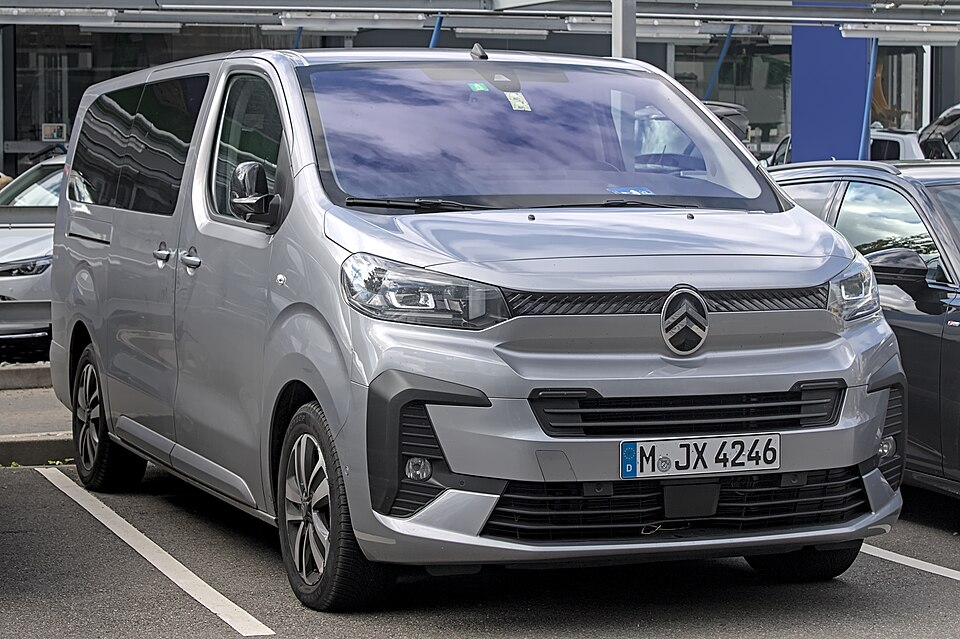

# Citroën ë-SpaceTourer

*Bild: [2024 Citroën Spacetourer IMG 2118.jpg](https://commons.wikimedia.org/wiki/File:2024_Citro%C3%ABn_Spacetourer_IMG_2118.jpg) · Urheber: Alexander-93 · Lizenz: CC BY-SA 4.0 · via Wikimedia Commons.*

> Elektrischer Großraum-Van von Citroën für die Personenbeförderung, baugleich mit Peugeot e-Traveller.

## Steckbrief

| Feld | Wert | Beleg |
|---|---|---|
| Hersteller | [[citroen\|Citroën]] | [[tn-batterycheck-alle-daten]] |
| Segment | Großraum-Van / Kleinbus | Fachwissen¹ |
| Karosserie | Van (Kleinbus), drei Längen | Fachwissen¹ |
| Bauzeit | seit 2020 | Fachwissen¹ |
| Plattform | EMP2 (Transporter-Baureihe K0, Stellantis) | Fachwissen¹ |
| Varianten im Bestand | 5 | [[tn-batterycheck-alle-daten]] |
| [[bruttokapazitaet\|Bruttokapazität]] | 50–75 kWh | [[tn-batterycheck-alle-daten]] |
| [[nettokapazitaet\|Nettokapazität]] | 46,3–68 kWh | [[tn-batterycheck-alle-daten]] |
| [[batteriepuffer\|Puffer]] | 7,4–9,3 % | berechnet |

## Beschreibung

Der Citroën ë-SpaceTourer ist die Pkw-orientierte Variante des Transporters Jumpy mit Elektroantrieb und richtet sich an Familien, Shuttle- und Taxibetriebe. Baugleich ist der [[peugeot-e-traveller|Peugeot e-Traveller]]; eng verwandt sind [[citroen-e-jumpy|ë-Jumpy]] und [[peugeot-e-expert|Peugeot e-Expert]]. Das Fahrzeug zählt damit zu den [[elektro-transporter|Elektro-Transportern]] der [[plattform-stellantis|Stellantis-Plattformen]].

Technisch basiert das Fahrzeug auf der EMP2-Plattform in der Ausprägung für Transporter (Baureihe K0), die Stellantis für mehrere Marken nutzt. Der [[elektromotor|Elektromotor]] treibt die Vorderräder an ([[frontantrieb|Frontantrieb]]); die [[traktionsbatterie|Traktionsbatterie]] ist im Unterboden untergebracht, sodass der Innenraum gegenüber den Verbrennerversionen weitgehend unverändert bleibt.

Wie beim ë-Jumpy standen zwei Batteriegrößen zur Wahl; die kürzeste Version wurde nur mit der kleineren Batterie angeboten.

## Varianten und Batterien

XS, M und XL bezeichnen die Fahrzeuglängen. Für M und XL sind die 50-kWh-Batterie (46,3 kWh netto) und die 75-kWh-Batterie (68,0 kWh netto) erfasst, für XS nur die 50-kWh-Batterie. Die Batterien sind parallele Ausstattungsoptionen.

| Variante | Brutto | Netto | Puffer | Zeile |
|---|---|---|---|---|
| e-Spacetourer M | 50 kWh | 46,3 kWh | 3,7 kWh (7,4 %) | 94 |
| e-Spacetourer M | 75 kWh | 68,0 kWh | 7 kWh (9,3 %) | 95 |
| e-Spacetourer XL | 50 kWh | 46,3 kWh | 3,7 kWh (7,4 %) | 96 |
| e-Spacetourer XL | 75 kWh | 68,0 kWh | 7 kWh (9,3 %) | 97 |
| e-Spacetourer XS | 50 kWh | 46,3 kWh | 3,7 kWh (7,4 %) | 98 |

Quelle: [[tn-batterycheck-alle-daten]], Blatt „Fahrzeuge“, Zeilen 94–98. Puffer = Brutto − Netto (berechnet).

## Fachbegriffe

- [[elektro-transporter|Elektro-Transporter und Vans]] — Leichte Nutzfahrzeuge und Großraum-Pkw mit Elektroantrieb – im Bestand vor allem von Stellantis, Mercedes, Renault und VW.
- [[plattform-stellantis|Stellantis-Plattformen (e-CMP, EMP2, STLA)]] — Die Elektro-Baukästen des Stellantis-Konzerns (Peugeot, Citroën, Opel u. a.).
- [[plattform-geschwister|Plattform-Geschwister (Badge-Engineering)]] — Fahrzeuge verschiedener Marken, die technisch weitgehend baugleich sind und dieselbe Batterie nutzen.
- [[batteriepuffer|Batteriepuffer]] — Differenz zwischen Brutto- und Nettokapazität – eine Reserve, die die Batterie schont und Alterung ausgleicht.
- [[frontantrieb|Frontantrieb (FWD)]] — Der Elektromotor treibt die Vorderräder an – typisch für Kleinwagen und Konversionsfahrzeuge.
- [[typbezeichnungen|Typbezeichnungen]] — Wie Hersteller Leistungsstufe, Batterie und Antrieb in Modellnamen codieren – ein Lesehilfe-Artikel.

## Verwandte Fahrzeuge

- [[peugeot-e-traveller|Peugeot e-Traveller]] — technisch verwandt / gleiche Plattform oder Batterie
- [[citroen-e-jumpy|Citroën ë-Jumpy Combi]] — technisch verwandt / gleiche Plattform oder Batterie
- [[peugeot-e-expert|Peugeot e-Expert Combi]] — technisch verwandt / gleiche Plattform oder Batterie
- Weitere Modelle von Citroën: [[citroen-c-zero|Citroën C-Zero]], [[citroen-e-berlingo|Citroën ë-Berlingo]], [[citroen-e-c3|Citroën ë-C3]], [[citroen-e-c3-aircross|Citroën ë-C3 Aircross]], [[citroen-e-c4|Citroën ë-C4]], [[citroen-e-c4-x|Citroën ë-C4 X]]

## Offene Punkte

- Schreibweise in den Rohdaten „e-Spacetourer“, Herstellerschreibweise „ë-SpaceTourer“.

Siehe auch [[datenqualitaet]].

## Quellen

- [[tn-batterycheck-alle-daten]] — Brutto-/Nettokapazität aller Varianten (Zeilen 94–98)

¹ *Beschreibung und Steckbrief-Felder ohne Quellseite beruhen auf allgemeinem Fachwissen des LLM (Stand 2026-09-23) und sind nicht durch eine Rohquelle im Bestand belegt. Zahlenwerte zur Batterie stammen ausschließlich aus der Rohquelle.*
