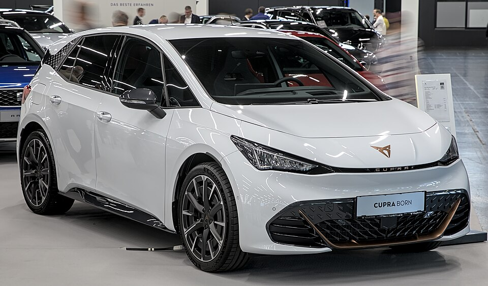

# Cupra Born

*Bild: [Cupra Born 1X7A6953.jpg](https://commons.wikimedia.org/wiki/File:Cupra_Born_1X7A6953.jpg) · Urheber: Alexander-93 · Lizenz: CC BY-SA 4.0 · via Wikimedia Commons.*

> Kompaktes Elektroauto der Marke Cupra, technisch eng verwandt mit dem VW ID.3 und wie dieser auf dem Modularen E-Antriebs-Baukasten aufgebaut.

## Steckbrief

| Feld | Wert | Beleg |
|---|---|---|
| Hersteller | [[cupra\|Cupra]] | [[tn-batterycheck-alle-daten]] |
| Segment | Kompaktklasse | Fachwissen¹ |
| Karosserie | Schrägheck-Limousine (fünftürig) | Fachwissen¹ |
| Bauzeit | seit 2021 | Fachwissen¹ |
| Plattform | MEB (Modularer E-Antriebs-Baukasten) | Fachwissen¹ |
| Varianten im Bestand | 4 | [[tn-batterycheck-alle-daten]] |
| [[bruttokapazitaet\|Bruttokapazität]] | 53–82 kWh | [[tn-batterycheck-alle-daten]] |
| [[nettokapazitaet\|Nettokapazität]] | 58–77 kWh | [[tn-batterycheck-alle-daten]] |
| [[batteriepuffer\|Puffer]] | 6,1–6,5 % | berechnet |

## Beschreibung

Der Cupra Born ist das erste reine Elektroauto der Marke Cupra und ein reiner [[bev|batterieelektrischer]] Kompaktwagen. Er basiert auf dem [[plattform-meb|MEB]] des Volkswagen-Konzerns und teilt sich Grundstruktur, Antrieb und Batterien weitgehend mit dem [[vw-id-3|VW ID.3]], von dem er sich vor allem durch Design, Abstimmung und Innenraum unterscheidet. Gebaut wird er gemeinsam mit dem ID.3 im VW-Werk Zwickau.

Wie bei allen MEB-Fahrzeugen sitzt die [[traktionsbatterie|Traktionsbatterie]] flach im Unterboden zwischen den Achsen, der [[elektromotor|Elektromotor]] treibt die Hinterräder an ([[hinterradantrieb|Hinterradantrieb]]). Die Batterie ist modular aufgebaut, sodass mit unterschiedlicher Modulzahl mehrere Kapazitätsstufen möglich sind. Zwischen [[bruttokapazitaet|Bruttokapazität]] und [[nettokapazitaet|Nettokapazität]] hält Volkswagen einen [[batteriepuffer|Puffer]] frei, der die Zellen vor Tiefentladung und Überladung schützt.

Die in den Rohdaten auftauchenden Batteriegrößen entsprechen den bekannten MEB-Stufen, die auch im ID.3 verwendet werden. Die Zusatzbezeichnung „e-boost“ steht bei Cupra für eine leistungsgesteigerte Motorvariante und ändert an der Batterie nichts.

## Varianten und Batterien

Die Zeilen tragen nur den Modellnamen „Born“ und unterscheiden sich allein durch die Batteriegröße: eine kleine Einstiegsbatterie, die mittlere Batterie (62 kWh brutto) und die große Batterie (82 kWh brutto). „Born e-boost“ nutzt dieselbe mittlere Batterie wie die Standardvariante, der Unterschied liegt in der Motorleistung. Die Kapazitätsstufen entsprechen den MEB-Batterien aus [[vw-id-3|VW ID.3]] und [[skoda-enyaq|Škoda Enyaq]].

| Variante | Brutto | Netto | Puffer | Zeile |
|---|---|---|---|---|
| Born | 53 kWh | 60,0 kWh | ⚠️ negativ | 99 |
| Born | 62 kWh | 58,0 kWh | 4 kWh (6,5 %) | 100 |
| Born | 82 kWh | 77,0 kWh | 5 kWh (6,1 %) | 101 |
| Born e-boost | 62 kWh | 58,0 kWh | 4 kWh (6,5 %) | 102 |

Quelle: [[tn-batterycheck-alle-daten]], Blatt „Fahrzeuge“, Zeilen 99–102. Puffer = Brutto − Netto (berechnet).

## Fachbegriffe

- [[plattform-meb|MEB (Modularer E-Antriebs-Baukasten)]] — Volkswagens erste reine Elektroauto-Plattform, Basis für ID.-Modelle, Enyaq, Elroq, Born, Tavascan und Q4 e-tron.
- [[bev|BEV (batterieelektrisches Fahrzeug)]] — Battery Electric Vehicle – Fahrzeug, das ausschließlich mit Strom aus einer Traktionsbatterie fährt.
- [[bruttokapazitaet|Bruttokapazität]] — Die gesamte, physikalisch in der Batterie verbaute Energiemenge – inklusive der Reserven, die der Fahrer nie nutzen kann.
- [[nettokapazitaet|Nettokapazität]] — Der Teil der Batteriekapazität, den der Fahrer tatsächlich nutzen kann – Grundlage für Reichweite und Batterietests.
- [[batteriepuffer|Batteriepuffer]] — Differenz zwischen Brutto- und Nettokapazität – eine Reserve, die die Batterie schont und Alterung ausgleicht.
- [[hinterradantrieb|Hinterradantrieb (RWD)]] — Der Elektromotor treibt die Hinterräder an – Standard auf vielen reinen Elektroplattformen.
- [[plattform-geschwister|Plattform-Geschwister (Badge-Engineering)]] — Fahrzeuge verschiedener Marken, die technisch weitgehend baugleich sind und dieselbe Batterie nutzen.

## Verwandte Fahrzeuge

- [[vw-id-3|VW ID.3]] — technisch verwandt / gleiche Plattform oder Batterie
- [[vw-id-4|VW ID.4]] — technisch verwandt / gleiche Plattform oder Batterie
- [[vw-id-5|VW ID.5]] — technisch verwandt / gleiche Plattform oder Batterie
- [[vw-id-7|VW ID.7]] — technisch verwandt / gleiche Plattform oder Batterie
- [[vw-id-buzz|VW ID. Buzz]] — technisch verwandt / gleiche Plattform oder Batterie
- [[skoda-enyaq|Škoda Enyaq]] — technisch verwandt / gleiche Plattform oder Batterie
- [[skoda-elroq|Škoda Elroq]] — technisch verwandt / gleiche Plattform oder Batterie
- [[cupra-tavascan|Cupra Tavascan]] — technisch verwandt / gleiche Plattform oder Batterie
- [[audi-q4-e-tron|Audi Q4 e-tron]] — technisch verwandt / gleiche Plattform oder Batterie

## Offene Punkte

- **Netto > Brutto:** „Born“ 53 kWh brutto / 60,0 kWh netto (Zeile 99) – physikalisch unmöglich, vermutlich vertauschte oder falsche Werte.
- Zeile 99: Nettokapazität (60,0 kWh) ist größer als die Bruttokapazität (53 kWh) – physikalisch unmöglich, vermutlich Tipp- oder Zuordnungsfehler (Einstiegsbatterie des MEB wird meist mit 45 kWh netto geführt).
- Zeilen 100 und 102 haben identische Batteriewerte; der Unterschied (e-boost) betrifft nur die Motorleistung.

Siehe auch [[datenqualitaet]].

## Quellen

- [[tn-batterycheck-alle-daten]] — Brutto-/Nettokapazität aller Varianten (Zeilen 99–102)
- Weiterlesen: [Wikipedia – Cupra Born](https://en.wikipedia.org/wiki/Cupra_Born)

¹ *Beschreibung und Steckbrief-Felder ohne Quellseite beruhen auf allgemeinem Fachwissen des LLM (Stand 2026-09-23) und sind nicht durch eine Rohquelle im Bestand belegt. Zahlenwerte zur Batterie stammen ausschließlich aus der Rohquelle.*
