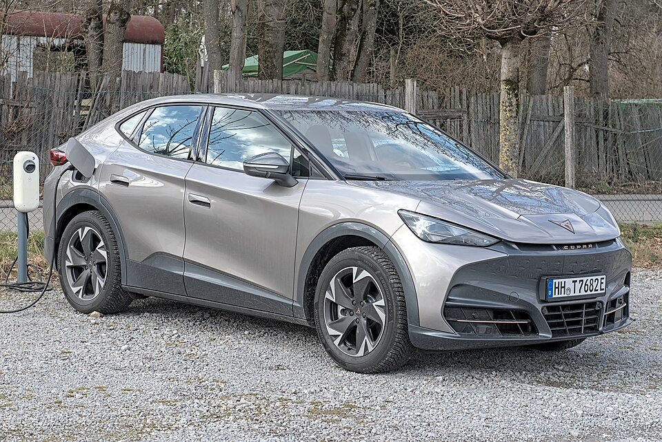

# Cupra Tavascan

*Bild: [Cupra Tavascan DSC 7785.jpg](https://commons.wikimedia.org/wiki/File:Cupra_Tavascan_DSC_7785.jpg) · Urheber: Alexander Migl · Lizenz: CC BY-SA 4.0 · via Wikimedia Commons.*

> Elektrisches SUV-Coupé der Marke Cupra auf Basis des MEB, das mit der großen 82-kWh-Batterie des Konzerns angeboten wird.

## Steckbrief

| Feld | Wert | Beleg |
|---|---|---|
| Hersteller | [[cupra\|Cupra]] | [[tn-batterycheck-alle-daten]] |
| Segment | Kompakt-SUV / SUV-Coupé | Fachwissen¹ |
| Karosserie | SUV-Coupé | Fachwissen¹ |
| Bauzeit | seit 2024 | Fachwissen¹ |
| Plattform | MEB (Modularer E-Antriebs-Baukasten) | Fachwissen¹ |
| Varianten im Bestand | 2 | [[tn-batterycheck-alle-daten]] |
| [[bruttokapazitaet\|Bruttokapazität]] | 82 kWh | [[tn-batterycheck-alle-daten]] |
| [[nettokapazitaet\|Nettokapazität]] | 77 kWh | [[tn-batterycheck-alle-daten]] |
| [[batteriepuffer\|Puffer]] | 6,1 % | berechnet |

## Beschreibung

Der Cupra Tavascan ist nach dem [[cupra-born|Cupra Born]] das zweite reine Elektromodell der Marke. Er ist als SUV mit abfallender Dachlinie gestaltet und basiert wie [[vw-id-5|VW ID.5]] und [[skoda-enyaq|Škoda Enyaq Coupé]] auf dem [[plattform-meb|MEB]]. Produziert wird der Tavascan in China bei einem Gemeinschaftsunternehmen des Volkswagen-Konzerns.

Technisch nutzt der Tavascan die große MEB-[[traktionsbatterie|Traktionsbatterie]]. Die Basisversion hat einen Heckmotor ([[hinterradantrieb|Hinterradantrieb]]), die sportliche Version VZ zusätzlich einen Motor an der Vorderachse und damit [[allradantrieb|Allradantrieb]]. Die Batterie ist in beiden Fällen gleich, der Unterschied zwischen [[bruttokapazitaet|Brutto-]] und [[nettokapazitaet|Nettokapazität]] entspricht dem üblichen MEB-[[batteriepuffer|Puffer]].

## Varianten und Batterien

„Endurance“ bezeichnet die reichweitenorientierte Version mit Hinterradantrieb, „VZ“ die leistungsstärkere Allradversion. Beide Zeilen (103 und 104) nutzen dieselbe Batterie mit 82 kWh brutto und 77 kWh netto; eine zweite Batteriegröße ist in den Rohdaten nicht enthalten.

| Variante | Brutto | Netto | Puffer | Zeile |
|---|---|---|---|---|
| Tavascan Endurance | 82 kWh | 77,0 kWh | 5 kWh (6,1 %) | 103 |
| Tavascan VZ | 82 kWh | 77,0 kWh | 5 kWh (6,1 %) | 104 |

Quelle: [[tn-batterycheck-alle-daten]], Blatt „Fahrzeuge“, Zeilen 103–104. Puffer = Brutto − Netto (berechnet).

## Fachbegriffe

- [[plattform-meb|MEB (Modularer E-Antriebs-Baukasten)]] — Volkswagens erste reine Elektroauto-Plattform, Basis für ID.-Modelle, Enyaq, Elroq, Born, Tavascan und Q4 e-tron.
- [[bev|BEV (batterieelektrisches Fahrzeug)]] — Battery Electric Vehicle – Fahrzeug, das ausschließlich mit Strom aus einer Traktionsbatterie fährt.
- [[allradantrieb|Allradantrieb (AWD)]] — Beide Achsen werden angetrieben, bei Elektroautos meist durch je einen eigenen Motor pro Achse.
- [[hinterradantrieb|Hinterradantrieb (RWD)]] — Der Elektromotor treibt die Hinterräder an – Standard auf vielen reinen Elektroplattformen.
- [[karosserieformen|Karosserieformen]] — Varianten der Aufbauform eines Modells – beeinflussen Aussehen und Luftwiderstand, meist nicht die Batterie.
- [[batteriepuffer|Batteriepuffer]] — Differenz zwischen Brutto- und Nettokapazität – eine Reserve, die die Batterie schont und Alterung ausgleicht.

## Verwandte Fahrzeuge

- [[vw-id-3|VW ID.3]] — technisch verwandt / gleiche Plattform oder Batterie
- [[vw-id-4|VW ID.4]] — technisch verwandt / gleiche Plattform oder Batterie
- [[vw-id-5|VW ID.5]] — technisch verwandt / gleiche Plattform oder Batterie
- [[vw-id-7|VW ID.7]] — technisch verwandt / gleiche Plattform oder Batterie
- [[vw-id-buzz|VW ID. Buzz]] — technisch verwandt / gleiche Plattform oder Batterie
- [[skoda-enyaq|Škoda Enyaq]] — technisch verwandt / gleiche Plattform oder Batterie
- [[skoda-elroq|Škoda Elroq]] — technisch verwandt / gleiche Plattform oder Batterie
- [[cupra-born|Cupra Born]] — technisch verwandt / gleiche Plattform oder Batterie
- [[audi-q4-e-tron|Audi Q4 e-tron]] — technisch verwandt / gleiche Plattform oder Batterie

## Quellen

- [[tn-batterycheck-alle-daten]] — Brutto-/Nettokapazität aller Varianten (Zeilen 103–104)
- Weiterlesen: [Wikipedia – Cupra Tavascan](https://en.wikipedia.org/wiki/Cupra_Tavascan)

¹ *Beschreibung und Steckbrief-Felder ohne Quellseite beruhen auf allgemeinem Fachwissen des LLM (Stand 2026-09-23) und sind nicht durch eine Rohquelle im Bestand belegt. Zahlenwerte zur Batterie stammen ausschließlich aus der Rohquelle.*
