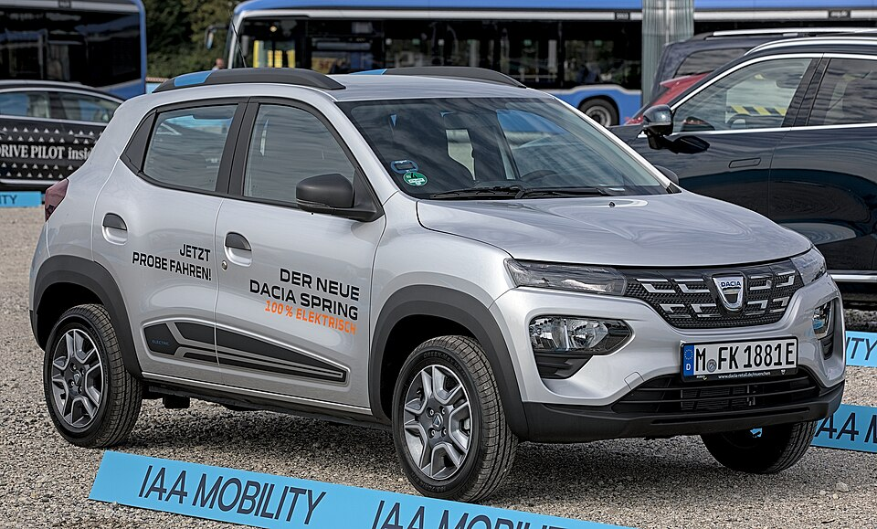

# Dacia Spring Electric

*Bild: [Dacia Spring IAA 2021 1X7A0215.jpg](https://commons.wikimedia.org/wiki/File:Dacia_Spring_IAA_2021_1X7A0215.jpg) · Urheber: Alexander Migl · Lizenz: CC BY-SA 4.0 · via Wikimedia Commons.*

> Elektrischer Kleinstwagen von Dacia im SUV-Stil, gilt als eines der günstigsten Elektroautos in Europa und wird in China gebaut.

## Steckbrief

| Feld | Wert | Beleg |
|---|---|---|
| Hersteller | [[dacia\|Dacia]] | [[tn-batterycheck-alle-daten]] |
| Segment | Kleinstwagen | Fachwissen¹ |
| Karosserie | Schrägheck im Mini-SUV-Stil, fünftürig | Fachwissen¹ |
| Bauzeit | seit 2021 | Fachwissen¹ |
| Plattform | CMF-A (Renault-Nissan-Kleinwagenplattform, Basis Renault Kwid) | Fachwissen¹ |
| Varianten im Bestand | 4 | [[tn-batterycheck-alle-daten]] |
| [[bruttokapazitaet\|Bruttokapazität]] | 26,8 kWh | [[tn-batterycheck-alle-daten]] |
| [[nettokapazitaet\|Nettokapazität]] | 25 kWh | [[tn-batterycheck-alle-daten]] |
| [[batteriepuffer\|Puffer]] | 6,7 % | berechnet |

## Beschreibung

Der Dacia Spring Electric ist das erste Elektroauto der Renault-Tochter Dacia. Er ist eng mit dem in China angebotenen [[renault-city-k-ze|Renault City K-ZE]] verwandt, der wiederum auf dem Kleinwagen Renault Kwid beruht; beide sind damit [[plattform-geschwister|Plattform-Geschwister]]. Gefertigt wird der Spring in China.

Das Konzept ist konsequent auf niedrige Kosten ausgelegt: kleine [[traktionsbatterie|Traktionsbatterie]], geringes Gewicht und ein leistungsschwacher [[elektromotor|Elektromotor]] an der Vorderachse ([[frontantrieb|Frontantrieb]]). Einsatzschwerpunkt ist der Stadt- und Nahverkehr; [[dc-schnellladen|DC-Schnellladen]] war je nach Ausstattung nur optional verfügbar.

Mit der [[modellpflege|Modellpflege]] 2024 erhielt der Spring eine neue Karosserie und neue Leistungsstufen; die Batteriekapazität blieb nach den Rohdaten unverändert.

## Varianten und Batterien

Alle vier Zeilen weisen dieselbe Batterie mit 26,8 kWh brutto / 25,0 kWh netto auf. Die Zahlen in „Spring Electric 45“ und „Spring Electric 65“ bezeichnen die Motorleistung in PS, „Extreme“ ist eine Ausstattungslinie. Die Zeile ohne Zusatz steht vermutlich für die frühe Version. Die Varianten unterscheiden sich also nur im Antrieb bzw. in der Ausstattung, nicht in der Batterie; siehe auch [[typbezeichnungen|Typbezeichnungen]].

| Variante | Brutto | Netto | Puffer | Zeile |
|---|---|---|---|---|
| Spring Electric | 26,8 kWh | 25,0 kWh | 1,8 kWh (6,7 %) | 105 |
| Spring Electric 45 | 26,8 kWh | 25,0 kWh | 1,8 kWh (6,7 %) | 106 |
| Spring Electric 65 | 26,8 kWh | 25,0 kWh | 1,8 kWh (6,7 %) | 107 |
| Spring Electric 65 Extreme | 26,8 kWh | 25,0 kWh | 1,8 kWh (6,7 %) | 108 |

Quelle: [[tn-batterycheck-alle-daten]], Blatt „Fahrzeuge“, Zeilen 105–108. Puffer = Brutto − Netto (berechnet).

## Fachbegriffe

- [[plattform-geschwister|Plattform-Geschwister (Badge-Engineering)]] — Fahrzeuge verschiedener Marken, die technisch weitgehend baugleich sind und dieselbe Batterie nutzen.
- [[traktionsbatterie|Traktionsbatterie]] — Der Hochvolt-Energiespeicher, der den Elektromotor eines Elektroautos versorgt.
- [[frontantrieb|Frontantrieb (FWD)]] — Der Elektromotor treibt die Vorderräder an – typisch für Kleinwagen und Konversionsfahrzeuge.
- [[dc-schnellladen|DC-Schnellladen]] — Laden mit Gleichstrom direkt in die Batterie, ohne Umweg über den Bordlader – mit 50 bis über 300 kW.
- [[modellpflege|Modellpflege (Facelift)]] — Überarbeitung eines Modells während der Bauzeit – bei Elektroautos oft mit neuer Batterie.
- [[typbezeichnungen|Typbezeichnungen]] — Wie Hersteller Leistungsstufe, Batterie und Antrieb in Modellnamen codieren – ein Lesehilfe-Artikel.

## Verwandte Fahrzeuge

- [[renault-city-k-ze|Renault City K-ZE]] — technisch verwandt / gleiche Plattform oder Batterie

## Offene Punkte

- Vier Zeilen mit identischen Kapazitätswerten – für die Batteriekapazität de facto Duplikate.
- Ob die Batterie beim Modell ab 2024 die Zellchemie gewechselt hat (NMC vs. LFP), ist nicht gesichert und wird hier bewusst nicht behauptet.
- Der Bruttowert 26,8 kWh taucht beim Schwestermodell Renault City K-ZE als Nettowert auf – mögliche Inkonsistenz zwischen den beiden Datensätzen.

Siehe auch [[datenqualitaet]].

## Quellen

- [[tn-batterycheck-alle-daten]] — Brutto-/Nettokapazität aller Varianten (Zeilen 105–108)
- Weiterlesen: [Wikipedia – Dacia Spring](https://en.wikipedia.org/wiki/Dacia_Spring)

¹ *Beschreibung und Steckbrief-Felder ohne Quellseite beruhen auf allgemeinem Fachwissen des LLM (Stand 2026-09-23) und sind nicht durch eine Rohquelle im Bestand belegt. Zahlenwerte zur Batterie stammen ausschließlich aus der Rohquelle.*
