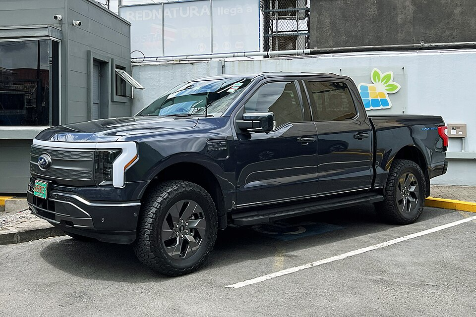

# Ford F-150 Lightning

*Bild: [Ford F-150 Lightning CRI 05 2023 3639.jpg](https://commons.wikimedia.org/wiki/File:Ford_F-150_Lightning_CRI_05_2023_3639.jpg) · Urheber: Mariordo (Mario Roberto Durán Ortiz) · Lizenz: CC BY-SA 4.0 · via Wikimedia Commons.*

> Elektrische Version des Full-Size-Pick-ups Ford F-150, vor allem für den nordamerikanischen Markt, mit sehr großen Batterien.

## Steckbrief

| Feld | Wert | Beleg |
|---|---|---|
| Hersteller | [[ford\|Ford]] | [[tn-batterycheck-alle-daten]] |
| Segment | Pick-up (Full-Size) | Fachwissen¹ |
| Karosserie | Pick-up (Doppelkabine) | Fachwissen¹ |
| Plattform | Leiterrahmen-Plattform des Ford F-150, für den Elektroantrieb angepasst | Fachwissen¹ |
| Varianten im Bestand | 2 | [[tn-batterycheck-alle-daten]] |
| [[bruttokapazitaet\|Bruttokapazität]] | 110–143,4 kWh | [[tn-batterycheck-alle-daten]] |
| [[nettokapazitaet\|Nettokapazität]] | 98–131 kWh | [[tn-batterycheck-alle-daten]] |
| [[batteriepuffer\|Puffer]] | 8,6–10,9 % | berechnet |

## Beschreibung

Der Ford F-150 Lightning ist die [[bev|batterieelektrische]] Ausführung des in den USA meistverkauften Pick-ups F-150. Er übernimmt Karosserie und Grundaufbau des Verbrenners, erhält aber eine eigene Batterie im Rahmen, Elektromotoren an beiden Achsen ([[allradantrieb|Allradantrieb]]) und anstelle des Motorraums einen zusätzlichen Stauraum unter der Fronthaube. Damit ist er ein [[konversionsfahrzeug|aus einem Verbrennermodell abgeleitetes]] Elektrofahrzeug, allerdings mit weitreichenden Anpassungen.

Wegen des hohen Gewichts und des Anhängebetriebs sind die [[traktionsbatterie|Traktionsbatterien]] außergewöhnlich groß. Es gibt zwei Stufen: Standard Range (SR) und Extended Range (ER). Die Differenz zwischen [[bruttokapazitaet|Brutto-]] und [[nettokapazitaet|Nettokapazität]] liegt im üblichen Bereich eines [[batteriepuffer|Batteriepuffers]].

## Varianten und Batterien

„SR“ steht für Standard Range (110 kWh brutto, Zeile 110), „ER“ für Extended Range (143,4 kWh brutto, Zeile 109). Die Ausstattungslinien des Pick-ups sind in den Rohdaten nicht aufgeschlüsselt; beide Batteriegrößen wurden parallel angeboten und stellen keine Generationen dar.

| Variante | Brutto | Netto | Puffer | Zeile |
|---|---|---|---|---|
| F-150 Lightning ER | 143,4 kWh | 131 kWh | 12,4 kWh (8,6 %) | 109 |
| F-150 Lightning SR | 110 kWh | 98 kWh | 12 kWh (10,9 %) | 110 |

Quelle: [[tn-batterycheck-alle-daten]], Blatt „Fahrzeuge“, Zeilen 109–110 – bereinigte Fassung (Stand 2026-09-24, Änderungen in [[datenqualitaet]]). Puffer = Brutto − Netto (berechnet).

## Fachbegriffe

- [[bev|BEV (batterieelektrisches Fahrzeug)]] — Battery Electric Vehicle – Fahrzeug, das ausschließlich mit Strom aus einer Traktionsbatterie fährt.
- [[traktionsbatterie|Traktionsbatterie]] — Der Hochvolt-Energiespeicher, der den Elektromotor eines Elektroautos versorgt.
- [[bruttokapazitaet|Bruttokapazität]] — Die gesamte, physikalisch in der Batterie verbaute Energiemenge – inklusive der Reserven, die der Fahrer nie nutzen kann.
- [[nettokapazitaet|Nettokapazität]] — Der Teil der Batteriekapazität, den der Fahrer tatsächlich nutzen kann – Grundlage für Reichweite und Batterietests.
- [[batteriepuffer|Batteriepuffer]] — Differenz zwischen Brutto- und Nettokapazität – eine Reserve, die die Batterie schont und Alterung ausgleicht.
- [[allradantrieb|Allradantrieb (AWD)]] — Beide Achsen werden angetrieben, bei Elektroautos meist durch je einen eigenen Motor pro Achse.
- [[konversionsfahrzeug|Konversionsfahrzeug]] — Elektroauto, das von einem Modell mit Verbrennungsmotor abgeleitet ist, statt auf einer reinen Elektroplattform zu basieren.

## Verwandte Fahrzeuge

- Weitere Modelle von Ford: [[ford-mustang-mach-e|Ford Mustang Mach-E]]

## Offene Punkte

- Bauzeit bewusst offen gelassen: Marktstart war 2022; Angaben zu einem Produktionsende bzw. einer Umstellung auf ein Modell mit Range-Extender sind nicht sicher bestätigt.
- Das Fahrzeug wurde in Europa nicht regulär angeboten; Bruttowerte stammen vermutlich aus US-Quellen.

Siehe auch [[datenqualitaet]].

## Quellen

- [[tn-batterycheck-alle-daten]] — Brutto-/Nettokapazität aller Varianten (Zeilen 109–110)
- Weiterlesen: [Wikipedia – Ford F-150 Lightning](https://en.wikipedia.org/wiki/Ford_F-150_Lightning)

¹ *Beschreibung und Steckbrief-Felder ohne Quellseite beruhen auf allgemeinem Fachwissen des LLM (Stand 2026-09-24) und sind nicht durch eine Rohquelle im Bestand belegt. Zahlenwerte zur Batterie stammen aus der Rohquelle, bereinigt nach dem Protokoll in [[datenqualitaet]].*
