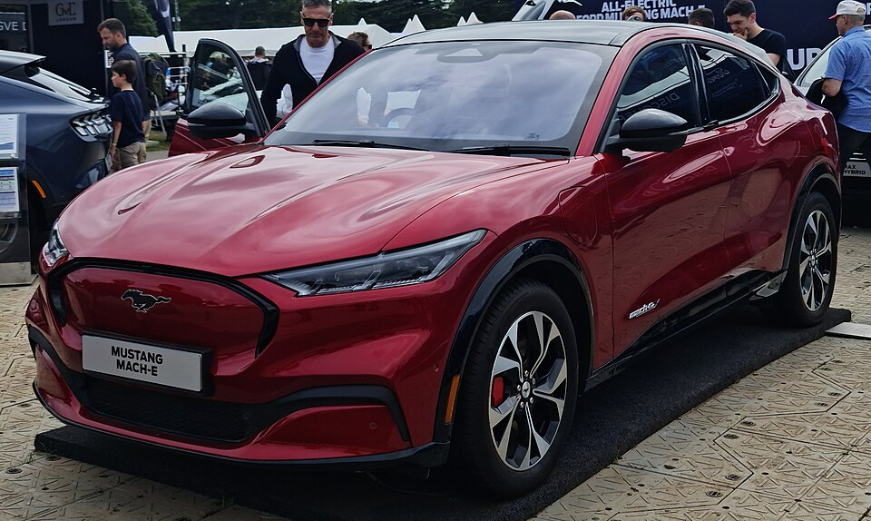

# Ford Mustang Mach-E

*Bild: [2021 Mustang Mach-E Red Ford.jpg](https://commons.wikimedia.org/wiki/File:2021_Mustang_Mach-E_Red_Ford.jpg) · Urheber: MrWalkr · Lizenz: CC BY-SA 4.0 · via Wikimedia Commons.*

> Elektrisches Crossover-SUV von Ford auf der eigenen Elektroplattform GE1, angeboten mit zwei Batteriegrößen sowie Heck- oder Allradantrieb.

## Steckbrief

| Feld | Wert | Beleg |
|---|---|---|
| Hersteller | [[ford\|Ford]] | [[tn-batterycheck-alle-daten]] |
| Segment | Mittelklasse-SUV | Fachwissen¹ |
| Karosserie | SUV-Crossover (fünftürig) | Fachwissen¹ |
| Bauzeit | seit 2020 | Fachwissen¹ |
| Plattform | Ford GE1 (Global Electrified 1) | Fachwissen¹ |
| Varianten im Bestand | 13 | [[tn-batterycheck-alle-daten]] |
| [[bruttokapazitaet\|Bruttokapazität]] | 75,7–98,7 kWh | [[tn-batterycheck-alle-daten]] |
| [[nettokapazitaet\|Nettokapazität]] | 68–91 kWh | [[tn-batterycheck-alle-daten]] |
| [[batteriepuffer\|Puffer]] | 6,9–10,8 % | berechnet |

## Beschreibung

Der Ford Mustang Mach-E war Fords erstes eigens als [[bev|Elektroauto]] entwickeltes Serienmodell. Trotz des Namens handelt es sich nicht um einen Sportwagen, sondern um ein fünftüriges Crossover-SUV, das Designelemente des Mustang übernimmt. Gebaut wird es in Mexiko.

Das Modell nutzt Fords Elektroplattform GE1 mit einer [[traktionsbatterie|Traktionsbatterie]] im Unterboden. Es gibt eine Standard-Range- (SR) und eine Extended-Range-Batterie (ER), jeweils mit [[hinterradantrieb|Hinterradantrieb]] (RWD) oder [[allradantrieb|Allradantrieb]] (AWD). Die Sportversion GT und die auf unbefestigte Strecken abgestimmte Rally-Version haben stets Allradantrieb und die große Batterie.

Im Laufe der [[modellpflege|Modellpflege]] hat Ford die nutzbare Kapazität bei gleicher [[bruttokapazitaet|Bruttokapazität]] angehoben, also den [[batteriepuffer|Puffer]] verkleinert. Zusätzlich taucht in den Rohdaten eine dritte SR-Batterie auf, die sich im Brutto- und Nettowert von der ursprünglichen unterscheidet und vermutlich auf eine andere [[lfp-zellchemie|Zellchemie]] zurückgeht.

## Varianten und Batterien

„SR“ = Standard Range, „ER“ = Extended Range, „RWD“ = Heckantrieb, „AWD“ = Allradantrieb, „GT“ und „Rally“ sind Top-Versionen mit Allrad. Für jede Kombination gibt es mehrere Zeilen mit gleichem Bruttowert (98,7 bzw. 75,7 kWh), aber unterschiedlichem Nettowert (88 bzw. 91 kWh, 68 bzw. 70 kWh) – das spricht für eine per Software geänderte Nutzbarkeit in späteren Modelljahren. Die SR-Zeilen mit 78 kWh brutto / 72,6 kWh netto (120 und 123) gehören zu einer späteren Batteriegeneration.

| Variante | Brutto | Netto | Puffer | Zeile |
|---|---|---|---|---|
| Mustang Mach-E ER AWD | 98,7 kWh | 88,0 kWh | 10,7 kWh (10,8 %) | 111 |
| Mustang Mach-E ER AWD | 98,7 kWh | 91,0 kWh | 7,7 kWh (7,8 %) | 112 |
| Mustang Mach-E ER RWD | 98,7 kWh | 88,0 kWh | 10,7 kWh (10,8 %) | 113 |
| Mustang Mach-E ER RWD | 98,7 kWh | 91,0 kWh | 7,7 kWh (7,8 %) | 114 |
| Mustang Mach-E GT | 98,7 kWh | 88,0 kWh | 10,7 kWh (10,8 %) | 115 |
| Mustang Mach-E GT | 98,7 kWh | 91,0 kWh | 7,7 kWh (7,8 %) | 116 |
| Mustang Mach-E Rally | 98,7 kWh | 91,0 kWh | 7,7 kWh (7,8 %) | 117 |
| Mustang Mach-E SR AWD | 75,7 kWh | 68,0 kWh | 7,7 kWh (10,2 %) | 118 |
| Mustang Mach-E SR AWD | 75,7 kWh | 70,0 kWh | 5,7 kWh (7,5 %) | 119 |
| Mustang Mach-E SR AWD | 78 kWh | 72,6 kWh | 5,4 kWh (6,9 %) | 120 |
| Mustang Mach-E SR RWD | 75,7 kWh | 68,0 kWh | 7,7 kWh (10,2 %) | 121 |
| Mustang Mach-E SR RWD | 75,7 kWh | 70,0 kWh | 5,7 kWh (7,5 %) | 122 |
| Mustang Mach-E SR RWD | 78 kWh | 72,6 kWh | 5,4 kWh (6,9 %) | 123 |

Quelle: [[tn-batterycheck-alle-daten]], Blatt „Fahrzeuge“, Zeilen 111–123. Puffer = Brutto − Netto (berechnet).

## Fachbegriffe

- [[bruttokapazitaet|Bruttokapazität]] — Die gesamte, physikalisch in der Batterie verbaute Energiemenge – inklusive der Reserven, die der Fahrer nie nutzen kann.
- [[nettokapazitaet|Nettokapazität]] — Der Teil der Batteriekapazität, den der Fahrer tatsächlich nutzen kann – Grundlage für Reichweite und Batterietests.
- [[batteriepuffer|Batteriepuffer]] — Differenz zwischen Brutto- und Nettokapazität – eine Reserve, die die Batterie schont und Alterung ausgleicht.
- [[allradantrieb|Allradantrieb (AWD)]] — Beide Achsen werden angetrieben, bei Elektroautos meist durch je einen eigenen Motor pro Achse.
- [[hinterradantrieb|Hinterradantrieb (RWD)]] — Der Elektromotor treibt die Hinterräder an – Standard auf vielen reinen Elektroplattformen.
- [[modellpflege|Modellpflege (Facelift)]] — Überarbeitung eines Modells während der Bauzeit – bei Elektroautos oft mit neuer Batterie.
- [[lfp-zellchemie|LFP-Zellchemie]] — Lithium-Eisenphosphat-Zellen – kobaltfrei, günstig, sehr langlebig, aber mit geringerer Energiedichte.
- [[typbezeichnungen|Typbezeichnungen]] — Wie Hersteller Leistungsstufe, Batterie und Antrieb in Modellnamen codieren – ein Lesehilfe-Artikel.

## Verwandte Fahrzeuge

- Weitere Modelle von Ford: [[ford-f-150-lightning|Ford F-150 Lightning]]

## Offene Punkte

- Gleiche Modellbezeichnungen erscheinen mehrfach mit identischem Brutto-, aber unterschiedlichem Nettowert (z. B. Zeilen 111/112, 118/119). Zuordnung zu Modelljahren ist in den Rohdaten nicht vermerkt.
- Dass die Batterie mit 78 kWh brutto / 72,6 kWh netto LFP-Zellen verwendet, ist eine Vermutung und nicht gesichert.
- Die Rally-Version (Zeile 117) ist nur mit dem höheren Nettowert 91 kWh gelistet, passend zu ihrer späteren Markteinführung.

Siehe auch [[datenqualitaet]].

## Quellen

- [[tn-batterycheck-alle-daten]] — Brutto-/Nettokapazität aller Varianten (Zeilen 111–123)
- Weiterlesen: [Wikipedia – Ford Mustang Mach-E](https://en.wikipedia.org/wiki/Ford_Mustang_Mach-E)

¹ *Beschreibung und Steckbrief-Felder ohne Quellseite beruhen auf allgemeinem Fachwissen des LLM (Stand 2026-09-23) und sind nicht durch eine Rohquelle im Bestand belegt. Zahlenwerte zur Batterie stammen ausschließlich aus der Rohquelle.*
