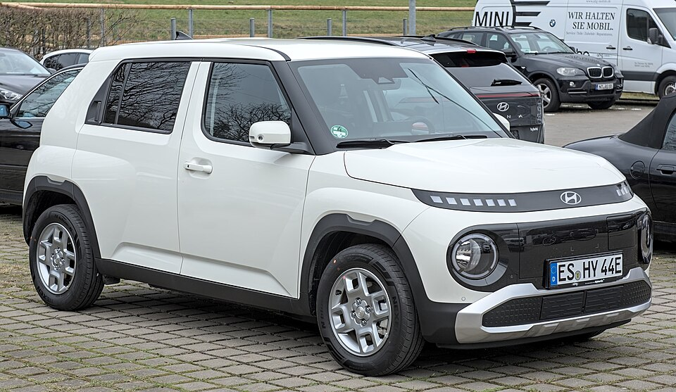

# Hyundai Inster

*Bild: [Hyundai Inster DSC 7947.jpg](https://commons.wikimedia.org/wiki/File:Hyundai_Inster_DSC_7947.jpg) · Urheber: Alexander Migl · Lizenz: CC BY-SA 4.0 · via Wikimedia Commons.*

> Elektrischer Kleinwagen von Hyundai im Crossover-Stil, der oberhalb eines klassischen Kleinstwagens positioniert ist und in zwei Batteriegrößen angeboten wird.

## Steckbrief

| Feld | Wert | Beleg |
|---|---|---|
| Hersteller | [[hyundai\|Hyundai]] | [[tn-batterycheck-alle-daten]] |
| Segment | Kleinwagen | Fachwissen¹ |
| Karosserie | Kleinwagen (Crossover-Optik, fünftürig) | Fachwissen¹ |
| Bauzeit | seit 2024 | Fachwissen¹ |
| Plattform | Kleinwagen-Plattform auf Basis des Hyundai Casper (keine E-GMP) | Fachwissen¹ |
| Varianten im Bestand | 2 | [[tn-batterycheck-alle-daten]] |
| [[bruttokapazitaet\|Bruttokapazität]] | 42–49 kWh | [[tn-batterycheck-alle-daten]] |
| [[nettokapazitaet\|Nettokapazität]] | 39–46 kWh | [[tn-batterycheck-alle-daten]] |
| [[batteriepuffer\|Puffer]] | 6,1–7,1 % | berechnet |

## Beschreibung

Der Hyundai Inster ist ein kompakt geschnittener [[bev|Elektro-Kleinwagen]], der aus dem in Korea angebotenen Verbrennermodell Casper abgeleitet wurde. Gegenüber dem Casper ist er verlängert, um Platz für die [[traktionsbatterie|Traktionsbatterie]] im Unterboden und einen größeren Innenraum zu schaffen. Er ist damit kein Modell der [[plattform-e-gmp|E-GMP]], sondern ein angepasstes Fahrzeug auf Kleinwagenbasis.

Angetrieben wird der Inster von einem [[elektromotor|Elektromotor]] an der Vorderachse ([[frontantrieb|Frontantrieb]]). Das Bordnetz arbeitet auf dem bei Kleinwagen üblichen 400-Volt-Niveau; [[dc-schnellladen|DC-Schnellladen]] und [[ac-laden|AC-Laden]] sind vorgesehen.

Die beiden Batterievarianten unterscheiden sich in der [[bruttokapazitaet|Bruttokapazität]] um wenige Kilowattstunden; der [[batteriepuffer|Puffer]] zwischen brutto und netto ist bei beiden Ausführungen gleich groß.

## Varianten und Batterien

Die Rohdaten nennen zwei Ausführungen: **INSTER Standard Range** mit der kleineren und **INSTER Long Range** mit der größeren Batterie. Es handelt sich nicht um Generationen, sondern um parallel angebotene Batteriegrößen derselben Baureihe; die Differenz zwischen [[bruttokapazitaet|brutto]] und [[nettokapazitaet|netto]] liegt bei beiden bei 3 kWh.

| Variante | Brutto | Netto | Puffer | Zeile |
|---|---|---|---|---|
| INSTER Long Range | 49 kWh | 46 kWh | 3 kWh (6,1 %) | 124 |
| INSTER Standard Range | 42 kWh | 39 kWh | 3 kWh (7,1 %) | 125 |

Quelle: [[tn-batterycheck-alle-daten]], Blatt „Fahrzeuge“, Zeilen 124–125 – bereinigte Fassung (Stand 2026-09-24, Änderungen in [[datenqualitaet]]). Puffer = Brutto − Netto (berechnet).

## Fachbegriffe

- [[bev|BEV (batterieelektrisches Fahrzeug)]] — Battery Electric Vehicle – Fahrzeug, das ausschließlich mit Strom aus einer Traktionsbatterie fährt.
- [[traktionsbatterie|Traktionsbatterie]] — Der Hochvolt-Energiespeicher, der den Elektromotor eines Elektroautos versorgt.
- [[bruttokapazitaet|Bruttokapazität]] — Die gesamte, physikalisch in der Batterie verbaute Energiemenge – inklusive der Reserven, die der Fahrer nie nutzen kann.
- [[nettokapazitaet|Nettokapazität]] — Der Teil der Batteriekapazität, den der Fahrer tatsächlich nutzen kann – Grundlage für Reichweite und Batterietests.
- [[batteriepuffer|Batteriepuffer]] — Differenz zwischen Brutto- und Nettokapazität – eine Reserve, die die Batterie schont und Alterung ausgleicht.
- [[frontantrieb|Frontantrieb (FWD)]] — Der Elektromotor treibt die Vorderräder an – typisch für Kleinwagen und Konversionsfahrzeuge.
- [[dc-schnellladen|DC-Schnellladen]] — Laden mit Gleichstrom direkt in die Batterie, ohne Umweg über den Bordlader – mit 50 bis über 300 kW.

## Verwandte Fahrzeuge

- Weitere Modelle von Hyundai: [[hyundai-ioniq-5|Hyundai IONIQ 5]], [[hyundai-ioniq-6|Hyundai IONIQ 6]], [[hyundai-ioniq-9|Hyundai IONIQ 9]], [[hyundai-ioniq-electric|Hyundai IONIQ Elektro]], [[hyundai-kona-electric|Hyundai Kona Elektro]]

## Offene Punkte

- Die Plattformzuordnung (Ableitung vom Hyundai Casper) ist als Einordnung zu verstehen; eine offizielle Plattformbezeichnung wurde nicht übernommen.
- Zellchemie der beiden Batterien in den Rohdaten nicht angegeben und hier nicht behauptet.

Siehe auch [[datenqualitaet]].

## Quellen

- [[tn-batterycheck-alle-daten]] — Brutto-/Nettokapazität aller Varianten (Zeilen 124–125)
- Weiterlesen: [Wikipedia – Hyundai Casper](https://en.wikipedia.org/wiki/Hyundai_Casper)

¹ *Beschreibung und Steckbrief-Felder ohne Quellseite beruhen auf allgemeinem Fachwissen des LLM (Stand 2026-09-24) und sind nicht durch eine Rohquelle im Bestand belegt. Zahlenwerte zur Batterie stammen aus der Rohquelle, bereinigt nach dem Protokoll in [[datenqualitaet]].*
