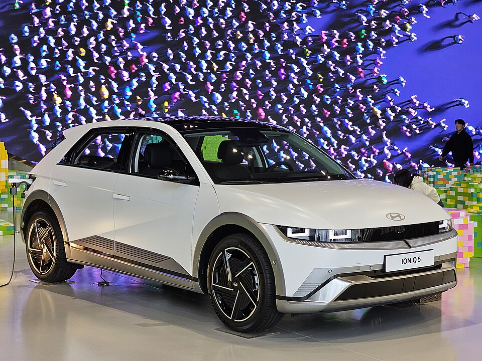

# Hyundai IONIQ 5

*Bild: [Hyundai IONIQ 5 Long Range Prestige NE1 PE Atlas White Matte (7).jpg](https://commons.wikimedia.org/wiki/File:Hyundai_IONIQ_5_Long_Range_Prestige_NE1_PE_Atlas_White_Matte_(7).jpg) · Urheber: Damian B Oh · Lizenz: CC BY-SA 4.0 · via Wikimedia Commons.*

> Elektrisches Mittelklasse-Crossover von Hyundai und erstes Serienmodell der Marke auf der E-GMP mit 800-Volt-Technik.

## Steckbrief

| Feld | Wert | Beleg |
|---|---|---|
| Hersteller | [[hyundai\|Hyundai]] | [[tn-batterycheck-alle-daten]] |
| Segment | Mittelklasse-SUV / Crossover | Fachwissen¹ |
| Karosserie | Crossover (Fließheck-SUV) | Fachwissen¹ |
| Bauzeit | seit 2021 | Fachwissen¹ |
| Plattform | E-GMP | Fachwissen¹ |
| Varianten im Bestand | 11 | [[tn-batterycheck-alle-daten]] |
| [[bruttokapazitaet\|Bruttokapazität]] | 58–84 kWh | [[tn-batterycheck-alle-daten]] |
| [[nettokapazitaet\|Nettokapazität]] | 54–80 kWh | [[tn-batterycheck-alle-daten]] |
| [[batteriepuffer\|Puffer]] | 3,6–6,9 % | berechnet |

## Beschreibung

Der IONIQ 5 war 2021 das erste Serienfahrzeug der Hyundai Motor Group auf der reinen Elektroplattform [[plattform-e-gmp|E-GMP]]. Kennzeichnend sind der lange Radstand, der flache Unterboden mit der [[traktionsbatterie|Traktionsbatterie]] und die [[800-volt-architektur|800-Volt-Architektur]], die sehr kurze Ladezeiten beim [[dc-schnellladen|DC-Schnellladen]] ermöglicht.

Die Basisversionen haben einen [[elektromotor|Elektromotor]] an der Hinterachse ([[hinterradantrieb|Hinterradantrieb]]), die AWD-Versionen einen zusätzlichen Motor vorne ([[allradantrieb|Allradantrieb]]). Der IONIQ 5 N ist die leistungsorientierte Topversion mit Allradantrieb.

Im Laufe der Bauzeit wurde die Batterie zweimal vergrößert: Auf die erste Long-Range-Batterie folgte eine Version mit höherer Kapazität, und mit der [[modellpflege|Modellpflege]] 2024 wurden sowohl die Standard- als auch die Long-Range-Batterie erneut vergrößert. Technisch eng verwandt sind [[kia-ev6|Kia EV6]] und [[hyundai-ioniq-6|Hyundai IONIQ 6]].

## Varianten und Batterien

Die Bezeichnungen folgen dem Muster *Batteriegröße + Antrieb*. „Standard Range“ und „Long Range“ bezeichnen die Batterie, „2WD“/„RWD“ Hinterradantrieb und „AWD“ Allradantrieb. Drei Batterie-Generationen lassen sich unterscheiden:

- **Erste Generation (ab 2021):** Standard Range 58,0/54 kWh und Long Range 72,6/70 kWh; auch das Launch-Sondermodell **Project 45** nutzt diese Long-Range-Batterie.
- **Zweite Stufe:** Long Range 77,4/74 kWh (die Zeilen „Long Range 2WD/AWD“ erscheinen daher doppelt).
- **Nach der Modellpflege 2024:** 63,0/60 kWh (als „RWD“ geführt) und 84,0/80 kWh („RWD“, „AWD“ sowie IONIQ 5 N).

Nach der Modellpflege verwendet Hyundai statt „Long Range 2WD“ meist die Kurzform „RWD“ bzw. „AWD“.

| Variante | Brutto | Netto | Puffer | Zeile |
|---|---|---|---|---|
| IONIQ 5 AWD | 84,0 kWh | 80,0 kWh | 4 kWh (4,8 %) | 126 |
| IONIQ 5 Long Range 2WD | 72,6 kWh | 70,0 kWh | 2,6 kWh (3,6 %) | 127 |
| IONIQ 5 Long Range 2WD | 77,4 kWh | 74,0 kWh | 3,4 kWh (4,4 %) | 128 |
| IONIQ 5 Long Range AWD | 72,6 kWh | 70,0 kWh | 2,6 kWh (3,6 %) | 129 |
| IONIQ 5 Long Range AWD | 77,4 kWh | 74,0 kWh | 3,4 kWh (4,4 %) | 130 |
| IONIQ 5 N | 84,0 kWh | 80,0 kWh | 4 kWh (4,8 %) | 131 |
| IONIQ 5 Project 45 | 72,6 kWh | 70,0 kWh | 2,6 kWh (3,6 %) | 132 |
| IONIQ 5 RWD | 63,0 kWh | 60,0 kWh | 3 kWh (4,8 %) | 133 |
| IONIQ 5 RWD | 84,0 kWh | 80,0 kWh | 4 kWh (4,8 %) | 134 |
| IONIQ 5 Standard Range 2WD | 58,0 kWh | 54,0 kWh | 4 kWh (6,9 %) | 135 |
| IONIQ 5 Standard Range AWD | 58,0 kWh | 54,0 kWh | 4 kWh (6,9 %) | 136 |

Quelle: [[tn-batterycheck-alle-daten]], Blatt „Fahrzeuge“, Zeilen 126–136. Puffer = Brutto − Netto (berechnet).

## Fachbegriffe

- [[plattform-e-gmp|E-GMP (Electric Global Modular Platform)]] — Elektroplattform von Hyundai und Kia, Basis für IONIQ 5/6/9 und EV6/EV9.
- [[800-volt-architektur|800-Volt-Architektur]] — Hochvoltsystem mit etwa doppelter Spannung gegenüber üblichen 400 Volt – ermöglicht schnelleres Laden und leichtere Kabel.
- [[dc-schnellladen|DC-Schnellladen]] — Laden mit Gleichstrom direkt in die Batterie, ohne Umweg über den Bordlader – mit 50 bis über 300 kW.
- [[hinterradantrieb|Hinterradantrieb (RWD)]] — Der Elektromotor treibt die Hinterräder an – Standard auf vielen reinen Elektroplattformen.
- [[allradantrieb|Allradantrieb (AWD)]] — Beide Achsen werden angetrieben, bei Elektroautos meist durch je einen eigenen Motor pro Achse.
- [[modellpflege|Modellpflege (Facelift)]] — Überarbeitung eines Modells während der Bauzeit – bei Elektroautos oft mit neuer Batterie.
- [[plattform-geschwister|Plattform-Geschwister (Badge-Engineering)]] — Fahrzeuge verschiedener Marken, die technisch weitgehend baugleich sind und dieselbe Batterie nutzen.
- [[typbezeichnungen|Typbezeichnungen]] — Wie Hersteller Leistungsstufe, Batterie und Antrieb in Modellnamen codieren – ein Lesehilfe-Artikel.

## Verwandte Fahrzeuge

- [[kia-ev6|Kia EV6]] — technisch verwandt / gleiche Plattform oder Batterie
- [[hyundai-ioniq-6|Hyundai IONIQ 6]] — technisch verwandt / gleiche Plattform oder Batterie
- [[hyundai-ioniq-9|Hyundai IONIQ 9]] — technisch verwandt / gleiche Plattform oder Batterie
- [[kia-ev9|Kia EV9]] — technisch verwandt / gleiche Plattform oder Batterie
- Weitere Modelle von Hyundai: [[hyundai-inster|Hyundai Inster]], [[hyundai-ioniq-electric|Hyundai IONIQ Elektro]], [[hyundai-kona-electric|Hyundai Kona Elektro]]

## Offene Punkte

- „IONIQ 5 Long Range 2WD“ und „IONIQ 5 Long Range AWD“ kommen je zweimal mit unterschiedlichen Kapazitäten vor (72,6 bzw. 77,4 kWh brutto) – verschiedene Batterie-Generationen unter gleichem Namen.
- „IONIQ 5 RWD“ erscheint zweimal (63,0 und 84,0 kWh brutto); gemeint sind die Standard- und die Long-Range-Batterie nach der Modellpflege.
- Uneinheitliche Antriebsbezeichnung: „2WD“ (vor der Modellpflege) und „RWD“ (danach) meinen beide Hinterradantrieb.
- Die Zuordnung der Stufen zu Modelljahren (insbesondere Einführung der 77,4-kWh-Batterie) ist aus den Rohdaten nicht ablesbar.

Siehe auch [[datenqualitaet]].

## Quellen

- [[tn-batterycheck-alle-daten]] — Brutto-/Nettokapazität aller Varianten (Zeilen 126–136)
- Weiterlesen: [Wikipedia – Hyundai Ioniq 5](https://en.wikipedia.org/wiki/Hyundai_Ioniq_5)

¹ *Beschreibung und Steckbrief-Felder ohne Quellseite beruhen auf allgemeinem Fachwissen des LLM (Stand 2026-09-23) und sind nicht durch eine Rohquelle im Bestand belegt. Zahlenwerte zur Batterie stammen ausschließlich aus der Rohquelle.*
