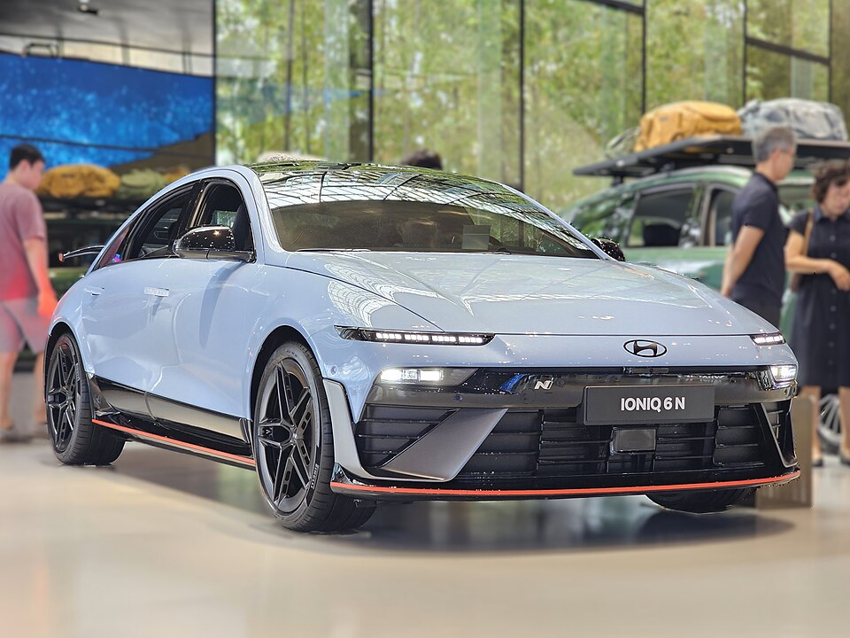

# Hyundai IONIQ 6

*Bild: [Hyundai IONIQ 6 N CE1 N Performance Blue Pearl (6).jpg](https://commons.wikimedia.org/wiki/File:Hyundai_IONIQ_6_N_CE1_N_Performance_Blue_Pearl_(6).jpg) · Urheber: Damian B Oh · Lizenz: CC BY-SA 4.0 · via Wikimedia Commons. Abgebildet ist die Sportversion IONIQ 6 N (nicht im Bestand).*

> Elektrische Mittelklasse-Limousine von Hyundai mit stromlinienförmiger Karosserie auf der E-GMP.

## Steckbrief

| Feld | Wert | Beleg |
|---|---|---|
| Hersteller | [[hyundai\|Hyundai]] | [[tn-batterycheck-alle-daten]] |
| Segment | Mittelklasse-Limousine | Fachwissen¹ |
| Karosserie | Limousine (Fließheck-Linie, viertürig) | Fachwissen¹ |
| Bauzeit | seit 2022 | Fachwissen¹ |
| Plattform | E-GMP | Fachwissen¹ |
| Varianten im Bestand | 3 | [[tn-batterycheck-alle-daten]] |
| [[bruttokapazitaet\|Bruttokapazität]] | 53–77,4 kWh | [[tn-batterycheck-alle-daten]] |
| [[nettokapazitaet\|Nettokapazität]] | 50–74 kWh | [[tn-batterycheck-alle-daten]] |
| [[batteriepuffer\|Puffer]] | 4,4–5,7 % | berechnet |

## Beschreibung

Der IONIQ 6 ist die Limousinen-Variante der IONIQ-Familie und nutzt dieselbe Plattform [[plattform-e-gmp|E-GMP]] wie der [[hyundai-ioniq-5|IONIQ 5]]. Die Karosserie ist auf geringen Luftwiderstand ausgelegt, was sich vor allem bei der [[wltp|WLTP]]-Reichweite bemerkbar macht.

Wie alle E-GMP-Modelle der ersten Generation verfügt der IONIQ 6 über eine [[800-volt-architektur|800-Volt-Architektur]] für schnelles [[dc-schnellladen|DC-Schnellladen]]. Es gibt Ausführungen mit [[hinterradantrieb|Hinterradantrieb]] (2WD) und mit [[allradantrieb|Allradantrieb]] (AWD).

Die Long-Range-Batterie entspricht in den Rohdaten der zweiten Batteriestufe von IONIQ 5 und [[kia-ev6|Kia EV6]]; die Standard-Range-Batterie ist eine eigene, kleinere Ausführung.

## Varianten und Batterien

**Standard Range 2WD** (53,0/50 kWh) und **Long Range 2WD/AWD** (77,4/74 kWh) sind parallel angebotene Batteriegrößen. „2WD“ steht für Hinterradantrieb, „AWD“ für Allradantrieb; die Long-Range-Zeilen unterscheiden sich nur im Antrieb, nicht in der Batterie.

| Variante | Brutto | Netto | Puffer | Zeile |
|---|---|---|---|---|
| IONIQ 6 Long Range 2WD | 77,4 kWh | 74 kWh | 3,4 kWh (4,4 %) | 137 |
| IONIQ 6 Long Range AWD | 77,4 kWh | 74 kWh | 3,4 kWh (4,4 %) | 138 |
| IONIQ 6 Standard Range 2WD | 53 kWh | 50 kWh | 3 kWh (5,7 %) | 139 |

Quelle: [[tn-batterycheck-alle-daten]], Blatt „Fahrzeuge“, Zeilen 137–139 – bereinigte Fassung (Stand 2026-09-24, Änderungen in [[datenqualitaet]]). Puffer = Brutto − Netto (berechnet).

## Fachbegriffe

- [[plattform-e-gmp|E-GMP (Electric Global Modular Platform)]] — Elektroplattform von Hyundai und Kia, Basis für IONIQ 5/6/9 und EV6/EV9.
- [[800-volt-architektur|800-Volt-Architektur]] — Hochvoltsystem mit etwa doppelter Spannung gegenüber üblichen 400 Volt – ermöglicht schnelleres Laden und leichtere Kabel.
- [[dc-schnellladen|DC-Schnellladen]] — Laden mit Gleichstrom direkt in die Batterie, ohne Umweg über den Bordlader – mit 50 bis über 300 kW.
- [[hinterradantrieb|Hinterradantrieb (RWD)]] — Der Elektromotor treibt die Hinterräder an – Standard auf vielen reinen Elektroplattformen.
- [[allradantrieb|Allradantrieb (AWD)]] — Beide Achsen werden angetrieben, bei Elektroautos meist durch je einen eigenen Motor pro Achse.
- [[wltp|WLTP]] — Worldwide Harmonized Light Vehicles Test Procedure – seit 2017/2018 der EU-Normzyklus für Verbrauch und Reichweite.
- [[plattform-geschwister|Plattform-Geschwister (Badge-Engineering)]] — Fahrzeuge verschiedener Marken, die technisch weitgehend baugleich sind und dieselbe Batterie nutzen.

## Verwandte Fahrzeuge

- [[hyundai-ioniq-5|Hyundai IONIQ 5]] — technisch verwandt / gleiche Plattform oder Batterie
- [[kia-ev6|Kia EV6]] — technisch verwandt / gleiche Plattform oder Batterie
- Weitere Modelle von Hyundai: [[hyundai-inster|Hyundai Inster]], [[hyundai-ioniq-9|Hyundai IONIQ 9]], [[hyundai-ioniq-electric|Hyundai IONIQ Elektro]], [[hyundai-kona-electric|Hyundai Kona Elektro]]

## Offene Punkte

- Die Rohdaten enthalten keine Varianten nach einer möglichen Modellpflege mit größeren Batterien (wie beim IONIQ 5); ob solche Versionen fehlen, ist nicht geprüft.

Siehe auch [[datenqualitaet]].

## Quellen

- [[tn-batterycheck-alle-daten]] — Brutto-/Nettokapazität aller Varianten (Zeilen 137–139)
- Weiterlesen: [Wikipedia – Hyundai Ioniq 6](https://en.wikipedia.org/wiki/Hyundai_Ioniq_6)

¹ *Beschreibung und Steckbrief-Felder ohne Quellseite beruhen auf allgemeinem Fachwissen des LLM (Stand 2026-09-24) und sind nicht durch eine Rohquelle im Bestand belegt. Zahlenwerte zur Batterie stammen aus der Rohquelle, bereinigt nach dem Protokoll in [[datenqualitaet]].*
