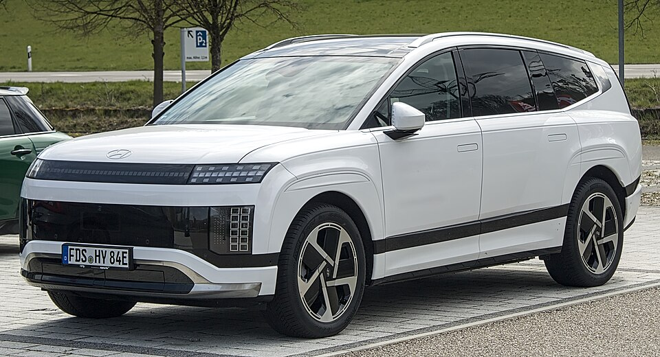

# Hyundai IONIQ 9

*Bild: [Hyundai Ioniq 9 IMG 5950.jpg](https://commons.wikimedia.org/wiki/File:Hyundai_Ioniq_9_IMG_5950.jpg) · Urheber: Alexander Migl · Lizenz: CC BY-SA 4.0 · via Wikimedia Commons.*

> Großes siebensitziges Elektro-SUV von Hyundai auf der E-GMP und Flaggschiff der IONIQ-Reihe.

## Steckbrief

| Feld | Wert | Beleg |
|---|---|---|
| Hersteller | [[hyundai\|Hyundai]] | [[tn-batterycheck-alle-daten]] |
| Segment | Oberklasse-SUV (drei Sitzreihen) | Fachwissen¹ |
| Karosserie | SUV | Fachwissen¹ |
| Plattform | E-GMP | Fachwissen¹ |
| Varianten im Bestand | 3 | [[tn-batterycheck-alle-daten]] |
| [[bruttokapazitaet\|Bruttokapazität]] | 110,3 kWh | [[tn-batterycheck-alle-daten]] |
| [[nettokapazitaet\|Nettokapazität]] | 106 kWh | [[tn-batterycheck-alle-daten]] |
| [[batteriepuffer\|Puffer]] | 3,9 % | berechnet |

## Beschreibung

Der IONIQ 9 ist das größte Modell der IONIQ-Familie und bietet drei Sitzreihen. Er basiert auf der [[plattform-e-gmp|E-GMP]] mit verlängertem Radstand und ist damit eng mit dem [[kia-ev9|Kia EV9]] verwandt.

Die [[traktionsbatterie|Traktionsbatterie]] ist die größte im Hyundai-Programm. Wie andere E-GMP-Modelle nutzt der IONIQ 9 eine [[800-volt-architektur|800-Volt-Architektur]] für schnelles [[dc-schnellladen|DC-Schnellladen]]. Es gibt eine Version mit [[hinterradantrieb|Hinterradantrieb]] sowie zwei Versionen mit [[allradantrieb|Allradantrieb]].

## Varianten und Batterien

Alle drei Zeilen (**Long Range RWD**, **Long Range AWD**, **Performance AWD**) nutzen dieselbe Batterie mit 110,3/106 kWh. Die Bezeichnungen unterscheiden nur Antrieb und Leistungsstufe; unterschiedliche Batteriegrößen oder Generationen gibt es in den Rohdaten nicht.

| Variante | Brutto | Netto | Puffer | Zeile |
|---|---|---|---|---|
| IONIQ 9 Long Range AWD | 110,3 kWh | 106,0 kWh | 4,3 kWh (3,9 %) | 140 |
| IONIQ 9 Long Range RWD | 110,3 kWh | 106,0 kWh | 4,3 kWh (3,9 %) | 141 |
| IONIQ 9 Performance AWD | 110,3 kWh | 106,0 kWh | 4,3 kWh (3,9 %) | 142 |

Quelle: [[tn-batterycheck-alle-daten]], Blatt „Fahrzeuge“, Zeilen 140–142. Puffer = Brutto − Netto (berechnet).

## Fachbegriffe

- [[plattform-e-gmp|E-GMP (Electric Global Modular Platform)]] — Elektroplattform von Hyundai und Kia, Basis für IONIQ 5/6/9 und EV6/EV9.
- [[800-volt-architektur|800-Volt-Architektur]] — Hochvoltsystem mit etwa doppelter Spannung gegenüber üblichen 400 Volt – ermöglicht schnelleres Laden und leichtere Kabel.
- [[traktionsbatterie|Traktionsbatterie]] — Der Hochvolt-Energiespeicher, der den Elektromotor eines Elektroautos versorgt.
- [[allradantrieb|Allradantrieb (AWD)]] — Beide Achsen werden angetrieben, bei Elektroautos meist durch je einen eigenen Motor pro Achse.
- [[hinterradantrieb|Hinterradantrieb (RWD)]] — Der Elektromotor treibt die Hinterräder an – Standard auf vielen reinen Elektroplattformen.
- [[dc-schnellladen|DC-Schnellladen]] — Laden mit Gleichstrom direkt in die Batterie, ohne Umweg über den Bordlader – mit 50 bis über 300 kW.

## Verwandte Fahrzeuge

- [[kia-ev9|Kia EV9]] — technisch verwandt / gleiche Plattform oder Batterie
- [[hyundai-ioniq-5|Hyundai IONIQ 5]] — technisch verwandt / gleiche Plattform oder Batterie
- Weitere Modelle von Hyundai: [[hyundai-inster|Hyundai Inster]], [[hyundai-ioniq-6|Hyundai IONIQ 6]], [[hyundai-ioniq-electric|Hyundai IONIQ Elektro]], [[hyundai-kona-electric|Hyundai Kona Elektro]]

## Offene Punkte

- Bauzeit bewusst offen gelassen: Produktionsstart Ende 2024, Markteinführung in Europa 2025 – exakte Angabe nicht gesichert.
- Alle Varianten mit identischen Kapazitäten; in den Rohdaten existiert keine kleinere Batterieoption.

Siehe auch [[datenqualitaet]].

## Quellen

- [[tn-batterycheck-alle-daten]] — Brutto-/Nettokapazität aller Varianten (Zeilen 140–142)
- Weiterlesen: [Wikipedia – Hyundai Ioniq 9](https://en.wikipedia.org/wiki/Hyundai_Ioniq_9)

¹ *Beschreibung und Steckbrief-Felder ohne Quellseite beruhen auf allgemeinem Fachwissen des LLM (Stand 2026-09-23) und sind nicht durch eine Rohquelle im Bestand belegt. Zahlenwerte zur Batterie stammen ausschließlich aus der Rohquelle.*
