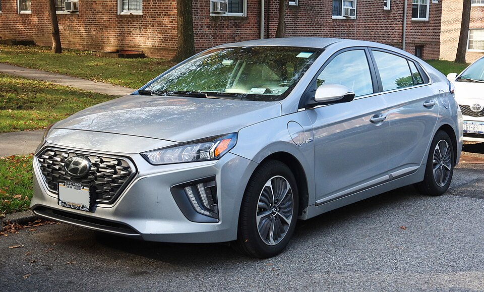

# Hyundai IONIQ Elektro

*Bild: [2020 Hyundai Ioniq Hybrid, front 11.7.22.jpg](https://commons.wikimedia.org/wiki/File:2020_Hyundai_Ioniq_Hybrid,_front_11.7.22.jpg) · Urheber: Kevauto · Lizenz: CC BY-SA 4.0 · via Wikimedia Commons. Abgebildet ist die Hybridversion; Karosserie identisch mit dem IONIQ Elektro.*

> Kompaktes Elektro-Fließheckmodell von Hyundai aus der IONIQ-Baureihe, die parallel als Hybrid, Plug-in-Hybrid und Elektroauto angeboten wurde.

## Steckbrief

| Feld | Wert | Beleg |
|---|---|---|
| Hersteller | [[hyundai\|Hyundai]] | [[tn-batterycheck-alle-daten]] |
| Segment | Kompaktklasse | Fachwissen¹ |
| Karosserie | Fließhecklimousine (fünftürig) | Fachwissen¹ |
| Bauzeit | 2016–2022 | Fachwissen¹ |
| Plattform | Mehrenergie-Plattform der IONIQ-Baureihe (Hybrid, Plug-in-Hybrid, Elektro) | Fachwissen¹ |
| Varianten im Bestand | 2 | [[tn-batterycheck-alle-daten]] |
| [[bruttokapazitaet\|Bruttokapazität]] | 30,5–40,4 kWh | [[tn-batterycheck-alle-daten]] |
| [[nettokapazitaet\|Nettokapazität]] | 28–38,3 kWh | [[tn-batterycheck-alle-daten]] |
| [[batteriepuffer\|Puffer]] | 5,2–8,2 % | berechnet |

## Beschreibung

Der Hyundai IONIQ Elektro war die batterieelektrische Variante des IONIQ, der von Beginn an für drei Antriebsarten entwickelt wurde. Das Modell ist nicht mit der späteren IONIQ-Submarke ([[hyundai-ioniq-5|IONIQ 5]] usw.) zu verwechseln, deren Fahrzeuge auf der [[plattform-e-gmp|E-GMP]] stehen.

Der [[elektromotor|Elektromotor]] treibt die Vorderräder an ([[frontantrieb|Frontantrieb]]). Das Fahrzeug galt als besonders effizient, was vor allem auf die windschlüpfige Karosserie zurückgeführt wird.

Mit der [[modellpflege|Modellpflege]] 2019 erhielt der IONIQ Elektro eine größere [[traktionsbatterie|Traktionsbatterie]]; die beiden Zeilen der Rohdaten entsprechen diesen zwei Generationen.

## Varianten und Batterien

Beide Zeilen tragen den identischen Namen **IONIQ Electric**. Die kleinere Batterie (30,5/28 kWh) gehört zur ersten Generation, die größere (40,4/38,3 kWh) zum Modell nach der Modellpflege 2019. Eine Unterscheidung ist nur über die Kapazität bzw. das Baujahr möglich.

| Variante | Brutto | Netto | Puffer | Zeile |
|---|---|---|---|---|
| IONIQ Electric | 30,5 kWh | 28 kWh | 2,5 kWh (8,2 %) | 143 |
| IONIQ Electric | 40,4 kWh | 38,3 kWh | 2,1 kWh (5,2 %) | 144 |

Quelle: [[tn-batterycheck-alle-daten]], Blatt „Fahrzeuge“, Zeilen 143–144 – bereinigte Fassung (Stand 2026-09-24, Änderungen in [[datenqualitaet]]). Puffer = Brutto − Netto (berechnet).

## Fachbegriffe

- [[modellpflege|Modellpflege (Facelift)]] — Überarbeitung eines Modells während der Bauzeit – bei Elektroautos oft mit neuer Batterie.
- [[frontantrieb|Frontantrieb (FWD)]] — Der Elektromotor treibt die Vorderräder an – typisch für Kleinwagen und Konversionsfahrzeuge.
- [[traktionsbatterie|Traktionsbatterie]] — Der Hochvolt-Energiespeicher, der den Elektromotor eines Elektroautos versorgt.
- [[batteriepuffer|Batteriepuffer]] — Differenz zwischen Brutto- und Nettokapazität – eine Reserve, die die Batterie schont und Alterung ausgleicht.
- [[typbezeichnungen|Typbezeichnungen]] — Wie Hersteller Leistungsstufe, Batterie und Antrieb in Modellnamen codieren – ein Lesehilfe-Artikel.
- [[bev|BEV (batterieelektrisches Fahrzeug)]] — Battery Electric Vehicle – Fahrzeug, das ausschließlich mit Strom aus einer Traktionsbatterie fährt.

## Verwandte Fahrzeuge

- [[kia-soul-ev|Kia Soul EV / e-Soul]] — technisch verwandt / gleiche Plattform oder Batterie
- Weitere Modelle von Hyundai: [[hyundai-inster|Hyundai Inster]], [[hyundai-ioniq-5|Hyundai IONIQ 5]], [[hyundai-ioniq-6|Hyundai IONIQ 6]], [[hyundai-ioniq-9|Hyundai IONIQ 9]], [[hyundai-kona-electric|Hyundai Kona Elektro]]

## Offene Punkte

- Zwei Zeilen mit identischer Bezeichnung „IONIQ Electric“ – Unterscheidung nur über die Kapazität (Generation vor/nach Modellpflege 2019).
- Die Brutto-Angabe der ersten Generation (30,5 kWh) entspricht der des Kia Soul EV (erste Generation), die Netto-Werte unterscheiden sich jedoch (28 vs. 27 kWh); ob es sich um denselben Batteriepack handelt, ist nicht belegt.

Siehe auch [[datenqualitaet]].

## Quellen

- [[tn-batterycheck-alle-daten]] — Brutto-/Nettokapazität aller Varianten (Zeilen 143–144)
- Weiterlesen: [Wikipedia – Hyundai Ioniq](https://en.wikipedia.org/wiki/Hyundai_Ioniq)

¹ *Beschreibung und Steckbrief-Felder ohne Quellseite beruhen auf allgemeinem Fachwissen des LLM (Stand 2026-09-24) und sind nicht durch eine Rohquelle im Bestand belegt. Zahlenwerte zur Batterie stammen aus der Rohquelle, bereinigt nach dem Protokoll in [[datenqualitaet]].*
