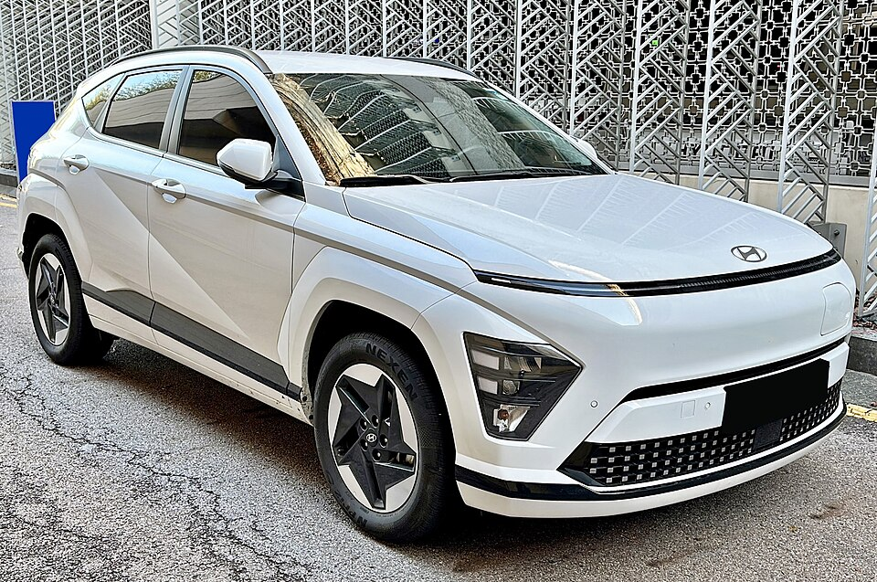

# Hyundai Kona Elektro

*Bild: [23 Hyundai Kona Electric (SX2) 1.jpg](https://commons.wikimedia.org/wiki/File:23_Hyundai_Kona_Electric_(SX2)_1.jpg) · Urheber: Benespit · Lizenz: CC BY-SA 4.0 · via Wikimedia Commons.*

> Elektrische Variante des Kompakt-SUV Hyundai Kona, erhältlich in zwei Generationen mit jeweils zwei Batteriegrößen.

## Steckbrief

| Feld | Wert | Beleg |
|---|---|---|
| Hersteller | [[hyundai\|Hyundai]] | [[tn-batterycheck-alle-daten]] |
| Segment | Kompakt-SUV | Fachwissen¹ |
| Karosserie | SUV | Fachwissen¹ |
| Bauzeit | seit 2018 | Fachwissen¹ |
| Plattform | Mehrenergie-Plattform des Kona (Verbrenner, Hybrid, Elektro; keine E-GMP) | Fachwissen¹ |
| Varianten im Bestand | 4 | [[tn-batterycheck-alle-daten]] |
| [[bruttokapazitaet\|Bruttokapazität]] | 42–68,5 kWh | [[tn-batterycheck-alle-daten]] |
| [[nettokapazitaet\|Nettokapazität]] | 39,2–65,4 kWh | [[tn-batterycheck-alle-daten]] |
| [[batteriepuffer\|Puffer]] | 4,5–6,7 % | berechnet |

## Beschreibung

Der Kona Elektro ist die batterieelektrische Ausführung des Hyundai Kona, der auch mit Verbrennungs- und Hybridantrieb angeboten wird. Er steht deshalb nicht auf der [[plattform-e-gmp|E-GMP]], sondern auf einer Plattform, die mehrere Antriebsarten aufnehmen kann. Angetrieben werden die Vorderräder ([[frontantrieb|Frontantrieb]]).

Die erste Generation (ab 2018) teilte ihre beiden Batteriegrößen mit dem [[kia-niro-ev|Kia e-Niro]] und dem [[kia-soul-ev|Kia e-Soul]]. Die zweite Generation (ab 2023) ist größer und erhielt neue, etwas größere Batterien.

Die Rohdaten enthalten damit vier Batterien unter demselben Modellnamen – je zwei pro Generation.

## Varianten und Batterien

Alle vier Zeilen heißen schlicht **Kona Electric**. Zuordnung über die Kapazität:

- **1. Generation:** 42,0/39,2 kWh und 67,5/64,0 kWh.
- **2. Generation:** 51,0/48,4 kWh und 68,5/65,4 kWh.

Innerhalb jeder Generation gab es eine kleinere und eine größere Batterie als parallele Ausstattungsoption.

| Variante | Brutto | Netto | Puffer | Zeile |
|---|---|---|---|---|
| Kona Electric | 42,0 kWh | 39,2 kWh | 2,8 kWh (6,7 %) | 145 |
| Kona Electric | 51,0 kWh | 48,4 kWh | 2,6 kWh (5,1 %) | 146 |
| Kona Electric | 67,5 kWh | 64,0 kWh | 3,5 kWh (5,2 %) | 147 |
| Kona Electric | 68,5 kWh | 65,4 kWh | 3,1 kWh (4,5 %) | 148 |

Quelle: [[tn-batterycheck-alle-daten]], Blatt „Fahrzeuge“, Zeilen 145–148. Puffer = Brutto − Netto (berechnet).

## Fachbegriffe

- [[frontantrieb|Frontantrieb (FWD)]] — Der Elektromotor treibt die Vorderräder an – typisch für Kleinwagen und Konversionsfahrzeuge.
- [[traktionsbatterie|Traktionsbatterie]] — Der Hochvolt-Energiespeicher, der den Elektromotor eines Elektroautos versorgt.
- [[plattform-geschwister|Plattform-Geschwister (Badge-Engineering)]] — Fahrzeuge verschiedener Marken, die technisch weitgehend baugleich sind und dieselbe Batterie nutzen.
- [[typbezeichnungen|Typbezeichnungen]] — Wie Hersteller Leistungsstufe, Batterie und Antrieb in Modellnamen codieren – ein Lesehilfe-Artikel.
- [[bruttokapazitaet|Bruttokapazität]] — Die gesamte, physikalisch in der Batterie verbaute Energiemenge – inklusive der Reserven, die der Fahrer nie nutzen kann.
- [[nettokapazitaet|Nettokapazität]] — Der Teil der Batteriekapazität, den der Fahrer tatsächlich nutzen kann – Grundlage für Reichweite und Batterietests.

## Verwandte Fahrzeuge

- [[kia-niro-ev|Kia e-Niro / Niro EV]] — technisch verwandt / gleiche Plattform oder Batterie
- [[kia-soul-ev|Kia Soul EV / e-Soul]] — technisch verwandt / gleiche Plattform oder Batterie
- Weitere Modelle von Hyundai: [[hyundai-inster|Hyundai Inster]], [[hyundai-ioniq-5|Hyundai IONIQ 5]], [[hyundai-ioniq-6|Hyundai IONIQ 6]], [[hyundai-ioniq-9|Hyundai IONIQ 9]], [[hyundai-ioniq-electric|Hyundai IONIQ Elektro]]

## Offene Punkte

- Vier Zeilen mit identischem Namen „Kona Electric“ ohne Hinweis auf Generation oder Batteriegröße.
- Die Batterien der 1. Generation sind mit Kia e-Niro und e-Soul identisch (42,0/39,2 und 67,5/64,0 kWh).
- Die großen Batterien der 2. Generation (68,5/65,4 kWh) und des Kia Niro EV (68,0/64,8 kWh) liegen sehr nah beieinander; ob es sich um denselben Pack mit abweichender Angabe handelt, ist unklar.

Siehe auch [[datenqualitaet]].

## Quellen

- [[tn-batterycheck-alle-daten]] — Brutto-/Nettokapazität aller Varianten (Zeilen 145–148)
- Weiterlesen: [Wikipedia – Hyundai Kona Electric](https://en.wikipedia.org/wiki/Hyundai_Kona_Electric)

¹ *Beschreibung und Steckbrief-Felder ohne Quellseite beruhen auf allgemeinem Fachwissen des LLM (Stand 2026-09-23) und sind nicht durch eine Rohquelle im Bestand belegt. Zahlenwerte zur Batterie stammen ausschließlich aus der Rohquelle.*
