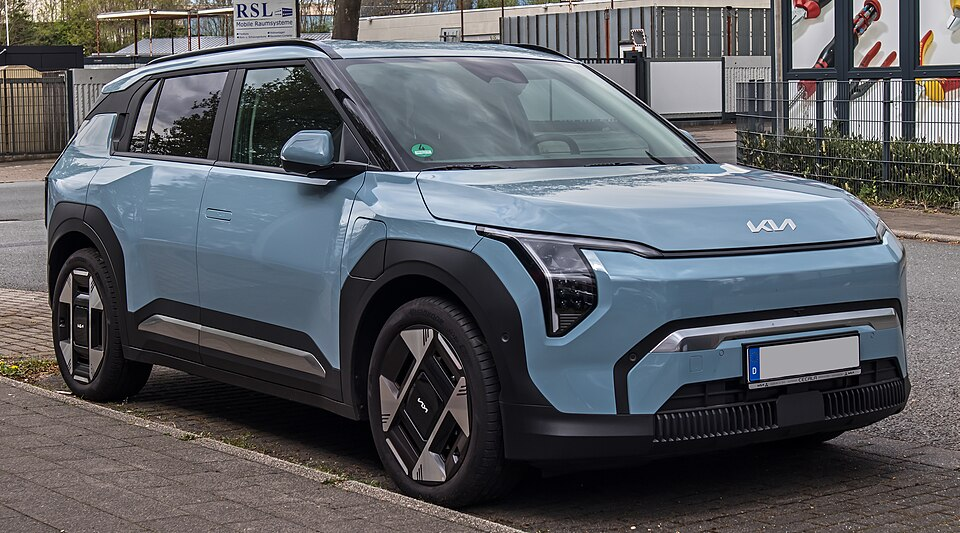

# Kia EV3

*Bild: [Kia EV3 Earth – f 21042025.jpg](https://commons.wikimedia.org/wiki/File:Kia_EV3_Earth_%E2%80%93_f_21042025.jpg) · Urheber: © M 93 · Lizenz: CC BY-SA 3.0 de · via Wikimedia Commons.*

> Kompaktes Elektro-SUV von Kia auf einer 400-Volt-Ausführung der E-GMP, positioniert unterhalb von EV6 und EV9.

## Steckbrief

| Feld | Wert | Beleg |
|---|---|---|
| Hersteller | [[kia\|Kia]] | [[tn-batterycheck-alle-daten]] |
| Segment | Kompakt-SUV | Fachwissen¹ |
| Karosserie | SUV | Fachwissen¹ |
| Bauzeit | seit 2024 | Fachwissen¹ |
| Plattform | E-GMP (400-Volt-Ausführung) | Fachwissen¹ |
| Varianten im Bestand | 2 | [[tn-batterycheck-alle-daten]] |
| [[bruttokapazitaet\|Bruttokapazität]] | 58,3–81,4 kWh | [[tn-batterycheck-alle-daten]] |
| [[nettokapazitaet\|Nettokapazität]] | 55–78 kWh | [[tn-batterycheck-alle-daten]] |
| [[batteriepuffer\|Puffer]] | 4,2–5,7 % | berechnet |

## Beschreibung

Der Kia EV3 ist das kompakteste SUV der EV-Baureihe und basiert auf der [[plattform-e-gmp|E-GMP]], allerdings nicht mit [[800-volt-architektur|800-Volt-Technik]] wie EV6 oder EV9, sondern mit einem 400-Volt-System. Angetrieben wird er über die Vorderachse ([[frontantrieb|Frontantrieb]]).

Der EV3 teilt seine beiden Batteriegrößen mit dem [[kia-ev4|Kia EV4]]. Die große Batterie bietet für ein Fahrzeug dieser Größe eine vergleichsweise hohe Kapazität, was sich in der [[wltp|WLTP]]-Reichweite niederschlägt.

## Varianten und Batterien

**EV3 Standard Range** (58,3/55,0 kWh) und **EV3 Long Range** (81,4/78,0 kWh) sind parallel angebotene Batteriegrößen derselben Generation; Generationswechsel gibt es in den Rohdaten nicht.

| Variante | Brutto | Netto | Puffer | Zeile |
|---|---|---|---|---|
| EV3 Long Range | 81,4 kWh | 78 kWh | 3,4 kWh (4,2 %) | 153 |
| EV3 Standard Range | 58,3 kWh | 55 kWh | 3,3 kWh (5,7 %) | 154 |

Quelle: [[tn-batterycheck-alle-daten]], Blatt „Fahrzeuge“, Zeilen 153–154 – bereinigte Fassung (Stand 2026-09-24, Änderungen in [[datenqualitaet]]). Puffer = Brutto − Netto (berechnet).

## Fachbegriffe

- [[plattform-e-gmp|E-GMP (Electric Global Modular Platform)]] — Elektroplattform von Hyundai und Kia, Basis für IONIQ 5/6/9 und EV6/EV9.
- [[frontantrieb|Frontantrieb (FWD)]] — Der Elektromotor treibt die Vorderräder an – typisch für Kleinwagen und Konversionsfahrzeuge.
- [[plattform-geschwister|Plattform-Geschwister (Badge-Engineering)]] — Fahrzeuge verschiedener Marken, die technisch weitgehend baugleich sind und dieselbe Batterie nutzen.
- [[bruttokapazitaet|Bruttokapazität]] — Die gesamte, physikalisch in der Batterie verbaute Energiemenge – inklusive der Reserven, die der Fahrer nie nutzen kann.
- [[nettokapazitaet|Nettokapazität]] — Der Teil der Batteriekapazität, den der Fahrer tatsächlich nutzen kann – Grundlage für Reichweite und Batterietests.
- [[wltp|WLTP]] — Worldwide Harmonized Light Vehicles Test Procedure – seit 2017/2018 der EU-Normzyklus für Verbrauch und Reichweite.

## Verwandte Fahrzeuge

- [[kia-ev4|Kia EV4]] — technisch verwandt / gleiche Plattform oder Batterie
- Weitere Modelle von Kia: [[kia-niro-ev|Kia e-Niro / Niro EV]], [[kia-soul-ev|Kia Soul EV / e-Soul]], [[kia-ev6|Kia EV6]], [[kia-ev9|Kia EV9]]

## Offene Punkte

- Kia kommuniziert die Batterien häufig als „58,3 kWh“ und „81,4 kWh“; ob diese Werte brutto oder netto sind, wird in Quellen uneinheitlich dargestellt. Die Rohdaten führen sie als brutto.

Siehe auch [[datenqualitaet]].

## Quellen

- [[tn-batterycheck-alle-daten]] — Brutto-/Nettokapazität aller Varianten (Zeilen 153–154)
- Weiterlesen: [Wikipedia – Kia EV3](https://en.wikipedia.org/wiki/Kia_EV3)

¹ *Beschreibung und Steckbrief-Felder ohne Quellseite beruhen auf allgemeinem Fachwissen des LLM (Stand 2026-09-24) und sind nicht durch eine Rohquelle im Bestand belegt. Zahlenwerte zur Batterie stammen aus der Rohquelle, bereinigt nach dem Protokoll in [[datenqualitaet]].*
