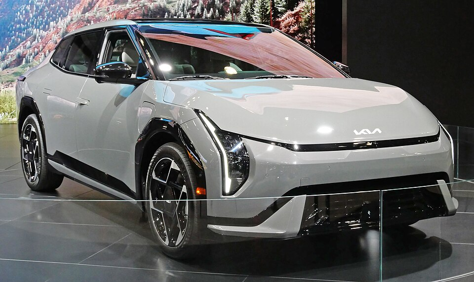

# Kia EV4

*Bild: [2026 Kia EV4, front NYIAS 2025.jpg](https://commons.wikimedia.org/wiki/File:2026_Kia_EV4,_front_NYIAS_2025.jpg) · Urheber: Kevauto · Lizenz: CC BY-SA 4.0 · via Wikimedia Commons.*

> Kompakter Elektro-Pkw von Kia, angeboten als Fließheck-Limousine (Fastback) und als Schrägheck (Hatchback), technisch eng mit dem EV3 verwandt.

## Steckbrief

| Feld | Wert | Beleg |
|---|---|---|
| Hersteller | [[kia\|Kia]] | [[tn-batterycheck-alle-daten]] |
| Segment | Kompaktklasse | Fachwissen¹ |
| Karosserie | Fließhecklimousine (Fastback), Schrägheck (Hatchback) | Fachwissen¹ |
| Bauzeit | seit 2025 | Fachwissen¹ |
| Plattform | E-GMP (400-Volt-Ausführung) | Fachwissen¹ |
| Varianten im Bestand | 3 | [[tn-batterycheck-alle-daten]] |
| [[bruttokapazitaet\|Bruttokapazität]] | 58,3–81,4 kWh | [[tn-batterycheck-alle-daten]] |
| [[nettokapazitaet\|Nettokapazität]] | 55–78 kWh | [[tn-batterycheck-alle-daten]] |
| [[batteriepuffer\|Puffer]] | 4,2–5,7 % | berechnet |

## Beschreibung

Der Kia EV4 ist das erste Kompaktmodell der EV-Reihe ohne SUV-Karosserie. Er wird in zwei [[karosserieformen|Karosserieformen]] angeboten: als Fastback mit Stufenheck-ähnlicher Linie und als Hatchback.

Technisch entspricht er weitgehend dem [[kia-ev3|Kia EV3]]: Er basiert auf der 400-Volt-Ausführung der [[plattform-e-gmp|E-GMP]], hat [[frontantrieb|Frontantrieb]] und nutzt dieselben beiden Batteriegrößen.

## Varianten und Batterien

Die Zusätze **Fastback** und **Hatchback** bezeichnen die Karosserieform, nicht die Batterie. Der Hatchback erscheint mit beiden Batterien (58,3/55,0 und 81,4/78,0 kWh), der Fastback in den Rohdaten nur mit der großen Batterie.

| Variante | Brutto | Netto | Puffer | Zeile |
|---|---|---|---|---|
| EV4 Fastback | 81,4 kWh | 78 kWh | 3,4 kWh (4,2 %) | 155 |
| EV4 Hatchback | 58,3 kWh | 55 kWh | 3,3 kWh (5,7 %) | 156 |
| EV4 Hatchback | 81,4 kWh | 78 kWh | 3,4 kWh (4,2 %) | 157 |

Quelle: [[tn-batterycheck-alle-daten]], Blatt „Fahrzeuge“, Zeilen 155–157 – bereinigte Fassung (Stand 2026-09-24, Änderungen in [[datenqualitaet]]). Puffer = Brutto − Netto (berechnet).

## Fachbegriffe

- [[plattform-e-gmp|E-GMP (Electric Global Modular Platform)]] — Elektroplattform von Hyundai und Kia, Basis für IONIQ 5/6/9 und EV6/EV9.
- [[karosserieformen|Karosserieformen]] — Varianten der Aufbauform eines Modells – beeinflussen Aussehen und Luftwiderstand, meist nicht die Batterie.
- [[frontantrieb|Frontantrieb (FWD)]] — Der Elektromotor treibt die Vorderräder an – typisch für Kleinwagen und Konversionsfahrzeuge.
- [[plattform-geschwister|Plattform-Geschwister (Badge-Engineering)]] — Fahrzeuge verschiedener Marken, die technisch weitgehend baugleich sind und dieselbe Batterie nutzen.
- [[typbezeichnungen|Typbezeichnungen]] — Wie Hersteller Leistungsstufe, Batterie und Antrieb in Modellnamen codieren – ein Lesehilfe-Artikel.

## Verwandte Fahrzeuge

- [[kia-ev3|Kia EV3]] — technisch verwandt / gleiche Plattform oder Batterie
- Weitere Modelle von Kia: [[kia-niro-ev|Kia e-Niro / Niro EV]], [[kia-soul-ev|Kia Soul EV / e-Soul]], [[kia-ev6|Kia EV6]], [[kia-ev9|Kia EV9]]

## Offene Punkte

- EV4 Fastback nur mit 81,4 kWh gelistet; ob eine Standard-Range-Version des Fastback existiert oder in den Rohdaten fehlt, ist unklar.
- Brutto-/Netto-Zuordnung wie beim EV3 (Herstellerangabe 81,4 kWh wird teils als Nennwert kommuniziert).

Siehe auch [[datenqualitaet]].

## Quellen

- [[tn-batterycheck-alle-daten]] — Brutto-/Nettokapazität aller Varianten (Zeilen 155–157)
- Weiterlesen: [Wikipedia – Kia EV4](https://en.wikipedia.org/wiki/Kia_EV4)

¹ *Beschreibung und Steckbrief-Felder ohne Quellseite beruhen auf allgemeinem Fachwissen des LLM (Stand 2026-09-24) und sind nicht durch eine Rohquelle im Bestand belegt. Zahlenwerte zur Batterie stammen aus der Rohquelle, bereinigt nach dem Protokoll in [[datenqualitaet]].*
