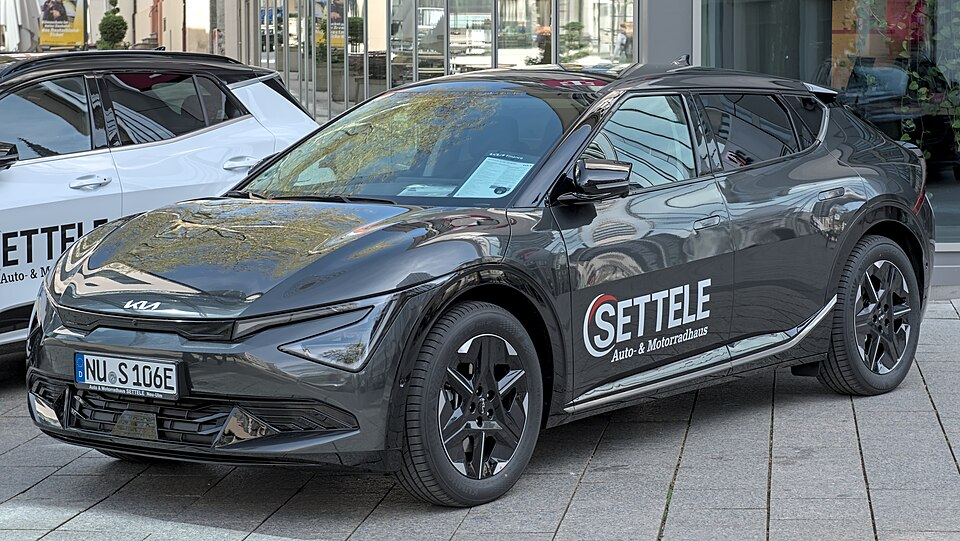

# Kia EV6

*Bild: [Kia EV6 (2024–) Autofrühling Ulm 2025 DSC 8698.jpg](https://commons.wikimedia.org/wiki/File:Kia_EV6_(2024%E2%80%93)_Autofr%C3%BChling_Ulm_2025_DSC_8698.jpg) · Urheber: Alexander Migl · Lizenz: CC BY-SA 4.0 · via Wikimedia Commons.*

> Elektrisches Crossover von Kia auf der E-GMP mit 800-Volt-Technik und technischer Zwilling des Hyundai IONIQ 5.

## Steckbrief

| Feld | Wert | Beleg |
|---|---|---|
| Hersteller | [[kia\|Kia]] | [[tn-batterycheck-alle-daten]] |
| Segment | Mittelklasse-SUV / Crossover | Fachwissen¹ |
| Karosserie | Crossover (Fließheck) | Fachwissen¹ |
| Bauzeit | seit 2021 | Fachwissen¹ |
| Plattform | E-GMP | Fachwissen¹ |
| Varianten im Bestand | 10 | [[tn-batterycheck-alle-daten]] |
| [[bruttokapazitaet\|Bruttokapazität]] | 58–84 kWh | [[tn-batterycheck-alle-daten]] |
| [[nettokapazitaet\|Nettokapazität]] | 54–80 kWh | [[tn-batterycheck-alle-daten]] |
| [[batteriepuffer\|Puffer]] | 4,4–6,9 % | berechnet |

## Beschreibung

Der Kia EV6 war 2021 das erste Modell von Kia auf der [[plattform-e-gmp|E-GMP]] und teilt Plattform, Batterien und [[800-volt-architektur|800-Volt-Architektur]] mit dem [[hyundai-ioniq-5|Hyundai IONIQ 5]]. Die Karosserie ist flacher und sportlicher ausgelegt als beim Hyundai-Schwestermodell.

Es gibt Versionen mit [[hinterradantrieb|Hinterradantrieb]] (2WD) und [[allradantrieb|Allradantrieb]] (AWD); der **EV6 GT** ist die leistungsstärkste Variante mit Allradantrieb.

Mit der [[modellpflege|Modellpflege]] 2024 wurden beide Batteriegrößen vergrößert – daher erscheinen fast alle Versionsbezeichnungen in den Rohdaten doppelt.

## Varianten und Batterien

Die Bezeichnungen folgen dem Muster *Batteriegröße + Antrieb*. Jede Version erscheint in zwei Batterie-Generationen:

- **Vor der Modellpflege:** Standard Range 58,0/54 kWh, Long Range und GT 77,4/74 kWh.
- **Nach der Modellpflege 2024:** Standard Range 63,0/60 kWh, Long Range und GT 84,0/80 kWh.

Die Werte entsprechen jeweils den Batterien des IONIQ 5.

| Variante | Brutto | Netto | Puffer | Zeile |
|---|---|---|---|---|
| EV6 GT | 77,4 kWh | 74 kWh | 3,4 kWh (4,4 %) | 158 |
| EV6 GT | 84 kWh | 80 kWh | 4 kWh (4,8 %) | 159 |
| EV6 Long Range 2WD | 77,4 kWh | 74 kWh | 3,4 kWh (4,4 %) | 160 |
| EV6 Long Range 2WD | 84 kWh | 80 kWh | 4 kWh (4,8 %) | 161 |
| EV6 Long Range AWD | 77,4 kWh | 74 kWh | 3,4 kWh (4,4 %) | 162 |
| EV6 Long Range AWD | 84 kWh | 80 kWh | 4 kWh (4,8 %) | 163 |
| EV6 Standard Range 2WD | 58 kWh | 54 kWh | 4 kWh (6,9 %) | 164 |
| EV6 Standard Range 2WD | 63 kWh | 60 kWh | 3 kWh (4,8 %) | 165 |
| EV6 Standard Range AWD | 58 kWh | 54 kWh | 4 kWh (6,9 %) | 166 |
| EV6 Standard Range AWD | 63 kWh | 60 kWh | 3 kWh (4,8 %) | 167 |

Quelle: [[tn-batterycheck-alle-daten]], Blatt „Fahrzeuge“, Zeilen 158–167 – bereinigte Fassung (Stand 2026-09-24, Änderungen in [[datenqualitaet]]). Puffer = Brutto − Netto (berechnet).

## Fachbegriffe

- [[plattform-e-gmp|E-GMP (Electric Global Modular Platform)]] — Elektroplattform von Hyundai und Kia, Basis für IONIQ 5/6/9 und EV6/EV9.
- [[800-volt-architektur|800-Volt-Architektur]] — Hochvoltsystem mit etwa doppelter Spannung gegenüber üblichen 400 Volt – ermöglicht schnelleres Laden und leichtere Kabel.
- [[dc-schnellladen|DC-Schnellladen]] — Laden mit Gleichstrom direkt in die Batterie, ohne Umweg über den Bordlader – mit 50 bis über 300 kW.
- [[hinterradantrieb|Hinterradantrieb (RWD)]] — Der Elektromotor treibt die Hinterräder an – Standard auf vielen reinen Elektroplattformen.
- [[allradantrieb|Allradantrieb (AWD)]] — Beide Achsen werden angetrieben, bei Elektroautos meist durch je einen eigenen Motor pro Achse.
- [[modellpflege|Modellpflege (Facelift)]] — Überarbeitung eines Modells während der Bauzeit – bei Elektroautos oft mit neuer Batterie.
- [[plattform-geschwister|Plattform-Geschwister (Badge-Engineering)]] — Fahrzeuge verschiedener Marken, die technisch weitgehend baugleich sind und dieselbe Batterie nutzen.
- [[typbezeichnungen|Typbezeichnungen]] — Wie Hersteller Leistungsstufe, Batterie und Antrieb in Modellnamen codieren – ein Lesehilfe-Artikel.

## Verwandte Fahrzeuge

- [[hyundai-ioniq-5|Hyundai IONIQ 5]] — technisch verwandt / gleiche Plattform oder Batterie
- [[hyundai-ioniq-6|Hyundai IONIQ 6]] — technisch verwandt / gleiche Plattform oder Batterie
- [[kia-ev9|Kia EV9]] — technisch verwandt / gleiche Plattform oder Batterie
- Weitere Modelle von Kia: [[kia-niro-ev|Kia e-Niro / Niro EV]], [[kia-soul-ev|Kia Soul EV / e-Soul]], [[kia-ev3|Kia EV3]], [[kia-ev4|Kia EV4]]

## Offene Punkte

- Alle Versionsbezeichnungen (GT, Long Range 2WD/AWD, Standard Range 2WD/AWD) kommen je zweimal mit unterschiedlichen Kapazitäten vor – Generation vor und nach der Modellpflege.
- Die erste Long-Range-Batterie des IONIQ 5 (72,6/70 kWh) taucht beim EV6 nicht auf.

Siehe auch [[datenqualitaet]].

## Quellen

- [[tn-batterycheck-alle-daten]] — Brutto-/Nettokapazität aller Varianten (Zeilen 158–167)
- Weiterlesen: [Wikipedia – Kia EV6](https://en.wikipedia.org/wiki/Kia_EV6)

¹ *Beschreibung und Steckbrief-Felder ohne Quellseite beruhen auf allgemeinem Fachwissen des LLM (Stand 2026-09-24) und sind nicht durch eine Rohquelle im Bestand belegt. Zahlenwerte zur Batterie stammen aus der Rohquelle, bereinigt nach dem Protokoll in [[datenqualitaet]].*
