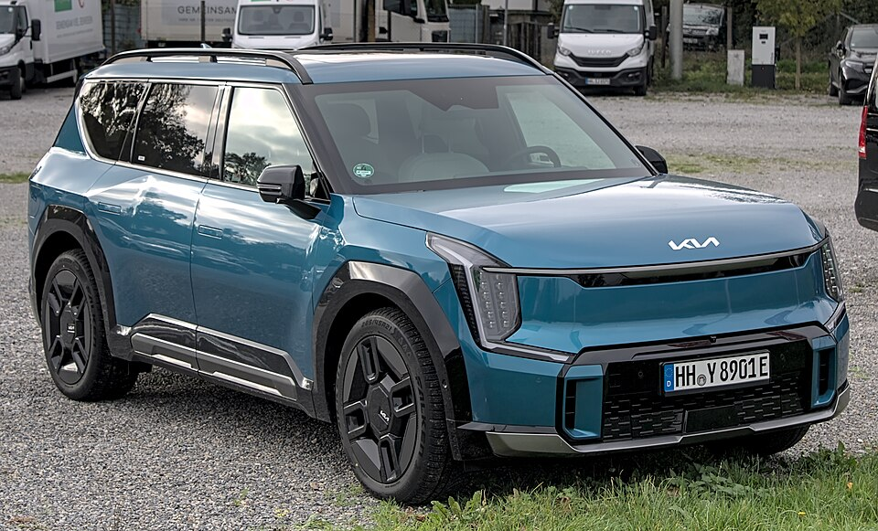

# Kia EV9

*Bild: [Kia EV9 GT-Line IMG 2595.jpg](https://commons.wikimedia.org/wiki/File:Kia_EV9_GT-Line_IMG_2595.jpg) · Urheber: Alexander-93 · Lizenz: CC BY-SA 4.0 · via Wikimedia Commons.*

> Großes Elektro-SUV von Kia mit drei Sitzreihen auf der E-GMP und Schwestermodell des Hyundai IONIQ 9.

## Steckbrief

| Feld | Wert | Beleg |
|---|---|---|
| Hersteller | [[kia\|Kia]] | [[tn-batterycheck-alle-daten]] |
| Segment | Oberklasse-SUV (drei Sitzreihen) | Fachwissen¹ |
| Karosserie | SUV | Fachwissen¹ |
| Bauzeit | seit 2023 | Fachwissen¹ |
| Plattform | E-GMP | Fachwissen¹ |
| Varianten im Bestand | 5 | [[tn-batterycheck-alle-daten]] |
| [[bruttokapazitaet\|Bruttokapazität]] | 76,1–99,8 kWh | [[tn-batterycheck-alle-daten]] |
| [[nettokapazitaet\|Nettokapazität]] | 73–96 kWh | [[tn-batterycheck-alle-daten]] |
| [[batteriepuffer\|Puffer]] | 3,8–4,1 % | berechnet |

## Beschreibung

Der Kia EV9 ist das größte Modell der EV-Baureihe und bietet bis zu sieben Sitzplätze. Er nutzt die [[plattform-e-gmp|E-GMP]] mit langem Radstand und eine [[800-volt-architektur|800-Volt-Architektur]] für schnelles [[dc-schnellladen|DC-Schnellladen]].

Das Basismodell hat [[hinterradantrieb|Hinterradantrieb]], die AWD-Versionen einen zweiten Motor an der Vorderachse ([[allradantrieb|Allradantrieb]]). Der **EV9 GT** ist die leistungsstärkste Version.

Technisch eng verwandt ist der [[hyundai-ioniq-9|Hyundai IONIQ 9]], der allerdings eine andere, größere Batterie verwendet.

## Varianten und Batterien

Die meisten Zeilen (AWD, AWD GT-Line, AWD GT und RWD) nutzen die große Batterie mit 99,8/96 kWh. Zusätzlich gibt es eine **EV9 RWD** mit 76,1/73 kWh – eine kleinere Batterieoption, die in der Bezeichnung nicht als „Standard Range“ gekennzeichnet ist. „GT-Line“ ist eine Ausstattungslinie, „GT“ die Leistungsversion.

| Variante | Brutto | Netto | Puffer | Zeile |
|---|---|---|---|---|
| EV9 AWD | 99,8 kWh | 96,0 kWh | 3,8 kWh (3,8 %) | 168 |
| EV9 AWD GT | 99,8 kWh | 96,0 kWh | 3,8 kWh (3,8 %) | 169 |
| EV9 AWD GT-Line | 99,8 kWh | 96,0 kWh | 3,8 kWh (3,8 %) | 170 |
| EV9 RWD | 76,1 kWh | 73,0 kWh | 3,1 kWh (4,1 %) | 171 |
| EV9 RWD | 99,8 kWh | 96,0 kWh | 3,8 kWh (3,8 %) | 172 |

Quelle: [[tn-batterycheck-alle-daten]], Blatt „Fahrzeuge“, Zeilen 168–172. Puffer = Brutto − Netto (berechnet).

## Fachbegriffe

- [[plattform-e-gmp|E-GMP (Electric Global Modular Platform)]] — Elektroplattform von Hyundai und Kia, Basis für IONIQ 5/6/9 und EV6/EV9.
- [[800-volt-architektur|800-Volt-Architektur]] — Hochvoltsystem mit etwa doppelter Spannung gegenüber üblichen 400 Volt – ermöglicht schnelleres Laden und leichtere Kabel.
- [[dc-schnellladen|DC-Schnellladen]] — Laden mit Gleichstrom direkt in die Batterie, ohne Umweg über den Bordlader – mit 50 bis über 300 kW.
- [[allradantrieb|Allradantrieb (AWD)]] — Beide Achsen werden angetrieben, bei Elektroautos meist durch je einen eigenen Motor pro Achse.
- [[hinterradantrieb|Hinterradantrieb (RWD)]] — Der Elektromotor treibt die Hinterräder an – Standard auf vielen reinen Elektroplattformen.
- [[typbezeichnungen|Typbezeichnungen]] — Wie Hersteller Leistungsstufe, Batterie und Antrieb in Modellnamen codieren – ein Lesehilfe-Artikel.

## Verwandte Fahrzeuge

- [[hyundai-ioniq-9|Hyundai IONIQ 9]] — technisch verwandt / gleiche Plattform oder Batterie
- [[kia-ev6|Kia EV6]] — technisch verwandt / gleiche Plattform oder Batterie
- [[hyundai-ioniq-5|Hyundai IONIQ 5]] — technisch verwandt / gleiche Plattform oder Batterie
- Weitere Modelle von Kia: [[kia-niro-ev|Kia e-Niro / Niro EV]], [[kia-soul-ev|Kia Soul EV / e-Soul]], [[kia-ev3|Kia EV3]], [[kia-ev4|Kia EV4]]

## Offene Punkte

- „EV9 RWD“ erscheint zweimal (76,1 und 99,8 kWh brutto); die kleine Batterie ist nicht als Standard Range gekennzeichnet.
- Ob die 76,1-kWh-Version in Deutschland angeboten wurde, ist nicht gesichert.

Siehe auch [[datenqualitaet]].

## Quellen

- [[tn-batterycheck-alle-daten]] — Brutto-/Nettokapazität aller Varianten (Zeilen 168–172)
- Weiterlesen: [Wikipedia – Kia EV9](https://en.wikipedia.org/wiki/Kia_EV9)

¹ *Beschreibung und Steckbrief-Felder ohne Quellseite beruhen auf allgemeinem Fachwissen des LLM (Stand 2026-09-23) und sind nicht durch eine Rohquelle im Bestand belegt. Zahlenwerte zur Batterie stammen ausschließlich aus der Rohquelle.*
