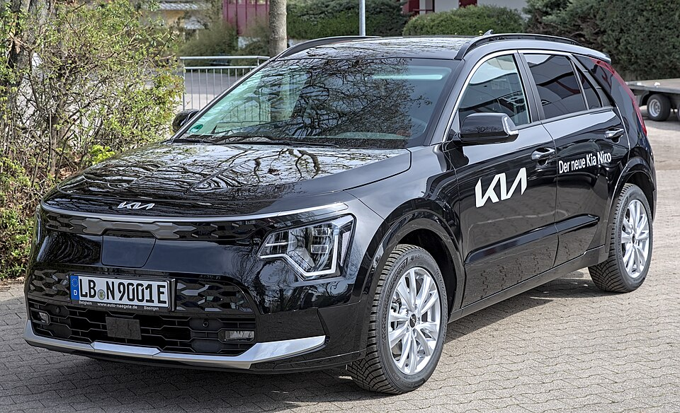

# Kia e-Niro / Niro EV

*Bild: [Kia Niro EV (SG2) 1X7A7188.jpg](https://commons.wikimedia.org/wiki/File:Kia_Niro_EV_(SG2)_1X7A7188.jpg) · Urheber: Alexander-93 · Lizenz: CC BY-SA 4.0 · via Wikimedia Commons. Abgebildet ist die zweite Generation (Niro EV, SG2).*

> Elektrische Variante des Kia Niro, eines Kompakt-Crossovers, der parallel als Hybrid, Plug-in-Hybrid und Elektroauto angeboten wird.

## Steckbrief

| Feld | Wert | Beleg |
|---|---|---|
| Hersteller | [[kia\|Kia]] | [[tn-batterycheck-alle-daten]] |
| Segment | Kompakt-SUV / Crossover | Fachwissen¹ |
| Karosserie | Crossover (SUV) | Fachwissen¹ |
| Bauzeit | seit 2018 | Fachwissen¹ |
| Plattform | Mehrenergie-Plattform des Niro (Hybrid, Plug-in-Hybrid, Elektro; keine E-GMP) | Fachwissen¹ |
| Varianten im Bestand | 3 | [[tn-batterycheck-alle-daten]] |
| [[bruttokapazitaet\|Bruttokapazität]] | 42–68 kWh | [[tn-batterycheck-alle-daten]] |
| [[nettokapazitaet\|Nettokapazität]] | 39,2–64,8 kWh | [[tn-batterycheck-alle-daten]] |
| [[batteriepuffer\|Puffer]] | 4,7–6,7 % | berechnet |

## Beschreibung

Der Kia Niro wurde von Beginn an für mehrere Antriebsarten konzipiert. Die batterieelektrische Version hieß in der ersten Generation **e-Niro**, in der zweiten Generation (ab 2022) **Niro EV**. Angetrieben werden die Vorderräder ([[frontantrieb|Frontantrieb]]).

Die erste Generation nutzte dieselben beiden Batteriegrößen wie der erste [[hyundai-kona-electric|Hyundai Kona Elektro]] und der [[kia-soul-ev|Kia e-Soul]]. Der Niro EV der zweiten Generation wird in den Rohdaten nur mit einer, etwas größeren [[traktionsbatterie|Traktionsbatterie]] geführt.

Der Namenswechsel von e-Niro zu Niro EV ist ein Beispiel dafür, wie [[typbezeichnungen|Typbezeichnungen]] mit einem Generationswechsel geändert werden.

## Varianten und Batterien

**e-Niro** (1. Generation) gibt es mit 42,0/39,2 kWh und 67,5/64,0 kWh – zwei parallel angebotene Batteriegrößen. **Niro EV** (2. Generation) steht mit 68,0/64,8 kWh in den Rohdaten. Der Name zeigt hier also direkt die Generation an.

| Variante | Brutto | Netto | Puffer | Zeile |
|---|---|---|---|---|
| e-Niro | 42,0 kWh | 39,2 kWh | 2,8 kWh (6,7 %) | 149 |
| e-Niro | 67,5 kWh | 64,0 kWh | 3,5 kWh (5,2 %) | 150 |
| Niro EV | 68,0 kWh | 64,8 kWh | 3,2 kWh (4,7 %) | 173 |

Quelle: [[tn-batterycheck-alle-daten]], Blatt „Fahrzeuge“, Zeilen 149–173. Puffer = Brutto − Netto (berechnet).

## Fachbegriffe

- [[frontantrieb|Frontantrieb (FWD)]] — Der Elektromotor treibt die Vorderräder an – typisch für Kleinwagen und Konversionsfahrzeuge.
- [[traktionsbatterie|Traktionsbatterie]] — Der Hochvolt-Energiespeicher, der den Elektromotor eines Elektroautos versorgt.
- [[typbezeichnungen|Typbezeichnungen]] — Wie Hersteller Leistungsstufe, Batterie und Antrieb in Modellnamen codieren – ein Lesehilfe-Artikel.
- [[plattform-geschwister|Plattform-Geschwister (Badge-Engineering)]] — Fahrzeuge verschiedener Marken, die technisch weitgehend baugleich sind und dieselbe Batterie nutzen.
- [[bruttokapazitaet|Bruttokapazität]] — Die gesamte, physikalisch in der Batterie verbaute Energiemenge – inklusive der Reserven, die der Fahrer nie nutzen kann.
- [[nettokapazitaet|Nettokapazität]] — Der Teil der Batteriekapazität, den der Fahrer tatsächlich nutzen kann – Grundlage für Reichweite und Batterietests.

## Verwandte Fahrzeuge

- [[hyundai-kona-electric|Hyundai Kona Elektro]] — technisch verwandt / gleiche Plattform oder Batterie
- [[kia-soul-ev|Kia Soul EV / e-Soul]] — technisch verwandt / gleiche Plattform oder Batterie
- Weitere Modelle von Kia: [[kia-ev3|Kia EV3]], [[kia-ev4|Kia EV4]], [[kia-ev6|Kia EV6]], [[kia-ev9|Kia EV9]]

## Offene Punkte

- Die Zeilennummern sind nicht zusammenhängend (e-Niro und Niro EV liegen in der Quelle an verschiedenen Stellen), vermutlich wegen alphabetischer Sortierung.
- Niro EV 68,0/64,8 kWh vs. Kona Elektro 2. Generation 68,5/65,4 kWh – ähnliche, aber nicht identische Werte.

Siehe auch [[datenqualitaet]].

## Quellen

- [[tn-batterycheck-alle-daten]] — Brutto-/Nettokapazität aller Varianten (Zeilen 149–173)

¹ *Beschreibung und Steckbrief-Felder ohne Quellseite beruhen auf allgemeinem Fachwissen des LLM (Stand 2026-09-23) und sind nicht durch eine Rohquelle im Bestand belegt. Zahlenwerte zur Batterie stammen ausschließlich aus der Rohquelle.*
