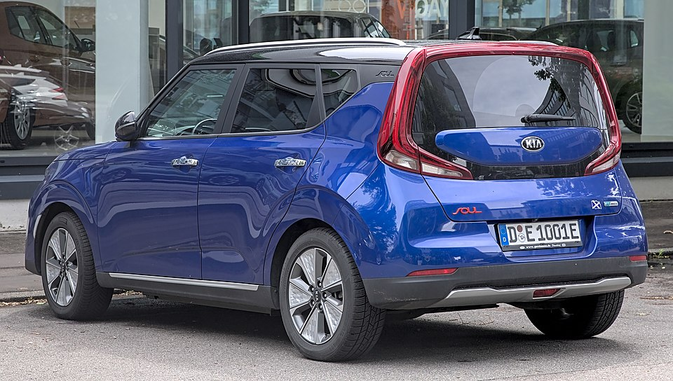

# Kia Soul EV / e-Soul

*Bild: [Kia e-Soul 1X7A0310.jpg](https://commons.wikimedia.org/wiki/File:Kia_e-Soul_1X7A0310.jpg) · Urheber: Alexander Migl · Lizenz: CC BY-SA 4.0 · via Wikimedia Commons.*

> Elektrische Version des kastenförmigen Kia Soul, als Soul EV eines der frühen Serien-Elektroautos von Kia und später als e-Soul neu aufgelegt.

## Steckbrief

| Feld | Wert | Beleg |
|---|---|---|
| Hersteller | [[kia\|Kia]] | [[tn-batterycheck-alle-daten]] |
| Segment | Kompaktklasse / Crossover | Fachwissen¹ |
| Karosserie | Kompaktvan-artiges Crossover (fünftürig) | Fachwissen¹ |
| Bauzeit | seit 2014 (Soul EV bis 2019, danach e-Soul) | Fachwissen¹ |
| Plattform | Verbrenner-Plattform des Kia Soul (Konversionsfahrzeug) | Fachwissen¹ |
| Varianten im Bestand | 4 | [[tn-batterycheck-alle-daten]] |
| [[bruttokapazitaet\|Bruttokapazität]] | 30,5–67,5 kWh | [[tn-batterycheck-alle-daten]] |
| [[nettokapazitaet\|Nettokapazität]] | 27–64 kWh | [[tn-batterycheck-alle-daten]] |
| [[batteriepuffer\|Puffer]] | 5,2–11,5 % | berechnet |

## Beschreibung

Der Soul EV wurde aus dem konventionellen Kia Soul abgeleitet und ist damit ein [[konversionsfahrzeug|Konversionsfahrzeug]]. Die [[traktionsbatterie|Traktionsbatterie]] ist im Unterboden des ursprünglich für Verbrenner konstruierten Fahrzeugs untergebracht; angetrieben werden die Vorderräder ([[frontantrieb|Frontantrieb]]).

Die erste Generation (Soul EV) erhielt im Laufe der Bauzeit eine etwas größere Batterie. Mit dem Generationswechsel 2019 wurde das Modell in Europa als **e-Soul** vermarktet und übernahm die beiden Batteriegrößen von [[kia-niro-ev|Kia e-Niro]] und [[hyundai-kona-electric|Hyundai Kona Elektro]].

## Varianten und Batterien

**Soul EV** (1. Generation) erscheint mit 30,5/27,0 kWh und – nach einer [[modellpflege|Modellpflege]] – mit 33,0/30,0 kWh. **e-Soul** (2. Generation) gibt es mit 42,0/39,2 kWh und 67,5/64,0 kWh als parallele Batterieoptionen. Der Name zeigt die Generation an, die Kapazität die Batteriegröße.

| Variante | Brutto | Netto | Puffer | Zeile |
|---|---|---|---|---|
| e-Soul | 42,0 kWh | 39,2 kWh | 2,8 kWh (6,7 %) | 151 |
| e-Soul | 67,5 kWh | 64,0 kWh | 3,5 kWh (5,2 %) | 152 |
| Soul EV | 30,5 kWh | 27,0 kWh | 3,5 kWh (11,5 %) | 174 |
| Soul EV | 33,0 kWh | 30,0 kWh | 3 kWh (9,1 %) | 175 |

Quelle: [[tn-batterycheck-alle-daten]], Blatt „Fahrzeuge“, Zeilen 151–175. Puffer = Brutto − Netto (berechnet).

## Fachbegriffe

- [[konversionsfahrzeug|Konversionsfahrzeug]] — Elektroauto, das von einem Modell mit Verbrennungsmotor abgeleitet ist, statt auf einer reinen Elektroplattform zu basieren.
- [[frontantrieb|Frontantrieb (FWD)]] — Der Elektromotor treibt die Vorderräder an – typisch für Kleinwagen und Konversionsfahrzeuge.
- [[modellpflege|Modellpflege (Facelift)]] — Überarbeitung eines Modells während der Bauzeit – bei Elektroautos oft mit neuer Batterie.
- [[typbezeichnungen|Typbezeichnungen]] — Wie Hersteller Leistungsstufe, Batterie und Antrieb in Modellnamen codieren – ein Lesehilfe-Artikel.
- [[batteriepuffer|Batteriepuffer]] — Differenz zwischen Brutto- und Nettokapazität – eine Reserve, die die Batterie schont und Alterung ausgleicht.
- [[plattform-geschwister|Plattform-Geschwister (Badge-Engineering)]] — Fahrzeuge verschiedener Marken, die technisch weitgehend baugleich sind und dieselbe Batterie nutzen.

## Verwandte Fahrzeuge

- [[kia-niro-ev|Kia e-Niro / Niro EV]] — technisch verwandt / gleiche Plattform oder Batterie
- [[hyundai-kona-electric|Hyundai Kona Elektro]] — technisch verwandt / gleiche Plattform oder Batterie
- [[hyundai-ioniq-electric|Hyundai IONIQ Elektro]] — technisch verwandt / gleiche Plattform oder Batterie
- Weitere Modelle von Kia: [[kia-ev3|Kia EV3]], [[kia-ev4|Kia EV4]], [[kia-ev6|Kia EV6]], [[kia-ev9|Kia EV9]]

## Offene Punkte

- Der Puffer der ersten Soul-EV-Batterie ist mit 3,5 kWh (30,5 brutto / 27,0 netto) im Verhältnis zur Größe vergleichsweise groß.
- Zeilennummern nicht zusammenhängend (e-Soul und Soul EV an getrennten Stellen der Quelle).
- Ob die 33-kWh-Version einer Modellpflege oder einem Modelljahreswechsel zuzuordnen ist, ist aus den Rohdaten nicht ersichtlich.

Siehe auch [[datenqualitaet]].

## Quellen

- [[tn-batterycheck-alle-daten]] — Brutto-/Nettokapazität aller Varianten (Zeilen 151–175)

¹ *Beschreibung und Steckbrief-Felder ohne Quellseite beruhen auf allgemeinem Fachwissen des LLM (Stand 2026-09-23) und sind nicht durch eine Rohquelle im Bestand belegt. Zahlenwerte zur Batterie stammen ausschließlich aus der Rohquelle.*
