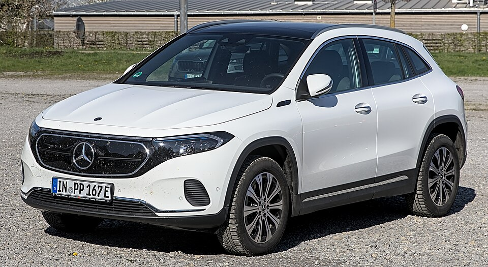

# Mercedes-Benz EQA

*Bild: [Mercedes-Benz H243 1X7A0089.jpg](https://commons.wikimedia.org/wiki/File:Mercedes-Benz_H243_1X7A0089.jpg) · Urheber: Alexander Migl · Lizenz: CC BY-SA 4.0 · via Wikimedia Commons.*

> Elektrisches Kompakt-SUV von Mercedes-Benz auf Basis des GLA, abgeleitet von der Kompaktwagen-Plattform MFA2.

## Steckbrief

| Feld | Wert | Beleg |
|---|---|---|
| Hersteller | [[mercedes\|Mercedes-Benz]] | [[tn-batterycheck-alle-daten]] |
| Segment | Kompakt-SUV | Fachwissen¹ |
| Karosserie | SUV | Fachwissen¹ |
| Bauzeit | seit 2021 | Fachwissen¹ |
| Plattform | Verbrenner-Plattform MFA2 | Fachwissen¹ |
| Varianten im Bestand | 4 | [[tn-batterycheck-alle-daten]] |
| [[bruttokapazitaet\|Bruttokapazität]] | 69,7–73,9 kWh | [[tn-batterycheck-alle-daten]] |
| [[nettokapazitaet\|Nettokapazität]] | 66,5–70,5 kWh | [[tn-batterycheck-alle-daten]] |
| [[batteriepuffer\|Puffer]] | 4,6–4,6 % | berechnet |

## Beschreibung

Der Mercedes-Benz EQA ist die elektrische Variante des GLA und ein [[konversionsfahrzeug|Konversionsfahrzeug]]: Die [[traktionsbatterie|Traktionsbatterie]] wurde in den Unterboden der für Verbrenner konzipierten Plattform MFA2 integriert. Sein engstes [[plattform-geschwister|Plattform-Geschwister]] ist der [[mercedes-eqb|EQB]].

Die Basisversionen haben [[frontantrieb|Frontantrieb]], die 4MATIC-Modelle einen zweiten [[elektromotor|Elektromotor]] und damit [[allradantrieb|Allradantrieb]]. Im Laufe der Bauzeit kam eine zweite Batterie mit höherer Kapazität hinzu, die bei ähnlichem Bauraum mehr Energie speichert.

## Varianten und Batterien

Die Zahl (250, 300, 350) ist eine Leistungsklasse, "4MATIC" steht für Allradantrieb, "+" für die Version mit größerer Batterie. Zwei Batterien: 69,7/66,5 kWh und 73,9/70,5 kWh (EQA 250+).

| Variante | Brutto | Netto | Puffer | Zeile |
|---|---|---|---|---|
| EQA 250 | 69,7 kWh | 66,5 kWh | 3,2 kWh (4,6 %) | 176 |
| EQA 250+ | 73,9 kWh | 70,5 kWh | 3,4 kWh (4,6 %) | 177 |
| EQA 300 4MATIC | 69,7 kWh | 66,5 kWh | 3,2 kWh (4,6 %) | 178 |
| EQA 350 4MATIC | 69,7 kWh | 66,5 kWh | 3,2 kWh (4,6 %) | 179 |

Quelle: [[tn-batterycheck-alle-daten]], Blatt „Fahrzeuge“, Zeilen 176–179 – bereinigte Fassung (Stand 2026-09-24, Änderungen in [[datenqualitaet]]). Puffer = Brutto − Netto (berechnet).

## Fachbegriffe

- [[konversionsfahrzeug|Konversionsfahrzeug]] — Elektroauto, das von einem Modell mit Verbrennungsmotor abgeleitet ist, statt auf einer reinen Elektroplattform zu basieren.
- [[frontantrieb|Frontantrieb (FWD)]] — Der Elektromotor treibt die Vorderräder an – typisch für Kleinwagen und Konversionsfahrzeuge.
- [[allradantrieb|Allradantrieb (AWD)]] — Beide Achsen werden angetrieben, bei Elektroautos meist durch je einen eigenen Motor pro Achse.
- [[typbezeichnungen|Typbezeichnungen]] — Wie Hersteller Leistungsstufe, Batterie und Antrieb in Modellnamen codieren – ein Lesehilfe-Artikel.
- [[plattform-geschwister|Plattform-Geschwister (Badge-Engineering)]] — Fahrzeuge verschiedener Marken, die technisch weitgehend baugleich sind und dieselbe Batterie nutzen.
- [[modellpflege|Modellpflege (Facelift)]] — Überarbeitung eines Modells während der Bauzeit – bei Elektroautos oft mit neuer Batterie.

## Verwandte Fahrzeuge

- [[mercedes-eqb|Mercedes-Benz EQB]] — technisch verwandt / gleiche Plattform oder Batterie
- Weitere Modelle von Mercedes-Benz: [[mercedes-eqc|Mercedes-Benz EQC]], [[mercedes-eqt|Mercedes-Benz EQT]], [[mercedes-eqv|Mercedes-Benz EQV]], [[mercedes-esprinter|Mercedes-Benz eSprinter]], [[mercedes-evito|Mercedes-Benz eVito]]

## Offene Punkte

- Nach der Modellpflege 2023 sollen auch weitere Versionen die größere Batterie erhalten haben; die Daten führen die 4MATIC-Modelle nur mit 69,7 kWh – ohne Modelljahr nicht eindeutig.

Siehe auch [[datenqualitaet]].

## Quellen

- [[tn-batterycheck-alle-daten]] — Brutto-/Nettokapazität aller Varianten (Zeilen 176–179)
- Weiterlesen: [Wikipedia – Mercedes-Benz EQA](https://en.wikipedia.org/wiki/Mercedes-Benz_EQA)

¹ *Beschreibung und Steckbrief-Felder ohne Quellseite beruhen auf allgemeinem Fachwissen des LLM (Stand 2026-09-24) und sind nicht durch eine Rohquelle im Bestand belegt. Zahlenwerte zur Batterie stammen aus der Rohquelle, bereinigt nach dem Protokoll in [[datenqualitaet]].*
