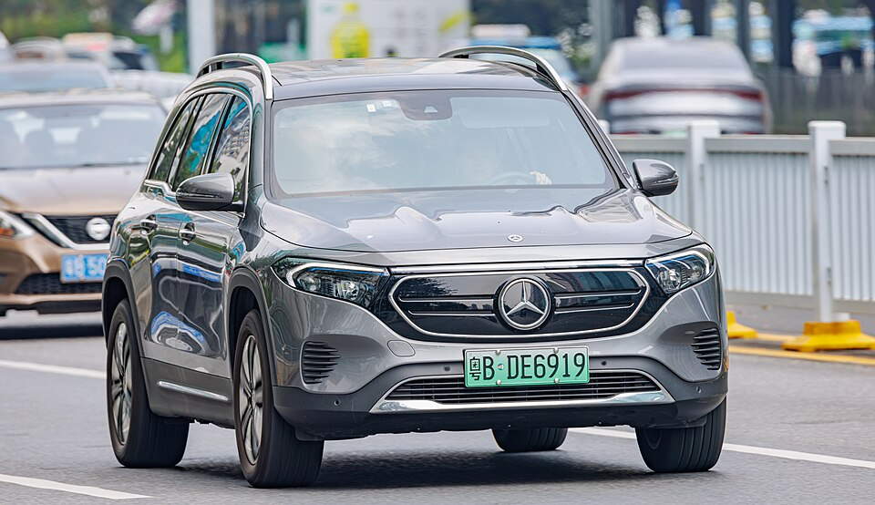

# Mercedes-Benz EQB

*Bild: [MERCEDES-EQ EQB China.jpg](https://commons.wikimedia.org/wiki/File:MERCEDES-EQ_EQB_China.jpg) · Urheber: Dinkun Chen · Lizenz: CC BY-SA 4.0 · via Wikimedia Commons.*

> Elektrisches Kompakt-SUV von Mercedes-Benz auf Basis des GLB, optional mit dritter Sitzreihe; technisch eng verwandt mit dem EQA.

## Steckbrief

| Feld | Wert | Beleg |
|---|---|---|
| Hersteller | [[mercedes\|Mercedes-Benz]] | [[tn-batterycheck-alle-daten]] |
| Segment | Kompakt-SUV | Fachwissen¹ |
| Karosserie | SUV (optional Siebensitzer) | Fachwissen¹ |
| Bauzeit | seit 2021 | Fachwissen¹ |
| Plattform | Verbrenner-Plattform MFA2 | Fachwissen¹ |
| Varianten im Bestand | 6 | [[tn-batterycheck-alle-daten]] |
| [[bruttokapazitaet\|Bruttokapazität]] | 69,7–73,9 kWh | [[tn-batterycheck-alle-daten]] |
| [[nettokapazitaet\|Nettokapazität]] | 66,5–70,5 kWh | [[tn-batterycheck-alle-daten]] |
| [[batteriepuffer\|Puffer]] | 4,6–4,6 % | berechnet |

## Beschreibung

Der Mercedes-Benz EQB ist die elektrische Version des GLB und wie der [[mercedes-eqa|EQA]] ein [[konversionsfahrzeug|Konversionsfahrzeug]] auf der Plattform MFA2. Gegenüber dem EQA ist er länger, kantiger und bietet optional eine dritte Sitzreihe.

Antriebe und [[traktionsbatterie|Traktionsbatterien]] entsprechen weitgehend dem EQA: [[frontantrieb|Frontantrieb]] in den Basisversionen, [[allradantrieb|Allradantrieb]] bei 4MATIC, dazu zwei Batteriegrößen.

## Varianten und Batterien

Die Zahl ist eine Leistungsklasse, "4MATIC" steht für Allradantrieb, "+" für die größere Batterie. Zwei Batterien: 69,7/66,5 kWh und 73,9/70,5 kWh. Der EQB 300 4MATIC erscheint mit beiden Batterien, was auf einen Wechsel der Batterie im Zuge der [[modellpflege|Modellpflege]] hindeutet.

| Variante | Brutto | Netto | Puffer | Zeile |
|---|---|---|---|---|
| EQB 250 | 69,7 kWh | 66,5 kWh | 3,2 kWh (4,6 %) | 180 |
| EQB 250+ | 73,9 kWh | 70,5 kWh | 3,4 kWh (4,6 %) | 181 |
| EQB 300 4MATIC | 69,7 kWh | 66,5 kWh | 3,2 kWh (4,6 %) | 182 |
| EQB 300 4MATIC | 73,9 kWh | 70,5 kWh | 3,4 kWh (4,6 %) | 183 |
| EQB 350 | 73,9 kWh | 70,5 kWh | 3,4 kWh (4,6 %) | 184 |
| EQB 350 4MATIC | 69,7 kWh | 66,5 kWh | 3,2 kWh (4,6 %) | 185 |

Quelle: [[tn-batterycheck-alle-daten]], Blatt „Fahrzeuge“, Zeilen 180–185. Puffer = Brutto − Netto (berechnet).

## Fachbegriffe

- [[konversionsfahrzeug|Konversionsfahrzeug]] — Elektroauto, das von einem Modell mit Verbrennungsmotor abgeleitet ist, statt auf einer reinen Elektroplattform zu basieren.
- [[frontantrieb|Frontantrieb (FWD)]] — Der Elektromotor treibt die Vorderräder an – typisch für Kleinwagen und Konversionsfahrzeuge.
- [[allradantrieb|Allradantrieb (AWD)]] — Beide Achsen werden angetrieben, bei Elektroautos meist durch je einen eigenen Motor pro Achse.
- [[typbezeichnungen|Typbezeichnungen]] — Wie Hersteller Leistungsstufe, Batterie und Antrieb in Modellnamen codieren – ein Lesehilfe-Artikel.
- [[modellpflege|Modellpflege (Facelift)]] — Überarbeitung eines Modells während der Bauzeit – bei Elektroautos oft mit neuer Batterie.
- [[plattform-geschwister|Plattform-Geschwister (Badge-Engineering)]] — Fahrzeuge verschiedener Marken, die technisch weitgehend baugleich sind und dieselbe Batterie nutzen.

## Verwandte Fahrzeuge

- [[mercedes-eqa|Mercedes-Benz EQA]] — technisch verwandt / gleiche Plattform oder Batterie
- Weitere Modelle von Mercedes-Benz: [[mercedes-eqc|Mercedes-Benz EQC]], [[mercedes-eqt|Mercedes-Benz EQT]], [[mercedes-eqv|Mercedes-Benz EQV]], [[mercedes-esprinter|Mercedes-Benz eSprinter]], [[mercedes-evito|Mercedes-Benz eVito]]

## Offene Punkte

- EQB 300 4MATIC steht zweimal mit unterschiedlichen Batterien (Zeilen 182 und 183).
- Zeile 184 "EQB 350" ohne 4MATIC: Die Leistungsstufe 350 ist bei Mercedes üblicherweise ein Allradmodell – mögliche unvollständige Bezeichnung.

Siehe auch [[datenqualitaet]].

## Quellen

- [[tn-batterycheck-alle-daten]] — Brutto-/Nettokapazität aller Varianten (Zeilen 180–185)
- Weiterlesen: [Wikipedia – Mercedes-Benz EQB](https://en.wikipedia.org/wiki/Mercedes-Benz_EQB)

¹ *Beschreibung und Steckbrief-Felder ohne Quellseite beruhen auf allgemeinem Fachwissen des LLM (Stand 2026-09-23) und sind nicht durch eine Rohquelle im Bestand belegt. Zahlenwerte zur Batterie stammen ausschließlich aus der Rohquelle.*
