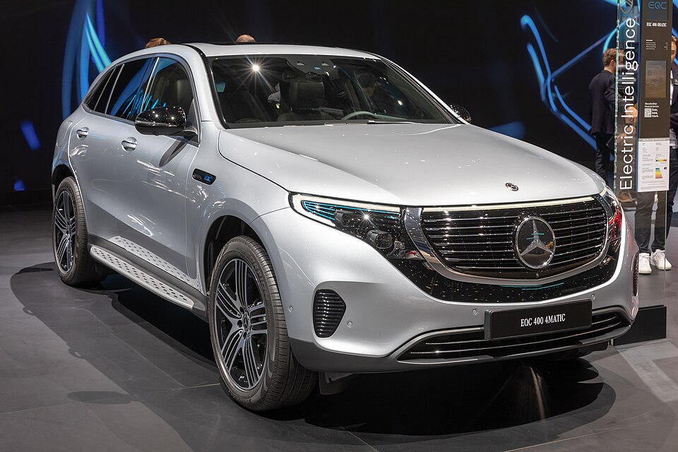

# Mercedes-Benz EQC

*Bild: [Mercedes-Benz EQC 400, GIMS 2019, Le Grand-Saconnex (GIMS1262).jpg](https://commons.wikimedia.org/wiki/File:Mercedes-Benz_EQC_400,_GIMS_2019,_Le_Grand-Saconnex_(GIMS1262).jpg) · Urheber: Matti Blume · Lizenz: CC BY-SA 4.0 · via Wikimedia Commons.*

> Erstes Serien-Elektroauto der Marke EQ von Mercedes-Benz: ein Mittelklasse-SUV auf Basis des GLC mit Allradantrieb.

## Steckbrief

| Feld | Wert | Beleg |
|---|---|---|
| Hersteller | [[mercedes\|Mercedes-Benz]] | [[tn-batterycheck-alle-daten]] |
| Segment | Mittelklasse-SUV | Fachwissen¹ |
| Karosserie | SUV | Fachwissen¹ |
| Plattform | Verbrenner-Plattform MRA (GLC-Basis) | Fachwissen¹ |
| Varianten im Bestand | 1 | [[tn-batterycheck-alle-daten]] |
| [[bruttokapazitaet\|Bruttokapazität]] | 85 kWh | [[tn-batterycheck-alle-daten]] |
| [[nettokapazitaet\|Nettokapazität]] | 80 kWh | [[tn-batterycheck-alle-daten]] |
| [[batteriepuffer\|Puffer]] | 5,9 % | berechnet |

## Beschreibung

Der Mercedes-Benz EQC war das erste Modell der Submarke EQ. Er ist ein [[konversionsfahrzeug|Konversionsfahrzeug]] auf Basis des GLC, dessen Plattform für den elektrischen Antrieb und die [[traktionsbatterie|Traktionsbatterie]] im Unterboden angepasst wurde.

Der EQC 400 hat zwei [[elektromotor|Elektromotoren]] und damit [[allradantrieb|Allradantrieb]]. Die Batterie besteht aus [[lithium-ionen-akku|Lithium-Ionen-Zellen]] mit [[nmc-zellchemie|NMC-Chemie]]. Das Modell wurde ohne direkten Nachfolger eingestellt.

## Varianten und Batterien

Nur eine Variante: EQC 400 (4MATIC) mit 85/80 kWh. "400" ist eine Leistungsklasse, kein Kapazitätswert.

| Variante | Brutto | Netto | Puffer | Zeile |
|---|---|---|---|---|
| EQC 400 | 85 kWh | 80,0 kWh | 5 kWh (5,9 %) | 186 |

Quelle: [[tn-batterycheck-alle-daten]], Blatt „Fahrzeuge“, Zeilen 186. Puffer = Brutto − Netto (berechnet).

## Fachbegriffe

- [[konversionsfahrzeug|Konversionsfahrzeug]] — Elektroauto, das von einem Modell mit Verbrennungsmotor abgeleitet ist, statt auf einer reinen Elektroplattform zu basieren.
- [[allradantrieb|Allradantrieb (AWD)]] — Beide Achsen werden angetrieben, bei Elektroautos meist durch je einen eigenen Motor pro Achse.
- [[nmc-zellchemie|NMC-Zellchemie]] — Lithium-Ionen-Zellen mit Kathode aus Nickel, Mangan und Kobalt – hohe Energiedichte, Standard in den meisten Fahrzeugen des Bestands.
- [[bruttokapazitaet|Bruttokapazität]] — Die gesamte, physikalisch in der Batterie verbaute Energiemenge – inklusive der Reserven, die der Fahrer nie nutzen kann.
- [[nettokapazitaet|Nettokapazität]] — Der Teil der Batteriekapazität, den der Fahrer tatsächlich nutzen kann – Grundlage für Reichweite und Batterietests.

## Verwandte Fahrzeuge

- Weitere Modelle von Mercedes-Benz: [[mercedes-eqa|Mercedes-Benz EQA]], [[mercedes-eqb|Mercedes-Benz EQB]], [[mercedes-eqt|Mercedes-Benz EQT]], [[mercedes-eqv|Mercedes-Benz EQV]], [[mercedes-esprinter|Mercedes-Benz eSprinter]], [[mercedes-evito|Mercedes-Benz eVito]]

## Offene Punkte

- Bauzeit nicht sicher belegt (Marktstart 2019, Produktionsende ca. 2023/2024).
- Die Bezeichnung in den Daten lautet nur "EQC 400"; offiziell EQC 400 4MATIC.

Siehe auch [[datenqualitaet]].

## Quellen

- [[tn-batterycheck-alle-daten]] — Brutto-/Nettokapazität aller Varianten (Zeilen 186)
- Weiterlesen: [Wikipedia – Mercedes-Benz EQC](https://en.wikipedia.org/wiki/Mercedes-Benz_EQC)

¹ *Beschreibung und Steckbrief-Felder ohne Quellseite beruhen auf allgemeinem Fachwissen des LLM (Stand 2026-09-23) und sind nicht durch eine Rohquelle im Bestand belegt. Zahlenwerte zur Batterie stammen ausschließlich aus der Rohquelle.*
