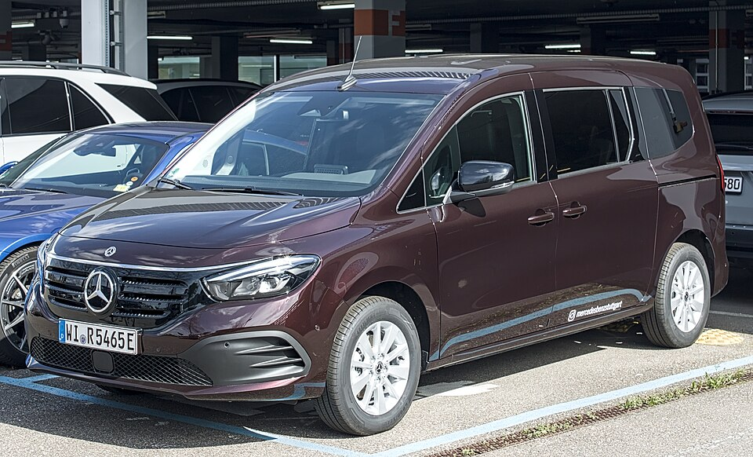

# Mercedes-Benz EQT

*Bild: [Mercedes-Benz EQT IMG 6086.jpg](https://commons.wikimedia.org/wiki/File:Mercedes-Benz_EQT_IMG_6086.jpg) · Urheber: Alexander Migl · Lizenz: CC BY-SA 4.0 · via Wikimedia Commons.*

> Elektrischer Hochdachkombi von Mercedes-Benz (T-Klasse), technisch aus der Kooperation mit Renault hervorgegangen und eng verwandt mit dem Renault Kangoo E-Tech.

## Steckbrief

| Feld | Wert | Beleg |
|---|---|---|
| Hersteller | [[mercedes\|Mercedes-Benz]] | [[tn-batterycheck-alle-daten]] |
| Segment | Hochdachkombi | Fachwissen¹ |
| Karosserie | Hochdachkombi (Van) | Fachwissen¹ |
| Bauzeit | seit 2022 | Fachwissen¹ |
| Plattform | Renault-Nissan-Plattform des Kangoo (dritte Generation) | Fachwissen¹ |
| Varianten im Bestand | 1 | [[tn-batterycheck-alle-daten]] |
| [[bruttokapazitaet\|Bruttokapazität]] | 48 kWh | [[tn-batterycheck-alle-daten]] |
| [[nettokapazitaet\|Nettokapazität]] | 45 kWh | [[tn-batterycheck-alle-daten]] |
| [[batteriepuffer\|Puffer]] | 6,2 % | berechnet |

## Beschreibung

Der Mercedes-Benz EQT ist die Pkw-orientierte Elektroversion der T-Klasse, die gemeinsam mit Renault entwickelt wurde. Technisch ist er ein [[plattform-geschwister|Plattform-Geschwister]] des [[renault-kangoo-electric|Renault Kangoo E-Tech]] und nutzt dessen Antrieb und [[traktionsbatterie|Traktionsbatterie]].

Der [[elektromotor|Elektromotor]] treibt die Vorderräder an ([[frontantrieb|Frontantrieb]]). Das Fahrzeug steht zwischen Familien-Van und [[elektro-transporter|Elektro-Transporter]]; die gewerbliche Schwester heißt eCitan.

## Varianten und Batterien

Nur eine Zeile: EQT mit 48/45 kWh (Rohquelle: 50/45, korrigiert). Gewerbliche Varianten (eCitan) sind in den Daten nicht enthalten.

| Variante | Brutto | Netto | Puffer | Zeile | Status |
|---|---|---|---|---|---|
| EQT | 48 kWh | 45 kWh | 3 kWh (6,2 %) | 187 | korrigiert ([#3](https://github.com/Thitronik01/Frank-Repo/issues/3)) |

Quelle: [[tn-batterycheck-alle-daten]], Blatt „Fahrzeuge“, Zeilen 187 – bereinigte Fassung (Stand 2026-09-24, Änderungen in [[datenqualitaet]]). Puffer = Brutto − Netto (berechnet).

## Korrekturen

- **Zeile 187 korrigiert:** „EQT“ 50 kWh / 45,0 kWh → 48 kWh / 45 kWh. Der EQT nutzt die 45-kWh-Batterie des Renault Kangoo E-Tech. ev-database: 48 / 45 kWh; für 50 kWh brutto gibt es keinen Beleg. Beleg: [Quelle 1](https://ev-database.org/car/1908/Mercedes-Benz-EQT-200-Standard), [Quelle 2](https://ev-database.org/car/1802/Renault-Kangoo-E-Tech-Electric). Issue [#3](https://github.com/Thitronik01/Frank-Repo/issues/3).

Gegenüber der Rohquelle geändert am 2026-09-24; vollständiges Protokoll in [[datenqualitaet]].

## Fachbegriffe

- [[plattform-geschwister|Plattform-Geschwister (Badge-Engineering)]] — Fahrzeuge verschiedener Marken, die technisch weitgehend baugleich sind und dieselbe Batterie nutzen.
- [[frontantrieb|Frontantrieb (FWD)]] — Der Elektromotor treibt die Vorderräder an – typisch für Kleinwagen und Konversionsfahrzeuge.
- [[elektro-transporter|Elektro-Transporter und Vans]] — Leichte Nutzfahrzeuge und Großraum-Pkw mit Elektroantrieb – im Bestand vor allem von Stellantis, Mercedes, Renault und VW.
- [[bruttokapazitaet|Bruttokapazität]] — Die gesamte, physikalisch in der Batterie verbaute Energiemenge – inklusive der Reserven, die der Fahrer nie nutzen kann.
- [[nettokapazitaet|Nettokapazität]] — Der Teil der Batteriekapazität, den der Fahrer tatsächlich nutzen kann – Grundlage für Reichweite und Batterietests.

## Verwandte Fahrzeuge

- [[renault-kangoo-electric|Renault Kangoo Z.E. / E-Tech]] — technisch verwandt / gleiche Plattform oder Batterie
- Weitere Modelle von Mercedes-Benz: [[mercedes-eqa|Mercedes-Benz EQA]], [[mercedes-eqb|Mercedes-Benz EQB]], [[mercedes-eqc|Mercedes-Benz EQC]], [[mercedes-eqv|Mercedes-Benz EQV]], [[mercedes-esprinter|Mercedes-Benz eSprinter]], [[mercedes-evito|Mercedes-Benz eVito]]

## Quellen

- [[tn-batterycheck-alle-daten]] — Brutto-/Nettokapazität aller Varianten (Zeilen 187)

¹ *Beschreibung und Steckbrief-Felder ohne Quellseite beruhen auf allgemeinem Fachwissen des LLM (Stand 2026-09-24) und sind nicht durch eine Rohquelle im Bestand belegt. Zahlenwerte zur Batterie stammen aus der Rohquelle, bereinigt nach dem Protokoll in [[datenqualitaet]].*
