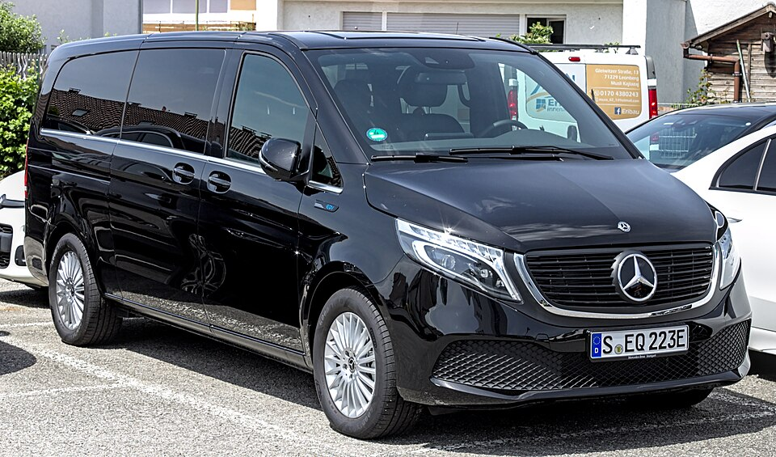

# Mercedes-Benz EQV

*Bild: [Mercedes-Benz EQV 300 IMG 4871.jpg](https://commons.wikimedia.org/wiki/File:Mercedes-Benz_EQV_300_IMG_4871.jpg) · Urheber: Alexander Migl · Lizenz: CC BY-SA 4.0 · via Wikimedia Commons.*

> Elektrische Großraumlimousine von Mercedes-Benz auf Basis der V-Klasse, eng verwandt mit dem eVito Tourer.

## Steckbrief

| Feld | Wert | Beleg |
|---|---|---|
| Hersteller | [[mercedes\|Mercedes-Benz]] | [[tn-batterycheck-alle-daten]] |
| Segment | Großraum-Van | Fachwissen¹ |
| Karosserie | Großraum-Van | Fachwissen¹ |
| Bauzeit | seit 2020 | Fachwissen¹ |
| Plattform | Verbrenner-Plattform der V-Klasse / Vito | Fachwissen¹ |
| Varianten im Bestand | 2 | [[tn-batterycheck-alle-daten]] |
| [[bruttokapazitaet\|Bruttokapazität]] | 66–100 kWh | [[tn-batterycheck-alle-daten]] |
| [[nettokapazitaet\|Nettokapazität]] | 60–90 kWh | [[tn-batterycheck-alle-daten]] |
| [[batteriepuffer\|Puffer]] | 9,1–10,0 % | berechnet |

## Beschreibung

Der Mercedes-Benz EQV ist die batterieelektrische Ausführung der V-Klasse und damit ein [[konversionsfahrzeug|Konversionsfahrzeug]]. Er teilt Antrieb und [[traktionsbatterie|Traktionsbatterie]] mit dem [[mercedes-evito|eVito Tourer]].

Der [[elektromotor|Elektromotor]] sitzt vorn und treibt die Vorderräder an ([[frontantrieb|Frontantrieb]]), obwohl die Verbrennerversionen der V-Klasse Hinterradantrieb haben. Die Batterie liegt im Unterboden zwischen den Achsen.

## Varianten und Batterien

Zwei Batterien: EQV 250 mit 66/60 kWh und EQV 300 mit 100/90 kWh. Die Zahl ist eine Leistungs- bzw. Ausstattungsklasse; die Batteriegröße ist hier jeweils an die Bezeichnung gekoppelt.

| Variante | Brutto | Netto | Puffer | Zeile |
|---|---|---|---|---|
| EQV 250 | 66 kWh | 60 kWh | 6 kWh (9,1 %) | 188 |
| EQV 300 | 100 kWh | 90 kWh | 10 kWh (10,0 %) | 189 |

Quelle: [[tn-batterycheck-alle-daten]], Blatt „Fahrzeuge“, Zeilen 188–189 – bereinigte Fassung (Stand 2026-09-24, Änderungen in [[datenqualitaet]]). Puffer = Brutto − Netto (berechnet).

## Fachbegriffe

- [[konversionsfahrzeug|Konversionsfahrzeug]] — Elektroauto, das von einem Modell mit Verbrennungsmotor abgeleitet ist, statt auf einer reinen Elektroplattform zu basieren.
- [[frontantrieb|Frontantrieb (FWD)]] — Der Elektromotor treibt die Vorderräder an – typisch für Kleinwagen und Konversionsfahrzeuge.
- [[elektro-transporter|Elektro-Transporter und Vans]] — Leichte Nutzfahrzeuge und Großraum-Pkw mit Elektroantrieb – im Bestand vor allem von Stellantis, Mercedes, Renault und VW.
- [[plattform-geschwister|Plattform-Geschwister (Badge-Engineering)]] — Fahrzeuge verschiedener Marken, die technisch weitgehend baugleich sind und dieselbe Batterie nutzen.
- [[typbezeichnungen|Typbezeichnungen]] — Wie Hersteller Leistungsstufe, Batterie und Antrieb in Modellnamen codieren – ein Lesehilfe-Artikel.

## Verwandte Fahrzeuge

- [[mercedes-evito|Mercedes-Benz eVito]] — technisch verwandt / gleiche Plattform oder Batterie
- Weitere Modelle von Mercedes-Benz: [[mercedes-eqa|Mercedes-Benz EQA]], [[mercedes-eqb|Mercedes-Benz EQB]], [[mercedes-eqc|Mercedes-Benz EQC]], [[mercedes-eqt|Mercedes-Benz EQT]], [[mercedes-esprinter|Mercedes-Benz eSprinter]]

## Offene Punkte

- Runde Werte (66/60, 100/90 kWh) – vermutlich gerundete Herstellerangaben.

Siehe auch [[datenqualitaet]].

## Quellen

- [[tn-batterycheck-alle-daten]] — Brutto-/Nettokapazität aller Varianten (Zeilen 188–189)
- Weiterlesen: [Wikipedia – Mercedes-Benz EQV](https://en.wikipedia.org/wiki/Mercedes-Benz_EQV)

¹ *Beschreibung und Steckbrief-Felder ohne Quellseite beruhen auf allgemeinem Fachwissen des LLM (Stand 2026-09-24) und sind nicht durch eine Rohquelle im Bestand belegt. Zahlenwerte zur Batterie stammen aus der Rohquelle, bereinigt nach dem Protokoll in [[datenqualitaet]].*
