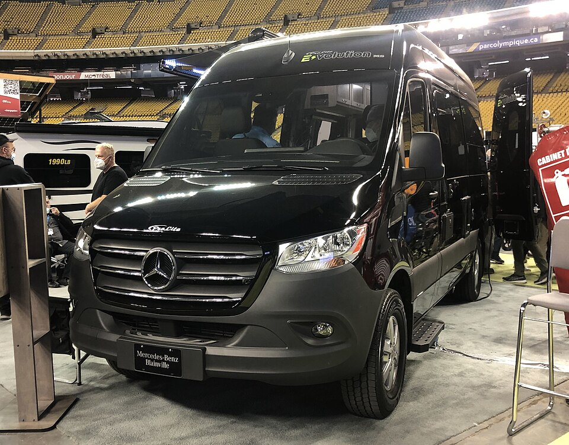

# Mercedes-Benz eSprinter

*Bild: [Mercedes-Benz eSprinter au salon des voitures éléctriques de Montréal 2022.JPG](https://commons.wikimedia.org/wiki/File:Mercedes-Benz_eSprinter_au_salon_des_voitures_%C3%A9l%C3%A9ctriques_de_Montr%C3%A9al_2022.JPG) · Urheber: Bull-Doser · Lizenz: Public domain · via Wikimedia Commons.*

> Elektrischer großer Transporter von Mercedes-Benz; die erste Generation basierte auf dem Sprinter-Verbrenner, die zweite nutzt eine neue Architektur mit LFP-Batterien.

## Steckbrief

| Feld | Wert | Beleg |
|---|---|---|
| Hersteller | [[mercedes\|Mercedes-Benz]] | [[tn-batterycheck-alle-daten]] |
| Segment | Transporter | Fachwissen¹ |
| Karosserie | Kastenwagen | Fachwissen¹ |
| Bauzeit | seit 2019 | Fachwissen¹ |
| Plattform | Sprinter-Plattform (zweite Generation mit neu entwickelter elektrischer Antriebseinheit) | Fachwissen¹ |
| Varianten im Bestand | 5 | [[tn-batterycheck-alle-daten]] |
| [[bruttokapazitaet\|Bruttokapazität]] | 41–119 kWh | [[tn-batterycheck-alle-daten]] |
| [[nettokapazitaet\|Nettokapazität]] | 35–113 kWh | [[tn-batterycheck-alle-daten]] |
| [[batteriepuffer\|Puffer]] | 4,7–14,6 % | berechnet |

## Beschreibung

Der Mercedes-Benz eSprinter ist ein [[elektro-transporter|Elektro-Transporter]] der großen Klasse. Die erste Generation war ein [[konversionsfahrzeug|Konversionsfahrzeug]] mit [[frontantrieb|Frontantrieb]] und Batterien aus dem Vito-Baukasten.

Die zweite Generation erhielt einen an der Hinterachse sitzenden [[elektromotor|Elektromotor]] ([[hinterradantrieb|Hinterradantrieb]]) und drei [[traktionsbatterie|Traktionsbatterien]] auf Basis von [[lfp-zellchemie|LFP-Zellchemie]]. LFP-Zellen gelten als robust und langlebig, haben aber eine geringere Energiedichte als [[nmc-zellchemie|NMC-Zellen]].

## Varianten und Batterien

Erste Generation ("eSprinter"): 41/35 kWh und 55/47 kWh. Zweite Generation ("eSprinter LFP"): 60/56, 85/81 und 119/113 kWh. Der Zusatz LFP kennzeichnet in den Daten die neue Generation mit Lithium-Eisenphosphat-Zellen; die Nettowerte entsprechen den Herstellerangaben, die Bruttowerte sind geschätzt.

| Variante | Brutto | Netto | Puffer | Zeile | Status |
|---|---|---|---|---|---|
| eSprinter | 41 kWh | 35 kWh | 6 kWh (14,6 %) | 190 |  |
| eSprinter | 55 kWh | 47 kWh | 8 kWh (14,5 %) | 191 |  |
| eSprinter LFP | ca, 60 kWh | 56 kWh | 4 kWh (6,7 %) | 193 | Näherungswert |
| eSprinter LFP | ca, 85 kWh | 81 kWh | 4 kWh (4,7 %) | 194 | Näherungswert |
| eSprinter LFP | ca, 119 kWh | 113 kWh | 6 kWh (5,0 %) | 192 | Näherungswert |

Quelle: [[tn-batterycheck-alle-daten]], Blatt „Fahrzeuge“, Zeilen 190–194 – bereinigte Fassung (Stand 2026-09-24, Änderungen in [[datenqualitaet]]). Puffer = Brutto − Netto (berechnet).

## Fachbegriffe

- [[elektro-transporter|Elektro-Transporter und Vans]] — Leichte Nutzfahrzeuge und Großraum-Pkw mit Elektroantrieb – im Bestand vor allem von Stellantis, Mercedes, Renault und VW.
- [[lfp-zellchemie|LFP-Zellchemie]] — Lithium-Eisenphosphat-Zellen – kobaltfrei, günstig, sehr langlebig, aber mit geringerer Energiedichte.
- [[nmc-zellchemie|NMC-Zellchemie]] — Lithium-Ionen-Zellen mit Kathode aus Nickel, Mangan und Kobalt – hohe Energiedichte, Standard in den meisten Fahrzeugen des Bestands.
- [[frontantrieb|Frontantrieb (FWD)]] — Der Elektromotor treibt die Vorderräder an – typisch für Kleinwagen und Konversionsfahrzeuge.
- [[hinterradantrieb|Hinterradantrieb (RWD)]] — Der Elektromotor treibt die Hinterräder an – Standard auf vielen reinen Elektroplattformen.
- [[modellpflege|Modellpflege (Facelift)]] — Überarbeitung eines Modells während der Bauzeit – bei Elektroautos oft mit neuer Batterie.
- [[bruttokapazitaet|Bruttokapazität]] — Die gesamte, physikalisch in der Batterie verbaute Energiemenge – inklusive der Reserven, die der Fahrer nie nutzen kann.

## Verwandte Fahrzeuge

- [[mercedes-evito|Mercedes-Benz eVito]] — technisch verwandt / gleiche Plattform oder Batterie
- Weitere Modelle von Mercedes-Benz: [[mercedes-eqa|Mercedes-Benz EQA]], [[mercedes-eqb|Mercedes-Benz EQB]], [[mercedes-eqc|Mercedes-Benz EQC]], [[mercedes-eqt|Mercedes-Benz EQT]], [[mercedes-eqv|Mercedes-Benz EQV]]

## Offene Punkte

- **Näherungswert:** „eSprinter LFP“ ist in der Rohquelle nur als „ca. 119 kWh“ angegeben (Zeile 192). Mercedes nennt nur nutzbare Kapazitäten (56 / 81 / 113 kWh); die Bruttowerte sind nicht offiziell. Klärung: [#11](https://github.com/Thitronik01/Frank-Repo/issues/11).
- **Näherungswert:** „eSprinter LFP“ ist in der Rohquelle nur als „ca. 60 kWh“ angegeben (Zeile 193). Mercedes nennt nur nutzbare Kapazitäten (56 / 81 / 113 kWh); die Bruttowerte sind nicht offiziell. Klärung: [#11](https://github.com/Thitronik01/Frank-Repo/issues/11).
- **Näherungswert:** „eSprinter LFP“ ist in der Rohquelle nur als „ca. 85 kWh“ angegeben (Zeile 194). Mercedes nennt nur nutzbare Kapazitäten (56 / 81 / 113 kWh); die Bruttowerte sind nicht offiziell. Klärung: [#11](https://github.com/Thitronik01/Frank-Repo/issues/11).
- Die Reihenfolge der LFP-Zeilen (119, 60, 85 kWh) ist nicht nach Größe sortiert.

Siehe auch [[datenqualitaet]].

## Quellen

- [[tn-batterycheck-alle-daten]] — Brutto-/Nettokapazität aller Varianten (Zeilen 190–194)

¹ *Beschreibung und Steckbrief-Felder ohne Quellseite beruhen auf allgemeinem Fachwissen des LLM (Stand 2026-09-24) und sind nicht durch eine Rohquelle im Bestand belegt. Zahlenwerte zur Batterie stammen aus der Rohquelle, bereinigt nach dem Protokoll in [[datenqualitaet]].*
