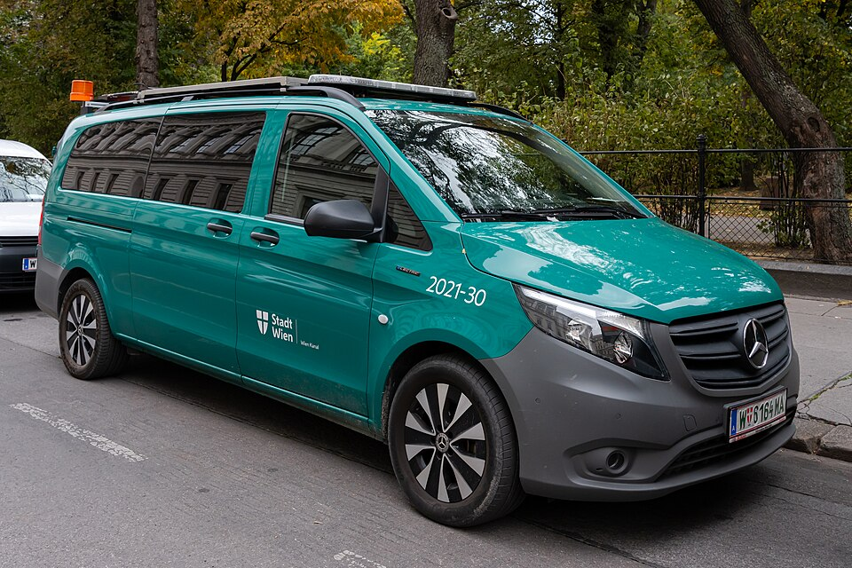

# Mercedes-Benz eVito

*Bild: [DSC06151 Mercedes-Benz eVito, Wien Kanal, Front Right, 2023-10.jpg](https://commons.wikimedia.org/wiki/File:DSC06151_Mercedes-Benz_eVito,_Wien_Kanal,_Front_Right,_2023-10.jpg) · Urheber: Aciarium · Lizenz: CC BY 4.0 · via Wikimedia Commons.*

> Elektrischer mittelgroßer Transporter von Mercedes-Benz auf Basis des Vito, als Kastenwagen und als Personentransporter (Tourer).

## Steckbrief

| Feld | Wert | Beleg |
|---|---|---|
| Hersteller | [[mercedes\|Mercedes-Benz]] | [[tn-batterycheck-alle-daten]] |
| Segment | Transporter | Fachwissen¹ |
| Karosserie | Kastenwagen, Kleinbus (Tourer) | Fachwissen¹ |
| Bauzeit | seit 2018 | Fachwissen¹ |
| Plattform | Verbrenner-Plattform des Vito | Fachwissen¹ |
| Varianten im Bestand | 6 | [[tn-batterycheck-alle-daten]] |
| [[bruttokapazitaet\|Bruttokapazität]] | 41–100 kWh | [[tn-batterycheck-alle-daten]] |
| [[nettokapazitaet\|Nettokapazität]] | 35–90 kWh | [[tn-batterycheck-alle-daten]] |
| [[batteriepuffer\|Puffer]] | 9,1–14,6 % | berechnet |

## Beschreibung

Der Mercedes-Benz eVito ist ein [[elektro-transporter|Elektro-Transporter]] und ein [[konversionsfahrzeug|Konversionsfahrzeug]] auf Basis des Vito. Die Pkw-nahe Tourer-Version teilt ihren Antrieb mit dem [[mercedes-eqv|EQV]].

Der [[elektromotor|Elektromotor]] treibt die Vorderräder an ([[frontantrieb|Frontantrieb]]). Über die Bauzeit wurden mehrere Batteriegrößen angeboten; die Kastenwagen erhielten im Zuge der [[modellpflege|Modellpflege]] eine größere Batterie.

## Varianten und Batterien

"long" und "extra long" sind Radstand-/Längenvarianten, "Tourer pro" die Personentransporter-Ausstattung, "129" eine Leistungsklasse. Batterien: 41/35 kWh (frühe Kastenwagen), 66/60 kWh (spätere Kastenwagen) und 100/90 kWh (Tourer).

| Variante | Brutto | Netto | Puffer | Zeile |
|---|---|---|---|---|
| eVito 129 Tourer pro extra long | 100 kWh | 90,0 kWh | 10 kWh (10,0 %) | 195 |
| eVito 129 Tourer pro long | 100 kWh | 90,0 kWh | 10 kWh (10,0 %) | 196 |
| eVito extra long | 41 kWh | 35,0 kWh | 6 kWh (14,6 %) | 197 |
| eVito extra long | 66 kWh | 60,0 kWh | 6 kWh (9,1 %) | 198 |
| eVito long | 41 kWh | 35,0 kWh | 6 kWh (14,6 %) | 199 |
| eVito long | 66 kWh | 60,0 kWh | 6 kWh (9,1 %) | 200 |

Quelle: [[tn-batterycheck-alle-daten]], Blatt „Fahrzeuge“, Zeilen 195–200. Puffer = Brutto − Netto (berechnet).

## Fachbegriffe

- [[elektro-transporter|Elektro-Transporter und Vans]] — Leichte Nutzfahrzeuge und Großraum-Pkw mit Elektroantrieb – im Bestand vor allem von Stellantis, Mercedes, Renault und VW.
- [[konversionsfahrzeug|Konversionsfahrzeug]] — Elektroauto, das von einem Modell mit Verbrennungsmotor abgeleitet ist, statt auf einer reinen Elektroplattform zu basieren.
- [[frontantrieb|Frontantrieb (FWD)]] — Der Elektromotor treibt die Vorderräder an – typisch für Kleinwagen und Konversionsfahrzeuge.
- [[modellpflege|Modellpflege (Facelift)]] — Überarbeitung eines Modells während der Bauzeit – bei Elektroautos oft mit neuer Batterie.
- [[typbezeichnungen|Typbezeichnungen]] — Wie Hersteller Leistungsstufe, Batterie und Antrieb in Modellnamen codieren – ein Lesehilfe-Artikel.

## Verwandte Fahrzeuge

- [[mercedes-eqv|Mercedes-Benz EQV]] — technisch verwandt / gleiche Plattform oder Batterie
- [[mercedes-esprinter|Mercedes-Benz eSprinter]] — technisch verwandt / gleiche Plattform oder Batterie
- Weitere Modelle von Mercedes-Benz: [[mercedes-eqa|Mercedes-Benz EQA]], [[mercedes-eqb|Mercedes-Benz EQB]], [[mercedes-eqc|Mercedes-Benz EQC]], [[mercedes-eqt|Mercedes-Benz EQT]]

## Offene Punkte

- Runde Werte (41/35, 66/60, 100/90 kWh) – vermutlich gerundete Herstellerangaben.

Siehe auch [[datenqualitaet]].

## Quellen

- [[tn-batterycheck-alle-daten]] — Brutto-/Nettokapazität aller Varianten (Zeilen 195–200)

¹ *Beschreibung und Steckbrief-Felder ohne Quellseite beruhen auf allgemeinem Fachwissen des LLM (Stand 2026-09-23) und sind nicht durch eine Rohquelle im Bestand belegt. Zahlenwerte zur Batterie stammen ausschließlich aus der Rohquelle.*
