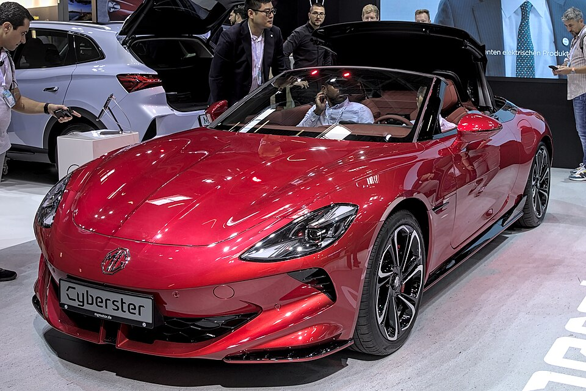

# MG Cyberster

*Bild: [MG Cyberster IAA 2023 1X7A0183.jpg](https://commons.wikimedia.org/wiki/File:MG_Cyberster_IAA_2023_1X7A0183.jpg) · Urheber: Alexander-93 · Lizenz: CC BY-SA 4.0 · via Wikimedia Commons.*

> Elektrischer zweisitziger Roadster der Marke MG mit elektrisch betätigtem Stoffverdeck.

## Steckbrief

| Feld | Wert | Beleg |
|---|---|---|
| Hersteller | [[mg\|MG]] | [[tn-batterycheck-alle-daten]] |
| Segment | Sportwagen / Roadster | Fachwissen¹ |
| Karosserie | Roadster (Cabrio, zweisitzig) | Fachwissen¹ |
| Bauzeit | seit 2024 | Fachwissen¹ |
| Varianten im Bestand | 2 | [[tn-batterycheck-alle-daten]] |
| [[bruttokapazitaet\|Bruttokapazität]] | 77 kWh | [[tn-batterycheck-alle-daten]] |
| [[nettokapazitaet\|Nettokapazität]] | 74,4 kWh | [[tn-batterycheck-alle-daten]] |
| [[batteriepuffer\|Puffer]] | 3,4 % | berechnet |

## Beschreibung

Der MG Cyberster knüpft an die Roadster-Tradition der ursprünglich britischen Marke an und ist ein zweisitziges [[bev|Elektroauto]] mit offener Karosserie. Er gehört zu den wenigen batterieelektrischen Roadstern am Markt.

Die Version **Trophy** hat einen [[elektromotor|Elektromotor]] an der Hinterachse ([[hinterradantrieb|Hinterradantrieb]]), die Version **GT** zusätzlich einen Motor vorne ([[allradantrieb|Allradantrieb]]). Die [[traktionsbatterie|Traktionsbatterie]] entspricht in ihren Kapazitätswerten der größten Batterie des [[mg4-electric|MG4 Electric]].

## Varianten und Batterien

**Cyberster Trophy** und **Cyberster GT** bezeichnen Antrieb und Leistungsstufe; beide nutzen dieselbe Batterie mit 77,0/74,4 kWh. Weitere Batterieoptionen sind in den Rohdaten nicht enthalten.

| Variante | Brutto | Netto | Puffer | Zeile |
|---|---|---|---|---|
| Cyberster GT | 77 kWh | 74,4 kWh | 2,6 kWh (3,4 %) | 201 |
| Cyberster Trophy | 77 kWh | 74,4 kWh | 2,6 kWh (3,4 %) | 202 |

Quelle: [[tn-batterycheck-alle-daten]], Blatt „Fahrzeuge“, Zeilen 201–202 – bereinigte Fassung (Stand 2026-09-24, Änderungen in [[datenqualitaet]]). Puffer = Brutto − Netto (berechnet).

## Fachbegriffe

- [[bev|BEV (batterieelektrisches Fahrzeug)]] — Battery Electric Vehicle – Fahrzeug, das ausschließlich mit Strom aus einer Traktionsbatterie fährt.
- [[hinterradantrieb|Hinterradantrieb (RWD)]] — Der Elektromotor treibt die Hinterräder an – Standard auf vielen reinen Elektroplattformen.
- [[allradantrieb|Allradantrieb (AWD)]] — Beide Achsen werden angetrieben, bei Elektroautos meist durch je einen eigenen Motor pro Achse.
- [[traktionsbatterie|Traktionsbatterie]] — Der Hochvolt-Energiespeicher, der den Elektromotor eines Elektroautos versorgt.
- [[plattform-geschwister|Plattform-Geschwister (Badge-Engineering)]] — Fahrzeuge verschiedener Marken, die technisch weitgehend baugleich sind und dieselbe Batterie nutzen.

## Verwandte Fahrzeuge

- [[mg4-electric|MG4 Electric]] — technisch verwandt / gleiche Plattform oder Batterie
- Weitere Modelle von MG: [[mg-marvel-r|MG Marvel R]], [[mg5-electric|MG5 Electric]], [[mg-zs-ev|MG ZS EV]]

## Offene Punkte

- Plattform nicht angegeben: Eine Zuordnung zur MSP-Plattform des MG4 ist nicht gesichert.
- Kapazität identisch mit der größten MG4-Batterie (77,0/74,4 kWh); ob es derselbe Pack ist, ist nicht belegt.
- Die Antriebszuordnung Trophy = Hinterradantrieb, GT = Allradantrieb gilt für den europäischen Markt; in anderen Märkten können die Bezeichnungen abweichen.

Siehe auch [[datenqualitaet]].

## Quellen

- [[tn-batterycheck-alle-daten]] — Brutto-/Nettokapazität aller Varianten (Zeilen 201–202)
- Weiterlesen: [Wikipedia – MG Cyberster](https://en.wikipedia.org/wiki/MG_Cyberster)

¹ *Beschreibung und Steckbrief-Felder ohne Quellseite beruhen auf allgemeinem Fachwissen des LLM (Stand 2026-09-24) und sind nicht durch eine Rohquelle im Bestand belegt. Zahlenwerte zur Batterie stammen aus der Rohquelle, bereinigt nach dem Protokoll in [[datenqualitaet]].*
