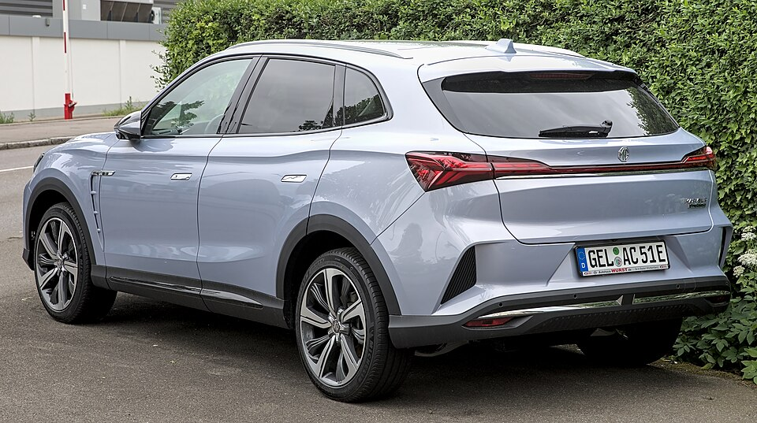

# MG Marvel R

*Bild: [MG Marvel R 1X7A0397.jpg](https://commons.wikimedia.org/wiki/File:MG_Marvel_R_1X7A0397.jpg) · Urheber: Alexander Migl · Lizenz: CC BY-SA 4.0 · via Wikimedia Commons.*

> Elektrisches Mittelklasse-SUV der Marke MG, das als technisch aufwendigeres Modell oberhalb des ZS EV positioniert war.

## Steckbrief

| Feld | Wert | Beleg |
|---|---|---|
| Hersteller | [[mg\|MG]] | [[tn-batterycheck-alle-daten]] |
| Segment | Mittelklasse-SUV | Fachwissen¹ |
| Karosserie | SUV | Fachwissen¹ |
| Varianten im Bestand | 2 | [[tn-batterycheck-alle-daten]] |
| [[bruttokapazitaet\|Bruttokapazität]] | 75 kWh | [[tn-batterycheck-alle-daten]] |
| [[nettokapazitaet\|Nettokapazität]] | 70 kWh | [[tn-batterycheck-alle-daten]] |
| [[batteriepuffer\|Puffer]] | 6,7 % | berechnet |

## Beschreibung

Der MG Marvel R ist ein [[bev|Elektro-SUV]] von SAIC, das in China als Roewe Marvel X angeboten wird und in Europa unter der Marke MG vertrieben wurde. Er war eines der ersten MG-Modelle mit mehr als einem [[elektromotor|Elektromotor]].

Die Performance-Version verfügt über [[allradantrieb|Allradantrieb]]. Die [[traktionsbatterie|Traktionsbatterie]] ist in beiden Versionen gleich; der [[batteriepuffer|Puffer]] zwischen brutto und netto fällt mit 5 kWh vergleichsweise groß aus.

## Varianten und Batterien

**Marvel R** und **Marvel R Performance** unterscheiden sich im Antrieb bzw. der Leistung, nicht in der Batterie (beide 75,0/70,0 kWh).

| Variante | Brutto | Netto | Puffer | Zeile |
|---|---|---|---|---|
| Marvel R | 75 kWh | 70 kWh | 5 kWh (6,7 %) | 203 |
| Marvel R Performance | 75 kWh | 70 kWh | 5 kWh (6,7 %) | 204 |

Quelle: [[tn-batterycheck-alle-daten]], Blatt „Fahrzeuge“, Zeilen 203–204 – bereinigte Fassung (Stand 2026-09-24, Änderungen in [[datenqualitaet]]). Puffer = Brutto − Netto (berechnet).

## Fachbegriffe

- [[bev|BEV (batterieelektrisches Fahrzeug)]] — Battery Electric Vehicle – Fahrzeug, das ausschließlich mit Strom aus einer Traktionsbatterie fährt.
- [[allradantrieb|Allradantrieb (AWD)]] — Beide Achsen werden angetrieben, bei Elektroautos meist durch je einen eigenen Motor pro Achse.
- [[traktionsbatterie|Traktionsbatterie]] — Der Hochvolt-Energiespeicher, der den Elektromotor eines Elektroautos versorgt.
- [[batteriepuffer|Batteriepuffer]] — Differenz zwischen Brutto- und Nettokapazität – eine Reserve, die die Batterie schont und Alterung ausgleicht.
- [[bruttokapazitaet|Bruttokapazität]] — Die gesamte, physikalisch in der Batterie verbaute Energiemenge – inklusive der Reserven, die der Fahrer nie nutzen kann.
- [[nettokapazitaet|Nettokapazität]] — Der Teil der Batteriekapazität, den der Fahrer tatsächlich nutzen kann – Grundlage für Reichweite und Batterietests.

## Verwandte Fahrzeuge

- Weitere Modelle von MG: [[mg-cyberster|MG Cyberster]], [[mg4-electric|MG4 Electric]], [[mg5-electric|MG5 Electric]], [[mg-zs-ev|MG ZS EV]]

## Offene Punkte

- Bauzeit offen gelassen: Europa-Marktstart 2021, Ende des Vertriebs in Europa nicht gesichert.
- Motoranordnung der Basisversion (Hinterachse, ggf. zwei Motoren) nicht gesichert und daher nicht im Text ausgeführt.
- Puffer von 5 kWh (75 brutto / 70 netto) – deutlich größer als bei anderen MG-Modellen.

Siehe auch [[datenqualitaet]].

## Quellen

- [[tn-batterycheck-alle-daten]] — Brutto-/Nettokapazität aller Varianten (Zeilen 203–204)

¹ *Beschreibung und Steckbrief-Felder ohne Quellseite beruhen auf allgemeinem Fachwissen des LLM (Stand 2026-09-24) und sind nicht durch eine Rohquelle im Bestand belegt. Zahlenwerte zur Batterie stammen aus der Rohquelle, bereinigt nach dem Protokoll in [[datenqualitaet]].*
