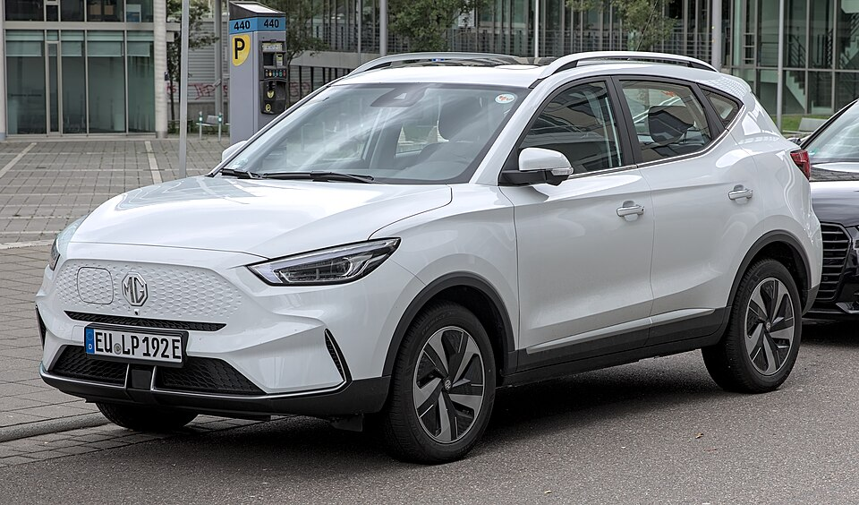

# MG ZS EV

*Bild: [MG ZS EV Facelift 1X7A5867.jpg](https://commons.wikimedia.org/wiki/File:MG_ZS_EV_Facelift_1X7A5867.jpg) · Urheber: Alexander Migl · Lizenz: CC BY-SA 4.0 · via Wikimedia Commons.*

> Elektrische Version des Kompakt-SUV MG ZS und eines der ersten MG-Elektroautos in Europa.

## Steckbrief

| Feld | Wert | Beleg |
|---|---|---|
| Hersteller | [[mg\|MG]] | [[tn-batterycheck-alle-daten]] |
| Segment | Kompakt-SUV | Fachwissen¹ |
| Karosserie | SUV | Fachwissen¹ |
| Bauzeit | seit 2019 (Europa) | Fachwissen¹ |
| Plattform | Verbrenner-Plattform des MG ZS (Konversionsfahrzeug) | Fachwissen¹ |
| Varianten im Bestand | 3 | [[tn-batterycheck-alle-daten]] |
| [[bruttokapazitaet\|Bruttokapazität]] | 44,5–72,6 kWh | [[tn-batterycheck-alle-daten]] |
| [[nettokapazitaet\|Nettokapazität]] | 42,5–68,3 kWh | [[tn-batterycheck-alle-daten]] |
| [[batteriepuffer\|Puffer]] | 4,1–5,9 % | berechnet |

## Beschreibung

Der MG ZS EV ist die batterieelektrische Variante des MG ZS, der auch mit Verbrennungsmotor angeboten wurde – ein typisches [[konversionsfahrzeug|Konversionsfahrzeug]]. Er trug maßgeblich zur Rückkehr der Marke MG auf den europäischen Markt bei. Angetrieben werden die Vorderräder ([[frontantrieb|Frontantrieb]]).

Nach der ersten Version mit einer einzigen Batterie erhielt der ZS EV mit der [[modellpflege|Modellpflege]] zwei neue Batteriegrößen (Standard und Long Range).

## Varianten und Batterien

- **ZS EV** ohne Zusatz (44,5/42,5 kWh): erste Version.
- **ZS EV Standard Range** (51,1/49,0 kWh) und **ZS EV Long Range** (72,6/68,3 kWh): parallel angebotene Batterien nach der Modellpflege.

| Variante | Brutto | Netto | Puffer | Zeile |
|---|---|---|---|---|
| ZS EV | 44,5 kWh | 42,5 kWh | 2 kWh (4,5 %) | 213 |
| ZS EV Long Range | 72,6 kWh | 68,3 kWh | 4,3 kWh (5,9 %) | 214 |
| ZS EV Standard Range | 51,1 kWh | 49,0 kWh | 2,1 kWh (4,1 %) | 215 |

Quelle: [[tn-batterycheck-alle-daten]], Blatt „Fahrzeuge“, Zeilen 213–215. Puffer = Brutto − Netto (berechnet).

## Fachbegriffe

- [[konversionsfahrzeug|Konversionsfahrzeug]] — Elektroauto, das von einem Modell mit Verbrennungsmotor abgeleitet ist, statt auf einer reinen Elektroplattform zu basieren.
- [[frontantrieb|Frontantrieb (FWD)]] — Der Elektromotor treibt die Vorderräder an – typisch für Kleinwagen und Konversionsfahrzeuge.
- [[modellpflege|Modellpflege (Facelift)]] — Überarbeitung eines Modells während der Bauzeit – bei Elektroautos oft mit neuer Batterie.
- [[typbezeichnungen|Typbezeichnungen]] — Wie Hersteller Leistungsstufe, Batterie und Antrieb in Modellnamen codieren – ein Lesehilfe-Artikel.
- [[batteriepuffer|Batteriepuffer]] — Differenz zwischen Brutto- und Nettokapazität – eine Reserve, die die Batterie schont und Alterung ausgleicht.

## Verwandte Fahrzeuge

- [[mg5-electric|MG5 Electric]] — technisch verwandt / gleiche Plattform oder Batterie
- Weitere Modelle von MG: [[mg-cyberster|MG Cyberster]], [[mg-marvel-r|MG Marvel R]], [[mg4-electric|MG4 Electric]]

## Offene Punkte

- Die Long-Range-Batterie (72,6 kWh brutto) hat denselben Bruttowert wie die erste Long-Range-Batterie des Hyundai IONIQ 5 – rein zufällige Übereinstimmung, kein technischer Zusammenhang.
- Zellchemie der Standard-Range-Batterie (möglicherweise LFP) nicht gesichert.

Siehe auch [[datenqualitaet]].

## Quellen

- [[tn-batterycheck-alle-daten]] — Brutto-/Nettokapazität aller Varianten (Zeilen 213–215)

¹ *Beschreibung und Steckbrief-Felder ohne Quellseite beruhen auf allgemeinem Fachwissen des LLM (Stand 2026-09-23) und sind nicht durch eine Rohquelle im Bestand belegt. Zahlenwerte zur Batterie stammen ausschließlich aus der Rohquelle.*
