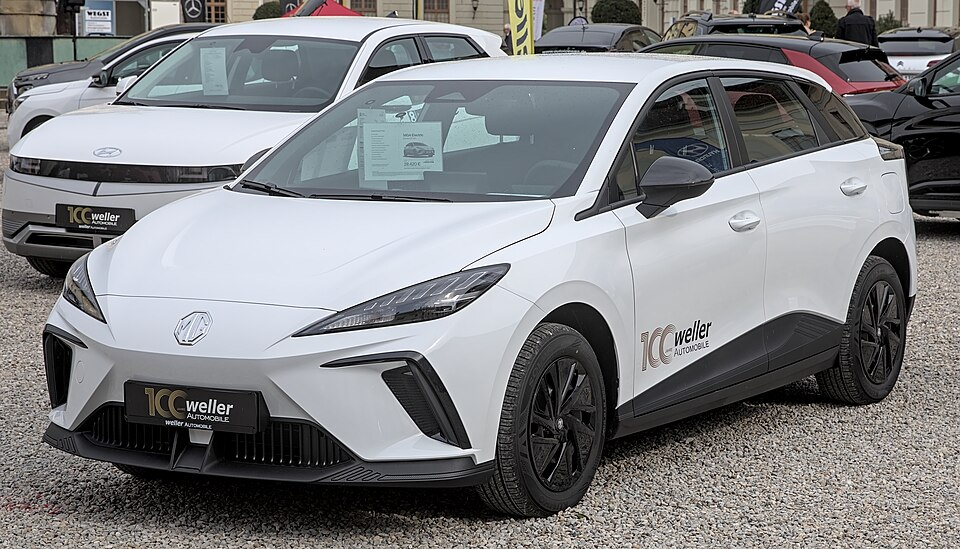

# MG4 Electric

*Bild: [MG4 EV Automesse Ludwigsburg 2022 1X7A5920.jpg](https://commons.wikimedia.org/wiki/File:MG4_EV_Automesse_Ludwigsburg_2022_1X7A5920.jpg) · Urheber: Alexander Migl · Lizenz: CC BY-SA 4.0 · via Wikimedia Commons.*

> Kompakter Elektro-Schrägheckwagen der Marke MG und erstes Modell auf der eigenen Elektroplattform MSP von SAIC.

## Steckbrief

| Feld | Wert | Beleg |
|---|---|---|
| Hersteller | [[mg\|MG]] | [[tn-batterycheck-alle-daten]] |
| Segment | Kompaktklasse | Fachwissen¹ |
| Karosserie | Schrägheck (fünftürig) | Fachwissen¹ |
| Bauzeit | seit 2022 | Fachwissen¹ |
| Plattform | MSP (Modular Scalable Platform) von SAIC | Fachwissen¹ |
| Varianten im Bestand | 4 | [[tn-batterycheck-alle-daten]] |
| [[bruttokapazitaet\|Bruttokapazität]] | 51–77 kWh | [[tn-batterycheck-alle-daten]] |
| [[nettokapazitaet\|Nettokapazität]] | 50,8–74,4 kWh | [[tn-batterycheck-alle-daten]] |
| [[batteriepuffer\|Puffer]] | 0,4–3,6 % | berechnet |

## Beschreibung

Der MG4 Electric ist ein [[bev|Elektroauto]] der Kompaktklasse und das erste Modell auf der reinen Elektroplattform MSP des SAIC-Konzerns. Die Grundversionen haben [[hinterradantrieb|Hinterradantrieb]], die Top-Version **XPOWER** einen zusätzlichen Motor vorne ([[allradantrieb|Allradantrieb]]).

Bemerkenswert ist der Mix unterschiedlicher Zellchemien: Die kleinste Batterie verwendet [[lfp-zellchemie|LFP-Zellen]], die größeren Batterien [[nmc-zellchemie|NMC-Zellen]]. LFP-Batterien werden oft mit sehr kleinem [[batteriepuffer|Puffer]] betrieben, was sich in den Rohdaten der kleinen Batterie zeigt.

Die größte Batterie (77 kWh brutto) entspricht in den Kapazitätswerten der des [[mg-cyberster|MG Cyberster]].

## Varianten und Batterien

Drei Zeilen heißen schlicht **MG4 Electric** und unterscheiden sich nur in der Batterie: 51,0/50,8 kWh (LFP), 64,0/61,7 kWh und 77,0/74,4 kWh. Im Handel wurden diese Stufen unter Ausstattungsnamen verkauft, die in den Rohdaten fehlen. **MG4 Electric XPOWER** nutzt die mittlere Batterie (64,0/61,7 kWh) mit Allradantrieb.

| Variante | Brutto | Netto | Puffer | Zeile |
|---|---|---|---|---|
| MG4 Electric | 51,0 kWh | 50,8 kWh | 0,2 kWh (0,4 %) | 205 |
| MG4 Electric | 64,0 kWh | 61,7 kWh | 2,3 kWh (3,6 %) | 206 |
| MG4 Electric | 77,0 kWh | 74,4 kWh | 2,6 kWh (3,4 %) | 207 |
| MG4 Electric XPOWER | 64,0 kWh | 61,7 kWh | 2,3 kWh (3,6 %) | 208 |

Quelle: [[tn-batterycheck-alle-daten]], Blatt „Fahrzeuge“, Zeilen 205–208. Puffer = Brutto − Netto (berechnet).

## Fachbegriffe

- [[lfp-zellchemie|LFP-Zellchemie]] — Lithium-Eisenphosphat-Zellen – kobaltfrei, günstig, sehr langlebig, aber mit geringerer Energiedichte.
- [[nmc-zellchemie|NMC-Zellchemie]] — Lithium-Ionen-Zellen mit Kathode aus Nickel, Mangan und Kobalt – hohe Energiedichte, Standard in den meisten Fahrzeugen des Bestands.
- [[batteriepuffer|Batteriepuffer]] — Differenz zwischen Brutto- und Nettokapazität – eine Reserve, die die Batterie schont und Alterung ausgleicht.
- [[hinterradantrieb|Hinterradantrieb (RWD)]] — Der Elektromotor treibt die Hinterräder an – Standard auf vielen reinen Elektroplattformen.
- [[allradantrieb|Allradantrieb (AWD)]] — Beide Achsen werden angetrieben, bei Elektroautos meist durch je einen eigenen Motor pro Achse.
- [[bev|BEV (batterieelektrisches Fahrzeug)]] — Battery Electric Vehicle – Fahrzeug, das ausschließlich mit Strom aus einer Traktionsbatterie fährt.
- [[typbezeichnungen|Typbezeichnungen]] — Wie Hersteller Leistungsstufe, Batterie und Antrieb in Modellnamen codieren – ein Lesehilfe-Artikel.

## Verwandte Fahrzeuge

- [[mg-cyberster|MG Cyberster]] — technisch verwandt / gleiche Plattform oder Batterie
- Weitere Modelle von MG: [[mg-marvel-r|MG Marvel R]], [[mg5-electric|MG5 Electric]], [[mg-zs-ev|MG ZS EV]]

## Offene Punkte

- Die 51-kWh-Batterie hat laut Rohdaten nur 0,2 kWh Puffer (51,0 brutto / 50,8 netto) – ungewöhnlich klein, bei LFP-Batterien aber nicht untypisch.
- Drei Zeilen mit identischer Bezeichnung „MG4 Electric“ – Unterscheidung nur über die Kapazität.

Siehe auch [[datenqualitaet]].

## Quellen

- [[tn-batterycheck-alle-daten]] — Brutto-/Nettokapazität aller Varianten (Zeilen 205–208)
- Weiterlesen: [Wikipedia – MG4 EV](https://en.wikipedia.org/wiki/MG4_EV)

¹ *Beschreibung und Steckbrief-Felder ohne Quellseite beruhen auf allgemeinem Fachwissen des LLM (Stand 2026-09-23) und sind nicht durch eine Rohquelle im Bestand belegt. Zahlenwerte zur Batterie stammen ausschließlich aus der Rohquelle.*
