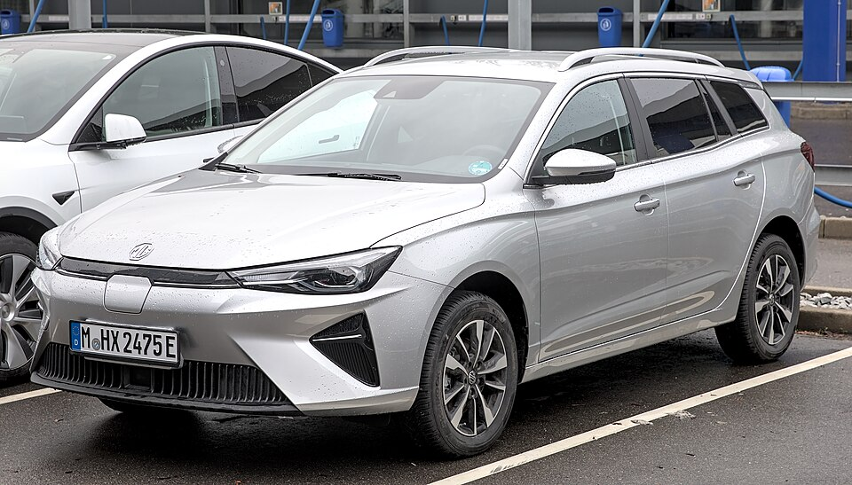

# MG5 Electric

*Bild: [MG 5 EV (EP22) 1X7A6207.jpg](https://commons.wikimedia.org/wiki/File:MG_5_EV_(EP22)_1X7A6207.jpg) · Urheber: Alexander Migl · Lizenz: CC BY-SA 4.0 · via Wikimedia Commons.*

> Elektrischer Kompaktkombi der Marke MG, der aus einem konventionellen Modell abgeleitet ist.

## Steckbrief

| Feld | Wert | Beleg |
|---|---|---|
| Hersteller | [[mg\|MG]] | [[tn-batterycheck-alle-daten]] |
| Segment | Kompaktklasse | Fachwissen¹ |
| Karosserie | Kombi | Fachwissen¹ |
| Bauzeit | seit 2020 | Fachwissen¹ |
| Plattform | Verbrenner-Plattform (Konversionsfahrzeug) | Fachwissen¹ |
| Varianten im Bestand | 4 | [[tn-batterycheck-alle-daten]] |
| [[bruttokapazitaet\|Bruttokapazität]] | 50,3–61,1 kWh | [[tn-batterycheck-alle-daten]] |
| [[nettokapazitaet\|Nettokapazität]] | 46–57,4 kWh | [[tn-batterycheck-alle-daten]] |
| [[batteriepuffer\|Puffer]] | 6,1–8,5 % | berechnet |

## Beschreibung

Der MG5 Electric ist ein Kompaktkombi und damit eines der wenigen batterieelektrischen Modelle mit dieser [[karosserieformen|Karosserieform]] in seiner Preisklasse. Er basiert auf einem Fahrzeug, das auch mit Verbrennungsmotor angeboten wird, und ist somit ein [[konversionsfahrzeug|Konversionsfahrzeug]]. Der [[elektromotor|Elektromotor]] treibt die Vorderräder an ([[frontantrieb|Frontantrieb]]).

Das Modell wurde zunächst mit einer Batterie angeboten; mit der [[modellpflege|Modellpflege]] kamen eine Standard- und eine Long-Range-Batterie hinzu.

## Varianten und Batterien

- **MG5 EV** (52,5/48,8 kWh): ursprüngliche Version.
- **MG5 Electric Standard Range** (50,3/46,0 kWh) und **MG5 Electric Long Range** (61,1/57,4 kWh): Versionen nach der Modellpflege.
- **MG5 EV Long Range** (61,1/57,4 kWh): gleiche Werte wie „MG5 Electric Long Range“ – vermutlich dieselbe Batterie unter älterer Bezeichnung.

| Variante | Brutto | Netto | Puffer | Zeile |
|---|---|---|---|---|
| MG5 Electric Long Range | 61,1 kWh | 57,4 kWh | 3,7 kWh (6,1 %) | 209 |
| MG5 Electric Standard Range | 50,3 kWh | 46,0 kWh | 4,3 kWh (8,5 %) | 210 |
| MG5 EV | 52,5 kWh | 48,8 kWh | 3,7 kWh (7,0 %) | 211 |
| MG5 EV Long Range | 61,1 kWh | 57,4 kWh | 3,7 kWh (6,1 %) | 212 |

Quelle: [[tn-batterycheck-alle-daten]], Blatt „Fahrzeuge“, Zeilen 209–212. Puffer = Brutto − Netto (berechnet).

## Fachbegriffe

- [[konversionsfahrzeug|Konversionsfahrzeug]] — Elektroauto, das von einem Modell mit Verbrennungsmotor abgeleitet ist, statt auf einer reinen Elektroplattform zu basieren.
- [[frontantrieb|Frontantrieb (FWD)]] — Der Elektromotor treibt die Vorderräder an – typisch für Kleinwagen und Konversionsfahrzeuge.
- [[modellpflege|Modellpflege (Facelift)]] — Überarbeitung eines Modells während der Bauzeit – bei Elektroautos oft mit neuer Batterie.
- [[typbezeichnungen|Typbezeichnungen]] — Wie Hersteller Leistungsstufe, Batterie und Antrieb in Modellnamen codieren – ein Lesehilfe-Artikel.
- [[karosserieformen|Karosserieformen]] — Varianten der Aufbauform eines Modells – beeinflussen Aussehen und Luftwiderstand, meist nicht die Batterie.
- [[batteriepuffer|Batteriepuffer]] — Differenz zwischen Brutto- und Nettokapazität – eine Reserve, die die Batterie schont und Alterung ausgleicht.

## Verwandte Fahrzeuge

- [[mg-zs-ev|MG ZS EV]] — technisch verwandt / gleiche Plattform oder Batterie
- Weitere Modelle von MG: [[mg-cyberster|MG Cyberster]], [[mg-marvel-r|MG Marvel R]], [[mg4-electric|MG4 Electric]]

## Offene Punkte

- „MG5 EV Long Range“ und „MG5 Electric Long Range“ mit identischen Werten (61,1/57,4 kWh) – wahrscheinlich Duplikat mit unterschiedlicher Schreibweise.
- Uneinheitliche Namensgebung „MG5 EV“ vs. „MG5 Electric“.
- Zellchemie der Standard-Range-Batterie (möglicherweise LFP) nicht gesichert und daher nicht behauptet.
- Die Einordnung als Geschwister des ZS EV bezieht sich auf die gemeinsame Konversionsbauweise und Antriebstechnik, nicht auf identische Batterien.

Siehe auch [[datenqualitaet]].

## Quellen

- [[tn-batterycheck-alle-daten]] — Brutto-/Nettokapazität aller Varianten (Zeilen 209–212)

¹ *Beschreibung und Steckbrief-Felder ohne Quellseite beruhen auf allgemeinem Fachwissen des LLM (Stand 2026-09-23) und sind nicht durch eine Rohquelle im Bestand belegt. Zahlenwerte zur Batterie stammen ausschließlich aus der Rohquelle.*
